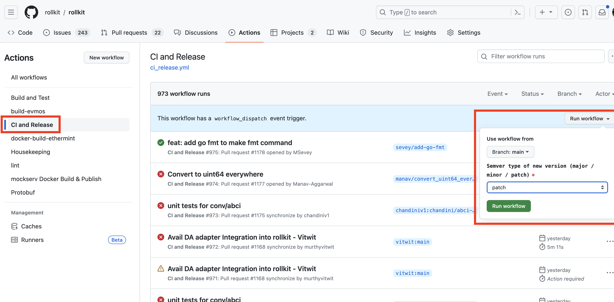
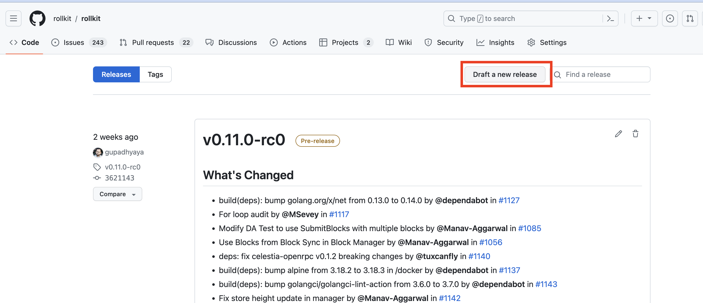
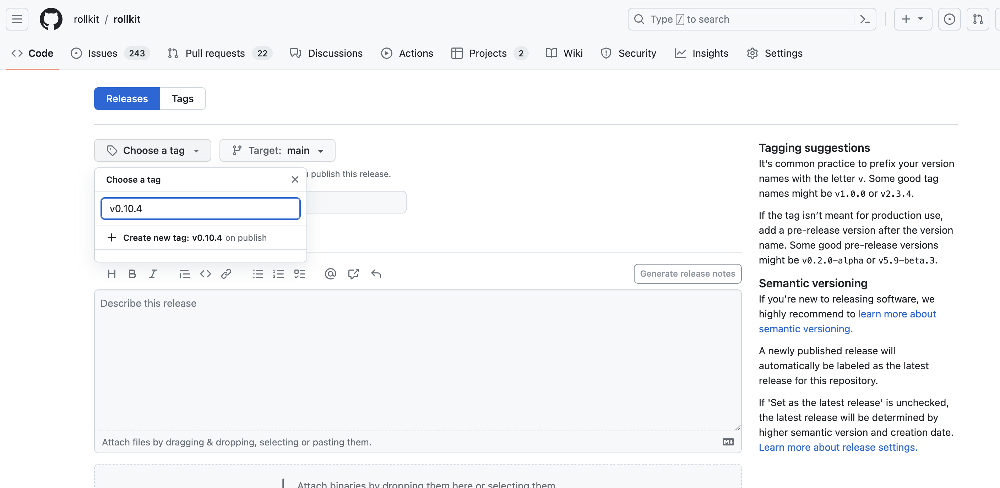

# Release

## Release Steps

* Update config version in [config/defaults.go](https://github.com/rollkit/rollkit/blob/main/config/defaults.go)
* Release new Rollkit version
* Update [Rollkit/Cosmos-SDK](https://github.com/rollkit/cosmos-sdk) with the newly released Rollkit version
* Release new Rollkit/Cosmos-SDK version

## Releasing a new Rollkit version

### Two ways

* [CI and Release Github Actions Workflows](https://github.com/rollkit/rollkit/actions/workflows/ci_release.yml)
* [Manual](https://github.com/rollkit/rollkit/releases)

#### CI and Release Actions Workflows

#### Manual

## Update Rollkit/Cosmos-SDK

### Update Steps

* Navigate to the branch that you want to update. e.g., [release/v0.47.x](https://github.com/rollkit/cosmos-sdk/tree/release/v0.47.x) or [release/v0.47.x](https://github.com/rollkit/cosmos-sdk/tree/release/v0.50.x)
* Modify go.mod with the newly released rollkit version. e.g., `github.com/rollkit/rollkit v0.10.4`
* Run `go mod tidy` for updating the dependencies for the newly added rollkit version
* Make a pull request/commit the changes

## Release new Rollkit/Cosmos-SDK version

Make a new release of the Rollkit/Cosmos-SDK by [drafting new release](https://github.com/rollkit/cosmos-sdk/releases)
