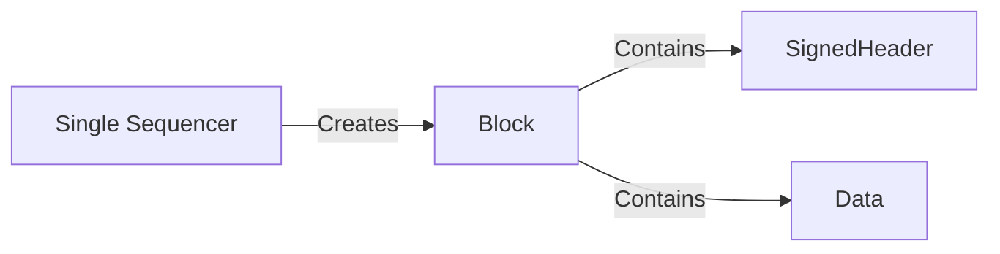
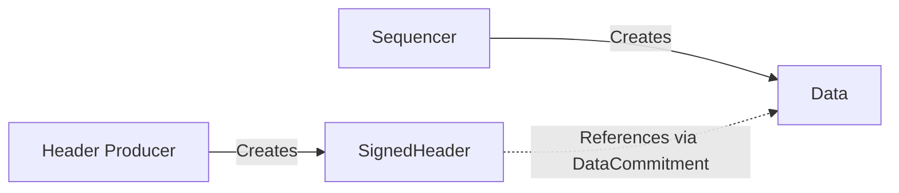
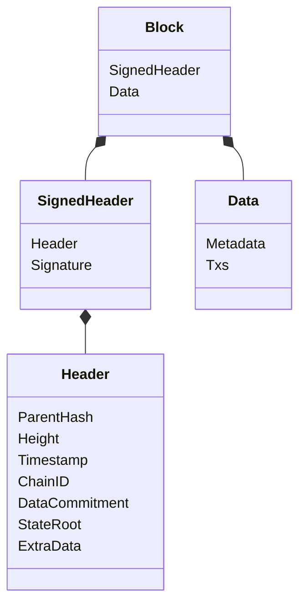
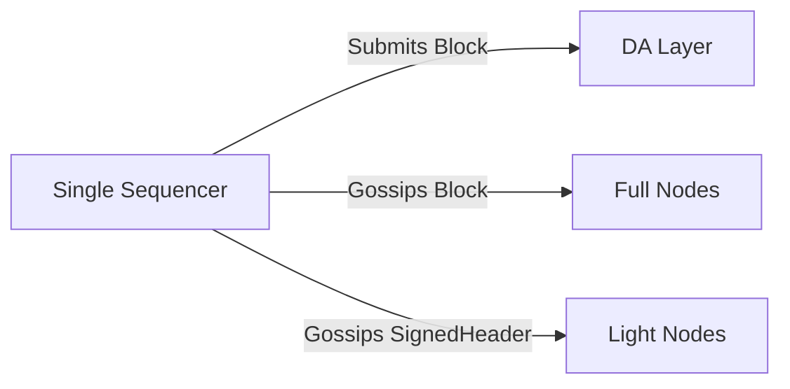
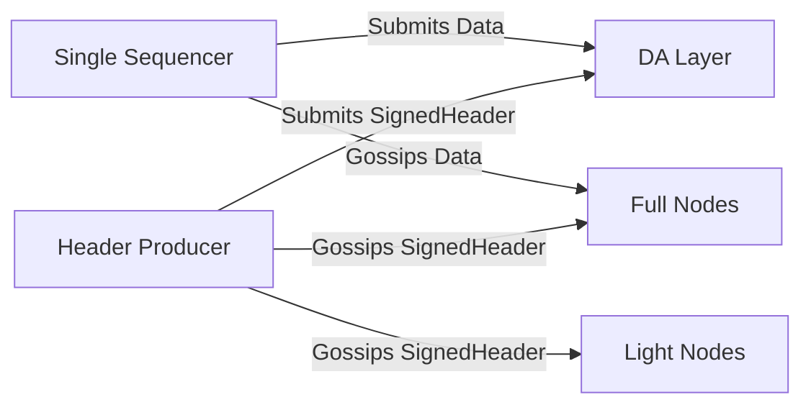
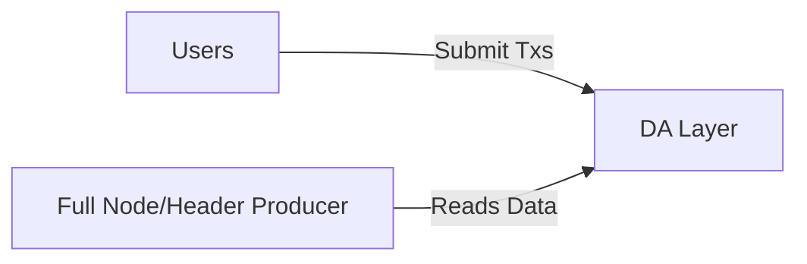
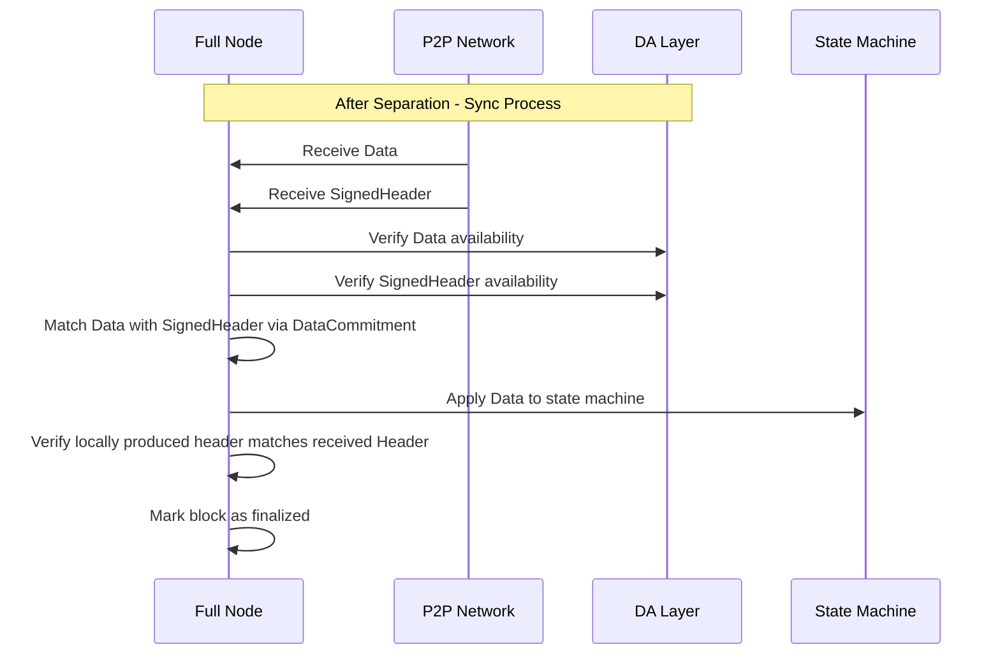
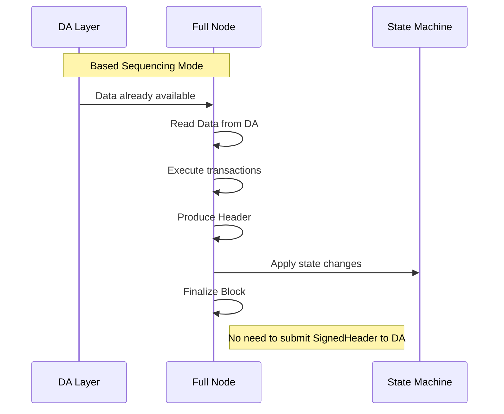

# Header and Data Separation ADR

## Abstract

The separation of header and data structures in Rollkit unlocks expanding the sequencing scheme beyond single sequencing and unlocks the use of a decentralized sequencer mode. This means that the creation of list of the transactions can be done by another network as well while nodes still produce headers after executing that list of transactions. This overall change is akin to the proposer-builder separation in the Ethereum protocol, where the Rollkit header producer acts as the proposer, and the sequencer, which produces a list of transactions, acts as the builder.

### Before Separation



### After Separation



## Protocol/Component Description

Before, Rollkit only supported the use of a single sequencer that was responsible for creating a list of transactions by reaping its mempool, executing them to produce a header, and putting them together in a block. Rollkit headers and data were encapsulated within a single block structure. The block struct looked like this:

```go
// Block defines the structure of Rollkit block.
type Block struct {
	SignedHeader SignedHeader
	Data         Data
}
```

The separation of header and data into distinct structures allows them to be processed independently. The `SignedHeader` struct now focuses on the header information, while the `Data` struct handles transaction data separately. This separation is particularly beneficial in unlocking based sequencing, where users submit transactions directly to the Data Availability layer which acts as the entity responsible for creating the list of transactions.



This change also affects how full nodes sync. Previously, full nodes would apply the transactions from the `Block` struct and verify that the `header` in `SignedHeader` matched their locally produced header. Now, with the separation, full nodes obtain the transaction data separately (via the DA layer directly in based sequencer mode, or via p2p gossip/DA layer in single sequencer mode) and verify it against the header signed by the header producer once they have both components. If a full node receives the header/data via a p2p gossip layer, they should wait to see the same header/data on the DA layer before marking the corresponding block as finalized in their view.

This ensures that the data integrity and consistency are maintained across the network.

```go
// SignedHeader struct consists of the header and a signature
type SignedHeader struct {
    Header // Rollkit Header
    Signature  Signature // Signature of the header producer
    ...
}

// Header struct focusing on header information
type Header struct {
    // Hash of the previous block header.
    ParentHash Hash
    // Height represents the block height (aka block number) of a given header
    Height uint64
    // Block creation timestamp
    Timestamp uint64
    // The Chain ID
    ChainID string
    // Pointer to location of associated block data aka transactions in the DA layer
    DataCommitment Hash
    // Commitment representing the state linked to the header
    StateRoot Hash
    // Arbitrary field for additional metadata
    ExtraData []byte
}

// Data defines Rollkit block data.
type Data struct {
	*Metadata // Defines metadata for Data struct to help with p2p gossiping.
	Txs Txs // List of transactions to be executed
}
```

The `publishBlock` method in `manager.go` now creates the header and data structures separately. This decoupling allows for the header to be submitted to the DA layer independently of the block data, which can be built by a separate network. This change supports the transition from a single sequencer mode to a decentralized sequencer mode, making the system more modular.

## Message Structure/Communication Format

### Header Producer

Before the separation: Only the entire `Block` struct composed of both header and data was submitted to the DA layer. The `Block` and `SignedHeader` were both gossipped over two separate p2p layers: gossipping `Block` to just full nodes and gossipping the `SignedHeader` to full nodes and future light nodes to join that will only sync headers (and proofs).

After the separation: The `SignedHeader` and `Data` are submitted separately to the DA layer. Note that the `SignedHeader` has a `Header` that is linked to the `Data` via a `DataCommitment` from the DA layer. `SignedHeader` and `Data` are both gossipped over two separate p2p layers: gossipping `Data` to just full nodes and gossipping the `SignedHeader` to full nodes and future light nodes to join that will only sync headers (and proofs).

In based sequencing mode, the header producer is equivalent to a full node.

### Before Separation



### After Separation - Single Sequencer Mode



### After Separation - Based Mode



### Syncing Full Node

Before the separation: Full Nodes get the entire `Block` struct via p2p or the DA layer. They can choose to apply the block as soon as they get it via p2p OR just wait to see it on the DA layer. This depends on whether a full node opts in to the p2p layer or not. Gossipping the `SignedHeader` over p2p is primarily for light nodes to get the header.

After the separation: Full nodes get the `Data` struct and the `SignedHeader` struct separately over p2p and DA layers. In code, this refers to the `HeaderStore` and the `DataStore` in block manager. A Full node should wait for having both the `Data` struct and the corresponding `SignedHeader` to it before applying the block data to its associated state machine. This is so that the full node can verify that its locally produced header's state commitment after it applies the `Data` associated to a block is consistent with the `Header` inside the `SignedHeader` that is received from the header producer. The `Header` should contain a link to its associated Data via a `DataCommitment` that is a pointer to the location of the `Data` on the DA layer.



In a single sequencer mode, before, a full node marks a block finalized, it should verify that both the `SignedHeader` and `Data` associated to it were made available on the DA layer by checking it directly or verifying DA inclusion proofs.

In based sequencing mode, blocks can be instantly finalized since the `Data` is directly always derived from the DA layer and already exists there. There's no need for a `SignedHeader` to exist on the DA layer.



## Assumptions and Considerations

- Considerations include ensuring that headers and data are correctly synchronized and validated to prevent inconsistencies.
- Ensure that all components interacting with headers and data are updated to handle them as separate entities.
- Security measures should be in place to prevent unauthorized access or tampering with headers and data during transmission and storage.
- Performance optimizations may be necessary to handle the increased complexity of managing separate header and data structures, especially in high-throughput environments.
- Testing and validation processes should be updated to account for the new structure and ensure that all components function correctly in both single and decentralized sequencer modes.

## Implementation

The implementation of this separation can be found in the Rollkit repository, specifically in the changes made to the `manager.go` file. The `publishBlock` method illustrates the creation of separate header and data structures, and the associated logic for handling them independently. See [Rollkit PR #1789](https://github.com/evstack/ev-node/pull/1789)

## References

- [Rollkit PR #1789](https://github.com/evstack/ev-node/pull/1789)
- [Proposer-Builder Separation](https://www.alchemy.com/overviews/proposer-builder-separation)
