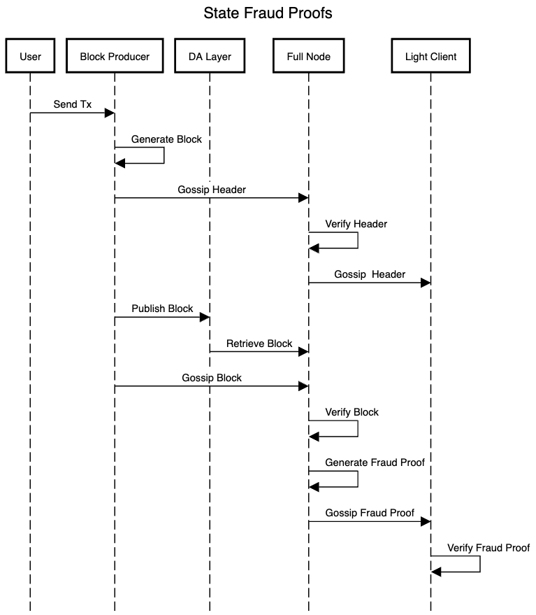

# ADR 009: State Fraud Proofs

## Changelog

- 2022-11-03: Initial draft

## Authors

Manav Aggarwal (@Manav-Aggarwal)

## Context

This ADR introduces a design for state fraud proofs in optimistic cosmos-sdk rollups using rollmint.
It implements parts of Section 4 (Fraud Proofs) of Al-Bassam et al’s paper [“Fraud and Data Availability Proofs: Detecting Invalid Blocks in Light Clients”](http://www0.cs.ucl.ac.uk/staff/M.AlBassam/publications/fraudproofs.pdf).
Some previous notes regarding this topic in the context of cosmos-sdk are described in Matthew Di Ferrante's [notes](https://github.com/celestiaorg/rollmint/issues/132).

Rollmint's design currently consists of a single sequencer that posts blocks to the DA layer, and multiple full nodes.
Sequencers gossip block headers to full nodes and full nodes fetch posted blocks from the DA layer. Full nodes then execute transactions in these blocks to update their state, and gossip block headers over P2P to Rollmint light clients. However, if a block contains a fraudulent state transition, Rollmint full nodes can detect it, and generate a state fraud proof that can be gossipped over P2P to Rollmint light clients. These Rollmint light clients can use this state fraud proof to verify whether a fraudulent state transition occured or not by themselves.

Overall, State Fraud Proofs enable trust-minimization between full nodes and light clients as long as there is at least 
one honest full node in the system that will generate state fraud proofs.

<p align="center">

</p>

## Alternative Approaches
For light clients to detect invalid blocks and verify it themselves, alternatives include downloading the whole state themselves or using zero-knowledge validity proof systems. 

## Detailed Design

### Detecting Fraudulent State Transitions

Rollmint blocks contain a field called `Intermediate State Roots` in block data:
```go

// Data defines rollmint block data.
type Data struct {
	Txs                    Txs
	IntermediateStateRoots IntermediateStateRoots
	Evidence               EvidenceData
}
```

These Intermediate State Roots (ISRs) are initially generated by a Rollmint sequencer during block execution which uses the ABCI interface. 

The following ABCI methods are called during block execution:
`BeginBlock` at the start of a block
`DeliverTx` for each transaction 
`EndBlock` at the end of a block

After each of the above ABCI method calls, we generate an intermediate state root using a new ABCI method we introduce:

```protobuf
service ABCIApplication {
    rpc GetAppHash(RequestGetAppHash) returns (ResponseGetAppHash);
}

message RequestGetAppHash {}

message ResponseGetAppHash {
  bytes app_hash = 1;
}
```

This `GetAppHash` ABCI method returns an equivalent of `CommitID` hash in the ABCI method `Commit` and thus provides a way to extract ISRs from an app without doing any disk write operations.

Full nodes use these ISRs to detect fraudulent state transitions. A full node must also execute all state transitions (`BeginBlock`, `DeliverTx`, and `EndBlock` calls) and compute its own Intermediate State Roots (ISRs). After each state transition, a full node compares the corresponding ISR with the ISR given by the Sequencer. If it finds a mismatch between its own computed ISR and and one given by the Sequencer, a fraudulent transition is detected and it moves on to generate a Fraud Proof.

### Generating Fraud Proofs

We introduce the following ABCI method to enable Fraud Proof Generation in the Cosmos SDK:

```protobuf
service ABCIApplication {
    rpc GenerateFraudProof(RequestGenerateFraudProof) returns (ResponseGenerateFraudProof);
}

```
With this new ABCI method, a Rollmint Full Node can send a request to a Cosmos SDK app to generate a Fraud Proof. In this request, it includes a list of all the state transitions from the start of the block upto the fraudulent state transition. The last non-nil state transition in this list corresponds to the fraudulent state transition.

```protobuf
message RequestGenerateFraudProof {
  // All state transitions upto and including the fraudulent state transition
  RequestBeginBlock begin_block_request = 1 [(gogoproto.nullable) = false];
  repeated RequestDeliverTx deliver_tx_requests = 2;
  RequestEndBlock end_block_request = 3;
}
```

The `GenerateFraudProof` method in the Cosmos SDK app receives this list of state transitions and takes the following steps to generate a fraud proof:

- Revert local state to the last committed state
- Execute all the non-fraudulent state transitions
- Remove all trace logs from executing the above state transitions
- Execute the fraudulent state transition with tracing-enabled and store logs of what state, specifically key/value pairs, is accessed, modified, added, or removed during this fraudulent state transition.
- Revert local state back to the last committed state
- Execute all the non-fraudulent state transitions again
- Use the stored logs to filter the local state down to the set of minimal set of key/value pairs needed to execute the fraudulent state transition and generate corresponding merkle inclusion proofs for the state.
- Put this minimal set of key/value pairs and corresponding merkle inclusion proofs in a State Fraud Proof which looks like this:

```protobuf

// Represents a single-round fraudProof
message FraudProof {
  // The block height during which the fraudulent state transition occured
  int64 block_height = 1;
  // Intermediate State Root right before the fraudulent state transition
  bytes app_hash = 2;

  // Map from an app module name to a State Witness
  map<string, StateWitness> state_witness = 3;

  // Fraudulent state transition has to be one of these
  // Only one have of these three can be non-nil
  RequestBeginBlock fraudulent_begin_block = 4;
  RequestDeliverTx fraudulent_deliver_tx = 5;
  RequestEndBlock fraudulent_end_block = 6;
}

// State witness with a list of all witness data
message StateWitness {
  // store level merkle inclusion proof
  tendermint.crypto.ProofOp proof = 1;
  // merkle root hash of the substore
  bytes root_hash = 2;
  // List of witness data
  repeated WitnessData witness_data = 3;
}

// Witness data containing a key/value pair and a Merkle inclusion proof for said key/value pair
message WitnessData {
  bytes key = 1;
  bytes value = 2;
  // substore level merkle inclusion proof
  tendermint.crypto.ProofOp proof = 3;
}
```

Finally, return this generated state fraud proof back to the Rollmint Full Node:

```protobuf
message ResponseGenerateFraudProof {
  FraudProof fraud_proof = 1;
}
```

### Gossiping Fraud Proofs

After a Rollmint Full Node generates a Fraud Proof, it gossips the Fraud Proof over P2P to Rollmint light clients. 

### Verifying Fraud Proofs

Rollmint light clients should be able to use these gossiped state fraud proofs to verify whether a fraudulent state transition occured or not by themselves. 

There are four stages of verification that must occur for a Fraud Proof. The first three stages take place in Rollmint and verify that the fraud proof itself was generated correctly. The fourth stage takes place in a Cosmos SDK app to actually execute the fraudulent state transition embedded in the fraud proof.

**Stage One**

Verify that both the `appHash` (ISR) and the fraudulent state transition in the `FraudProof` exist as part of a block published on the DA layer within a specified fraud proof window.

**Stage Two**

Go through the `state_witness` list in the `FraudProof` and verify that all the store level merkle inclusion proofs are valid: the corresponding `root_hash` was included in a merkle tree with root `appHash`.

**Stage Three**

Go through the `WitnessData` in each `StateWitness` and verify that all the substore level merkle inclusion proofs are valid: the corresponding `key` was included in a merkle tree with root `root_hash`.

**Stage Four**

Spin up a new Cosmos SDK app and initialize its store with Deep Subtrees constructed using merkle inclusion proofs in the `FraudProof`. After this initialization, the app hash representing the state of the app should match the `appHash` inside the `FraudProof`. This store should now contain all the key/value pairs and underlying tree structure necessary to execute the fraudulent state transition contained in the `FraudProof`. 

We introduce the following ABCI method to enable Fraud Proof Verification in the Cosmos SDK:

```protobuf
service ABCIApplication {
    rpc VerifyFraudProof(RequestVerifyFraudProof) returns (ResponseVerifyFraudProof);
}
```

With this new ABCI method, a Rollmint light client can send a request to a newly initialized Cosmos SDK app to verify whether executing a state transition on the app would lead to a particular app hash. In this request, it includes the fraudulent state transition and an expected app hash to match against.

```protobuf
message RequestVerifyFraudProof {
  // Fraudulent state transition has to be one of these
  // Only one have of these three can be non-nil
  RequestBeginBlock fraudulent_begin_block = 1;
  RequestDeliverTx fraudulent_deliver_tx = 2;
  RequestEndBlock fraudulent_end_block = 3;

  // The app hash to compare against after executing the above state transition
  bytes expected_app_hash = 4;
}
```

The `VerifyFraudProof` method in the Cosmos SDK app receives this fraudulent state transition and expected app hash, and takes the following steps to complete this verification step:

- Execute the provided fraudulent state transition
- Get the app hash and compare it against the expected app hash
- Return a boolean representing whether the two app hashes above match or not.

```protobuf
message ResponseVerifyFraudProof {
  bool success = 1;
}
```

If a fraud proof is successfuly verified, the Rollmint light client can halt and wait for an off-chain social recovery process. Otherwise, it ignores the Fraud Proof and proceeds as usual.

## Status

Proposed

## Consequences

### Positive

- Enables trust-minimization between Rollmint Full nodes and Light clients.
- Introduces an honest minority assumption for Rollmint full nodes.

### Negative

- Breaks ABCI compatibility and requires maintaining an ABCI version specific to Rollmint.

### Neutral

## References

> Are there any relevant PR comments, issues that led up to this, or articles referenced for why we made the given design choice? If so link them here!

- {http://www0.cs.ucl.ac.uk/staff/M.AlBassam/publications/fraudproofs.pdf}
- {https://github.com/celestiaorg/rollmint/issues/132}
- {https://github.com/celestiaorg/cosmos-sdk/issues/245}
