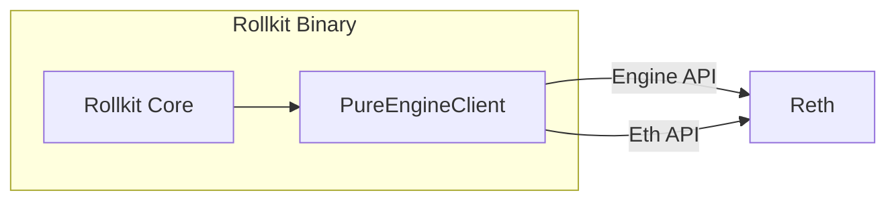

# Go Execution EVM

This repository implements the `execution.Executor` interface from `github.com/rollkit/rollkit/core/execution` (currently on feature branch `feature/exec_api`). It provides a pure Engine API-based execution client for Rollkit.

## PureEngineClient Implementation

The `PureEngineClient` is a 100% Engine API compatible implementation of the `execution.Executor` interface. It connects to an Ethereum execution client (like Reth) and uses both the Engine API and standard Ethereum JSON-RPC API to execute transactions.

### Genesis and initial height

In the context of the EVM, the genesis block is designated as a unique block with the block number `0`.
To ensure compatibility with both rollkit and the EVM, the only permissible initial height is `1`.
During `InitChain` EVM genesis block is acknowledged (at height 0), and empty block is created (at height 1).
This approach ensures that the block numbers between the EVM and rollkit remain consistent and synchronized.

### Genesis Requirements

Since the `PureEngineClient` relies on the Engine API, the genesis configuration must properly enable it with the correct hardfork settings:

1. The genesis file must include post-merge hardfork configurations
2. `terminalTotalDifficulty` must be set to 0
3. `terminalTotalDifficultyPassed` must be set to true
4. Hardforks like `mergeNetsplitBlock`, `shanghaiTime`, and `cancunTime` should be properly configured

Example of required genesis configuration:

```json
{
  "config": {
    "chainId": 1234,
    "homesteadBlock": 0,
    "eip150Block": 0,
    "eip155Block": 0,
    "eip158Block": 0,
    "byzantiumBlock": 0,
    "constantinopleBlock": 0,
    "petersburgBlock": 0,
    "istanbulBlock": 0,
    "berlinBlock": 0,
    "londonBlock": 0,
    "mergeNetsplitBlock": 0,
    "terminalTotalDifficulty": 0,
    "terminalTotalDifficultyPassed": true,
    "shanghaiTime": 0,
    "cancunTime": 0
  }
}
```

Without these settings, the Engine API will not be available, and the `PureEngineClient` will not function correctly.

### PayloadID Storage

The `PureEngineClient` maintains the `payloadID` between calls:

1. During `InitChain`, a payload ID is obtained from the Engine API via `engine_forkchoiceUpdatedV3`
2. This payload ID is stored in the client instance as `c.payloadID`
3. The stored payload ID is used in subsequent calls to `GetTxs` to retrieve the current execution payload
4. After each `ExecuteTxs` call, a new payload ID is obtained and stored for the next block

### Payload as First Transaction

The `PureEngineClient` implements a unique approach to transaction execution:

1. In `GetTxs`, the entire execution payload is serialized to JSON and returned as the first transaction
2. In `ExecuteTxs`, this first transaction is deserialized back into an execution payload
3. The remaining transactions are added to the payload's transaction list
4. The complete payload is then submitted to the execution client via `engine_newPayloadV3`

This approach ensures that:

- The execution payload structure is preserved between calls
- All execution happens within the EVM
- It's not possible to create a payload outside of the EVM
- Transactions cannot be selected or ordered outside of the EVM

### How Eth API is Used

The `PureEngineClient` uses the standard Ethereum JSON-RPC API for:

1. Retrieving block information (via `HeaderByNumber`)
2. Reading the genesis block hash and state root
3. Getting gas limits and other block parameters

This allows the client to interact with the execution layer for read operations while using the Engine API for write operations.

## Deployment Architecture



## Development and Testing

### Running Reth in Docker

```bash
cd docker
docker compose up -d
```

### Reading Genesis Information

If you've modified the genesis file, you can read the genesis hash and state root using the Ethereum JSON-RPC API:

```bash
# Get genesis block hash
curl -X POST -H "Content-Type: application/json" --data '{"jsonrpc":"2.0","method":"eth_getBlockByNumber","params":["0x0", false],"id":1}' http://localhost:8545 | jq -r '.result.hash'

# Get genesis state root
curl -X POST -H "Content-Type: application/json" --data '{"jsonrpc":"2.0","method":"eth_getBlockByNumber","params":["0x0", false],"id":1}' http://localhost:8545 | jq -r '.result.stateRoot'
```
