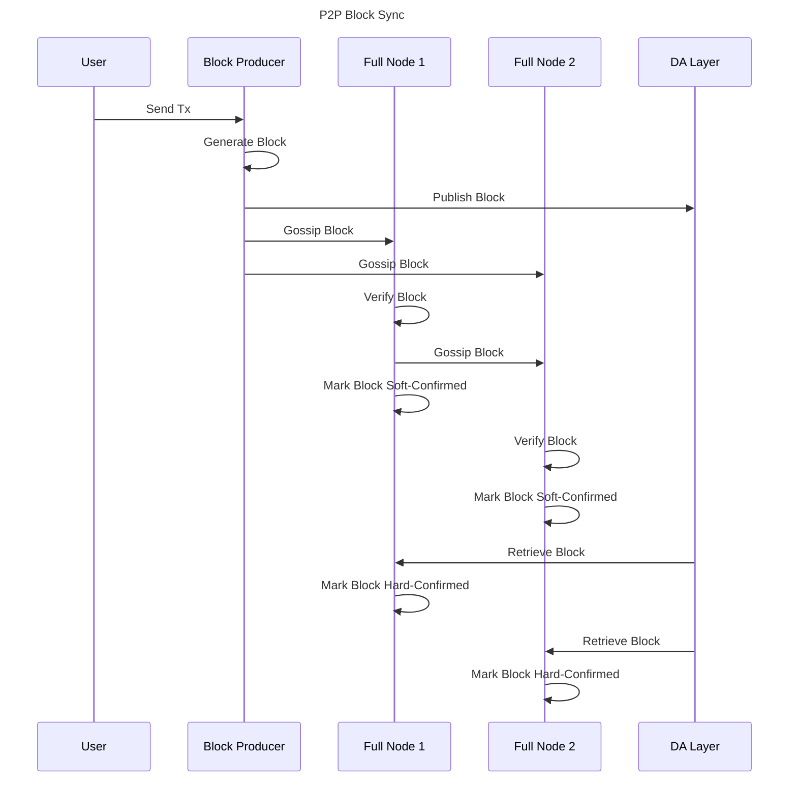

# P2P Block Sync

## Abstract

P2P Block Sync enables rollkit full nodes, including aggregators, to gossip blocks amongst  
themselves and sync with the rollup chain faster than they can sync using the DA layer.

## Protocol/Component Description

P2P Block Sync consists of the following components:

* block exchange service: responsible for gossiping blocks over P2P
* block publication to P2P network
* block retrieval from P2P network

### Block Exchange Service

The block exchange service uses the ([`go-header` service](https://github.com/celestiaorg/go-header)) to gossip blocks over P2P.

### Block Publication to P2P network

Blocks ready to be published to the P2P network are sent to the `BlockCh` channel in Block Manager inside `publishLoop`.
The `blockPublishLoop` in the full node continuously listens for new blocks from the `BlockCh` channel and when a new block  
is received, it is written to the block store and broadcasted to the network using the block exchange service.

### Block Retrieval from P2P network

Blocks gossiped to validating full nodes through the P2P network are retreived from the `Block Store` in `BlockStoreRetrieveLoop` in Block Manager.
For every `blockTime` unit of time, a signal is sent to the `blockStoreCh` channel in block manager and when this signal is received, the  
`BlockStoreRetrieveLoop` retrieves blocks from the block store. It keeps track of the last retrieved block's height and if the current block store's height  is greater than the last retrieved block's height, it retrieves all blocks from the block store that are between these two heights.
For each retrieved block, it sends a new block event to the `blockInCh` channel which is the same channel that blocks retrieved from the DA layer are sent.
This block is marked as soft-confirmed by the validating full node until the same block is seen on the DA layer and then marked hard-confirmed.

## Message Structure/Communication Format

The communication within Block Manager and between itself and the full node is all done through channels that pass around the `block struct`.  

## Assumptions and Considerations

* The block exchange store is created by prefixing `blockEx` on the main data store.
* The genesis `ChainID` is used to create the `PubSubTopID` in go-header. Refer to go-header specs for more details.
* P2P Block sync works only when a full node is connected to p2p network by specifying the initial seeds to connect to via `P2PConfig.Seeds` configuration parameter when starting the full node.
* Node's context is passed down to all the components of the p2p block exchange to control shutting down the service either abruptly (in case of failure) or gracefully (during successful scenarios).

## Implementation

The `blockStore` in `BlockExchangeService` ([node/block_exchange.go](https://github.com/rollkit/rollkit/blob/main/node/block_exchange.go)) is used when initializing a full node ([node/full.go](https://github.com/rollkit/rollkit/blob/main/node/full.go)). Blocks are written to `blockStore` in `blockPublishLoop` in full node ([node/full.go](https://github.com/rollkit/rollkit/blob/main/node/full.go)), gossiped amongst the network, and retrieved in `BlockStoreRetrieveLoop` in Block Manager ([block/manager.go](https://github.com/rollkit/rollkit/blob/main/block/manager.go)).

## References

Refer to `go-header` ([specs](https://github.com/celestiaorg/go-header)).
