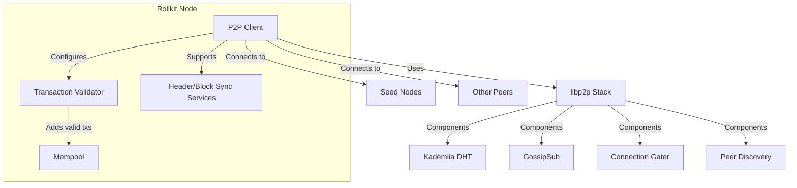
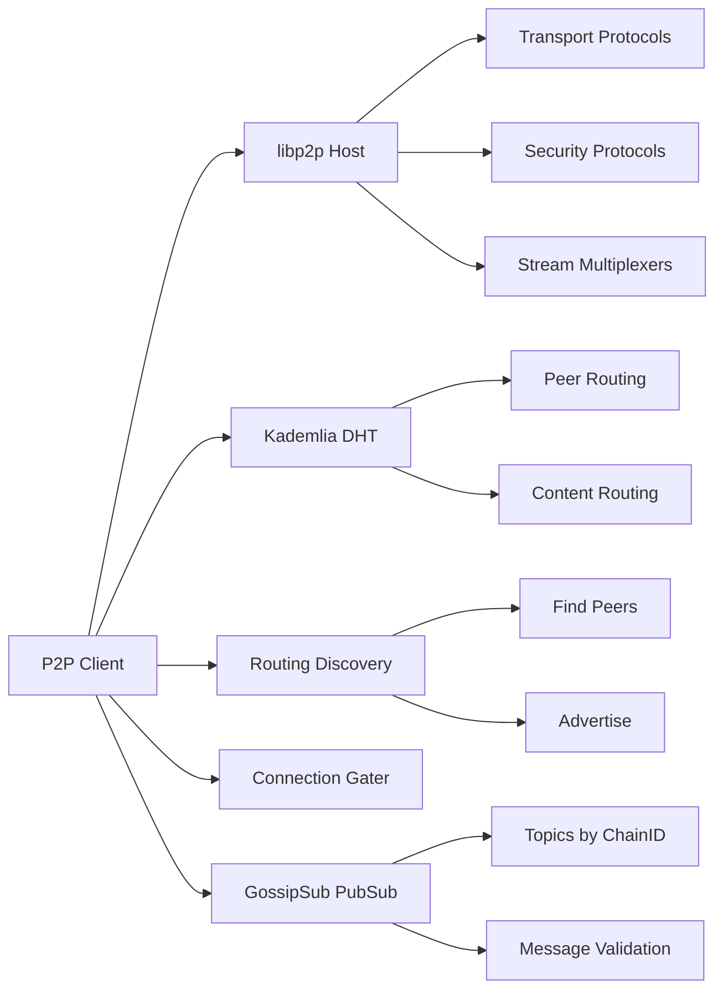
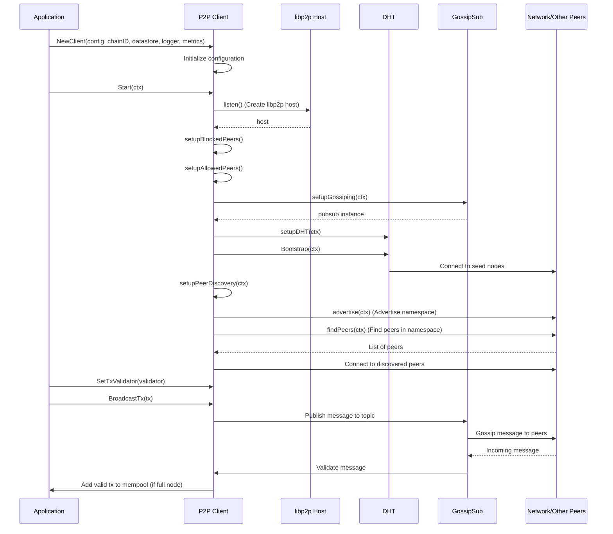

# P2P Package

This document provides an overview of the P2P (peer-to-peer) networking system used in Rollkit. The P2P package leverages [go-libp2p](https://github.com/libp2p/go-libp2p) stack for establishing peer connections, gossiping transactions, and synchronizing headers and blocks across the rollup network.

## Overview

Every rollup node (both full and light) runs a P2P client for participating in the rollup's P2P network. The client handles the following key functions:

- Establishing and managing peer connections
- Gossiping transactions through the network
- Supporting header and block synchronization services
- Validating gossiped messages (different for full and light nodes)

## Architecture



## Configuration

The P2P client is configured using the `P2PConfig` struct:

```go
type P2PConfig struct {
    ListenAddress string // Address to listen for incoming connections
    Seeds         string // Comma separated list of seed nodes to connect to
    BlockedPeers  string // Comma separated list of nodes to ignore
    AllowedPeers  string // Comma separated list of nodes to whitelist
}
```

### Configuration Parameters

| Parameter | Description | Default | Example |
|-----------|-------------|---------|---------|
| ListenAddress | The address where the node listens for incoming P2P connections | `/ip4/0.0.0.0/tcp/26656` | `/ip4/0.0.0.0/tcp/26656` |
| Seeds | Comma-separated list of seed nodes (bootstrap nodes) | "" | `/ip4/1.2.3.4/tcp/26656/p2p/12D3KooWA8EXV3KjBxEU...,/ip4/5.6.7.8/tcp/26656/p2p/12D3KooWJN9ByvD...` |
| BlockedPeers | Comma-separated list of peer IDs to block | "" | `12D3KooWA8EXV3KjBxEU...,12D3KooWJN9ByvD...` |
| AllowedPeers | Comma-separated list of peer IDs to explicitly allow | "" | `12D3KooWA8EXV3KjBxEU...,12D3KooWJN9ByvD...` |

## libp2p Components

The P2P client leverages several key components from the libp2p stack:



### Key libp2p Technologies

1. **Host**: The basic libp2p node that provides connectivity to the P2P network
   - Handles connections and streams
   - Manages identity (using a private key)
   - Listens on specified multiaddresses

2. **Kademlia DHT**: Distributed Hash Table for peer discovery and routing
   - Used for finding other peers within the same rollup network
   - Bootstrapped with seed nodes defined in configuration

3. **GossipSub**: Publish-subscribe protocol for message dissemination
   - Used for gossiping transactions, headers, and blocks
   - Provides efficient message propagation with reduced bandwidth overhead
   - Supports message validation through custom validators

4. **Connection Gater**: Controls which peers can connect
   - Implements peer filtering based on blocked and allowed peer lists
   - Provides security by blocking unwanted connections

5. **Peer Discovery**: Mechanisms for finding peers on the network
   - Uses DHT for peer routing
   - Advertises presence on the network using chain ID as namespace
   - Actively searches for peers in the same namespace

## Client Lifecycle



## Full vs. Light Node Validators

The P2P clients in full and light nodes handle transaction validation differently:

1. **Full Node Validator**:
   - Processes all gossiped transactions
   - Validates transactions before adding to mempool
   - Participates fully in the P2P network

2. **Light Node Validator**:
   - Implements a "dummy" validator that doesn't process transactions
   - Doesn't maintain a mempool
   - Still participates in the P2P network for other purposes

## Message Gossiping

Messages (transactions, blocks, etc.) are gossiped through the network using GossipSub topics. The topic format is:

```
<chainID>+<topicSuffix>
```

Where:

- `chainID` is the rollup's chain identifier
- `topicSuffix` is a suffix specific to the message type (e.g., "tx" for transactions)

This namespace approach ensures that messages only propagate within the intended rollup network.

## Key Functions

- `NewClient`: Creates a new P2P client with the provided configuration
- `Start`: Establishes P2P connectivity (sets up host, gossipping, DHT, and peer discovery)
- `Close`: Gracefully stops the client
- `Peers`: Returns a list of connected peers
- `BroadcastTx`: Broadcasts a transaction to the P2P network

## Metrics

The P2P client can collect and expose metrics about its operations, including:

- Number of connected peers
- Bytes sent/received per peer
- Number of transactions submitted by each peer
- Message bytes by message type

These metrics can be exposed via Prometheus for monitoring and alerting.

## Examples

### Creating and Starting a P2P Client

```go
// Create configuration
conf := config.Config{
    RootDir: "/path/to/root",
    P2P: config.P2PConfig{
        ListenAddress: "/ip4/0.0.0.0/tcp/26656",
        Seeds: "/ip4/1.2.3.4/tcp/26656/p2p/12D3KooWXYZ...,/ip4/5.6.7.8/tcp/26656/p2p/12D3KooWABC...",
    },
}

// Create datastore
ds := datastore.NewMapDatastore()

// Create logger
logger := log.NewTMLogger(log.NewSyncWriter(os.Stdout))

// Create metrics
metrics := p2p.PrometheusMetrics("rollkit")

// Create client
client, err := p2p.NewClient(conf, "mychain-1", ds, logger, metrics)
if err != nil {
    // Handle error
}

// Start client
err = client.Start(context.Background())
if err != nil {
    // Handle error
}

// When done, close the client
defer client.Close()
``` 
