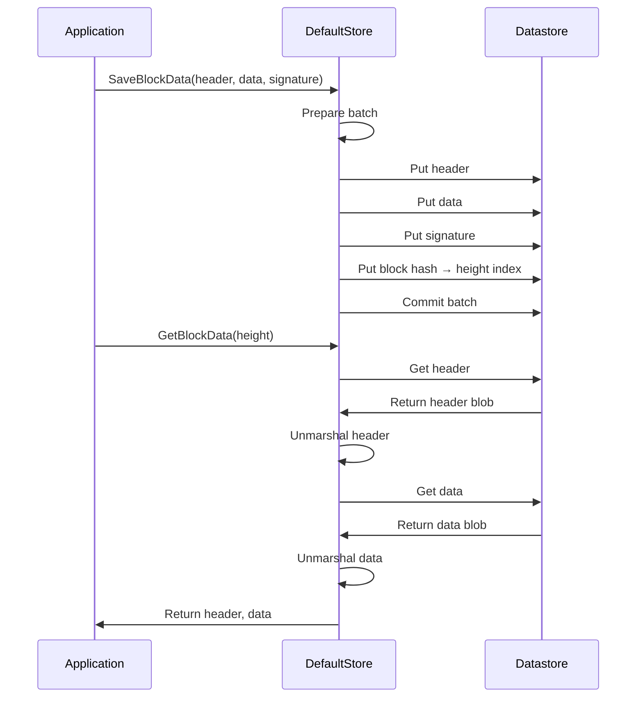
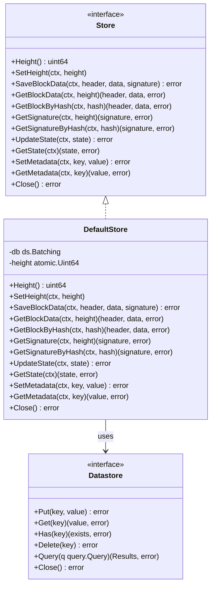

# Rollkit Storage System

The `store` package provides a persistent storage solution for Rollkit, designed to efficiently store and retrieve blockchain data such as blocks, signatures, state, and metadata.

## Overview

The storage system consists of a key-value store interface that allows for the persistence of blockchain data. It leverages the IPFS Datastore interface (`go-datastore`) with a Badger database implementation by default.

## Core Components

### Storage Interface

The main interface (`Store`) defines methods for:

- Block data storage and retrieval
- State management
- Metadata storage
- Height tracking and querying

### Implementation

The `DefaultStore` is the standard implementation of the `Store` interface, utilizing a key-value datastore.

## Data Organization

The store organizes data using a prefix-based key system:

| Prefix | Purpose | Key Format |
|--------|---------|------------|
| `h` | Block headers | `/h/{height}` |
| `d` | Block data | `/d/{height}` |
| `i` | Block index (hash -> height) | `/i/{hash}` |
| `c` | Block signatures | `/c/{height}` |
| `s` | Chain state | `s` |
| `m` | Metadata | `/m/{key}` |

## Block Storage Sequence



## Store Component Architecture



## Usage Examples

### Creating a Store

```go
// In-memory store (for testing)
kvStore, err := store.NewDefaultInMemoryKVStore()
if err != nil {
    // handle error
}
myStore := store.New(kvStore)

// Persistent store
kvStore, err := store.NewDefaultKVStore("/path/to/root", "data", "rollkit-db")
if err != nil {
    // handle error
}
myStore := store.New(kvStore)
```

### Saving and Retrieving Data

```go
// Save block data
err := myStore.SaveBlockData(ctx, header, data, signature)

// Get block by height
header, data, err := myStore.GetBlockData(ctx, height)

// Get block by hash
header, data, err := myStore.GetBlockByHash(ctx, blockHash)

// Update state
err := myStore.UpdateState(ctx, newState)

// Get current state
state, err := myStore.GetState(ctx)

// Store metadata
err := myStore.SetMetadata(ctx, "myKey", []byte("myValue"))

// Retrieve metadata
value, err := myStore.GetMetadata(ctx, "myKey")
```

## Advanced Usage: Batching Operations

For performance-critical operations, the underlying datastore supports batching:

```go
batch, err := kvStore.Batch(ctx)
if err != nil {
    // handle error
}

// Add operations to batch
batch.Put(ctx, key1, value1)
batch.Put(ctx, key2, value2)
batch.Delete(ctx, key3)

// Commit all operations atomically
err = batch.Commit(ctx)
```
