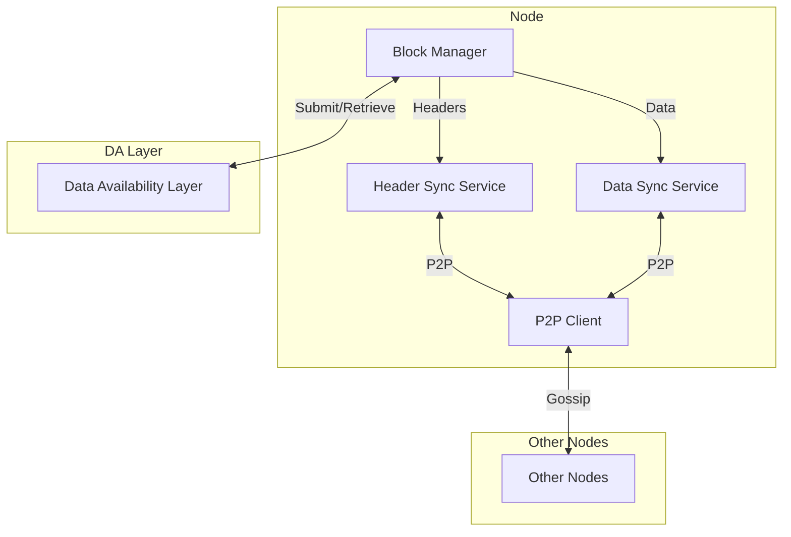
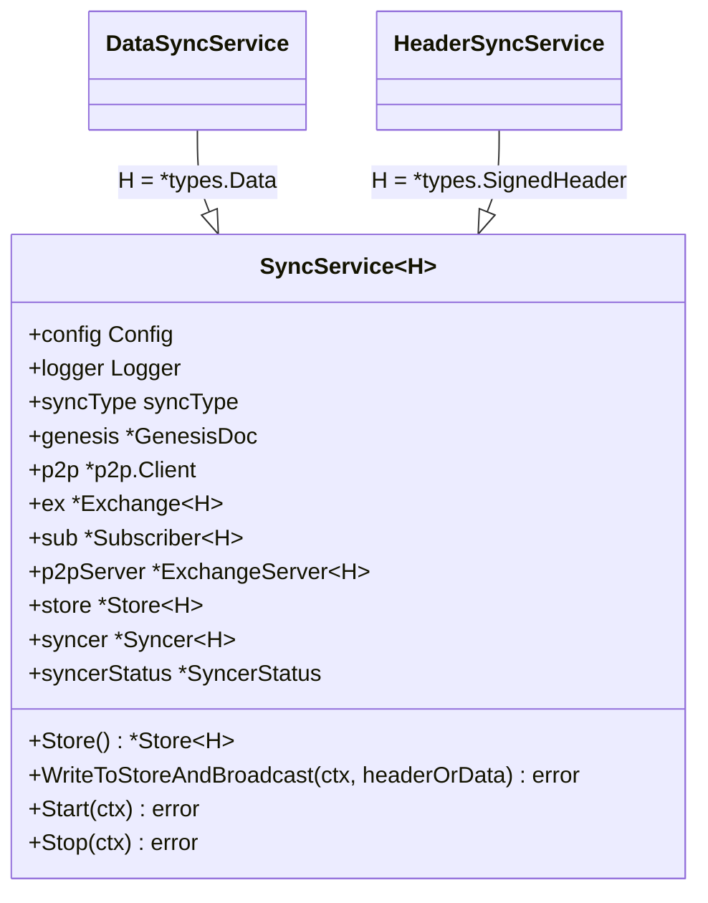
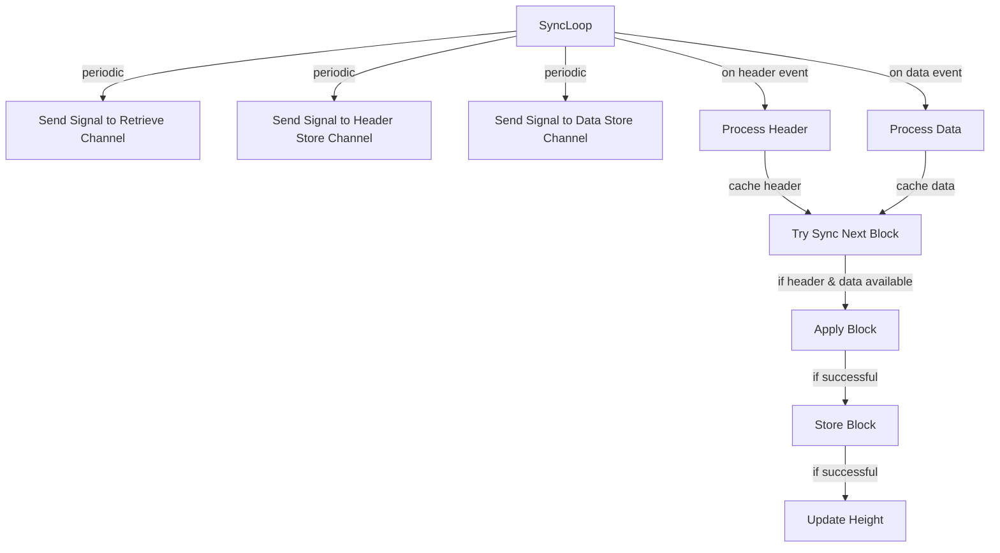
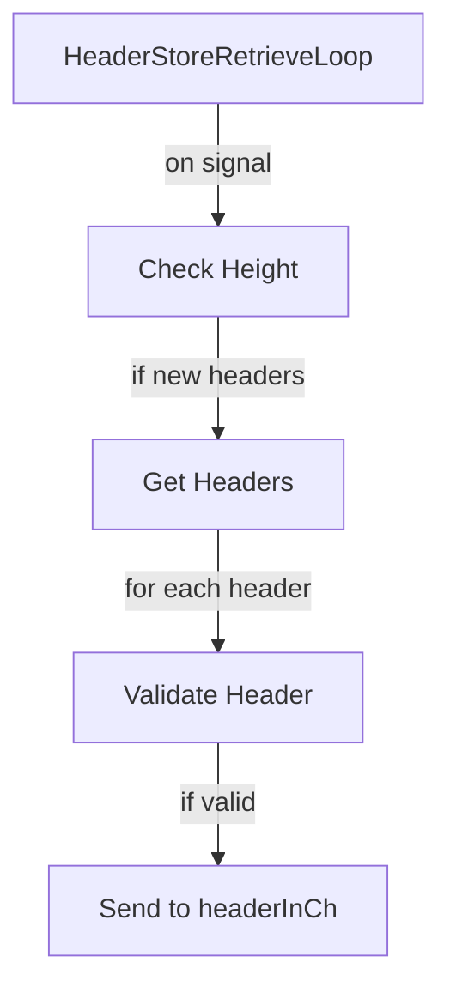
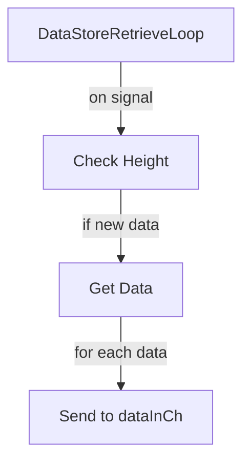
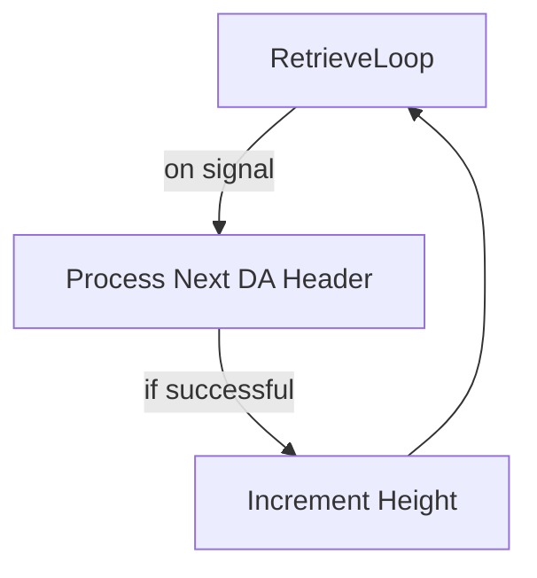

# Rollkit Sync Service

This document explains how the Rollkit Sync Service works, its dependencies, and its architecture.

## Overview

Rollkit's Sync Service is responsible for synchronizing block headers and data across nodes in the Rollkit network. It's a critical component that allows nodes to maintain a consistent view of the blockchain state.

The sync mechanism consists of two main components:

1. **Header Sync Service** - responsible for synchronizing block headers
2. **Data Sync Service** - responsible for synchronizing block data (transactions and metadata)

## Architecture



## Key Components

### 1. SyncService (`pkg/sync/sync_service.go`)

A generic service that implements both header and data synchronization using type parameters:



### 2. Block Manager (`block/manager.go`)

The Block Manager orchestrates the synchronization process through several key goroutines:

#### a. SyncLoop



#### b. HeaderStoreRetrieveLoop



#### c. DataStoreRetrieveLoop



#### d. RetrieveLoop



## Communication Channels

The Block Manager uses several channels for communication between its components:

1. `headerInCh` - Receives headers from both P2P and DA layer
2. `dataInCh` - Receives data from both P2P and DA layer
3. `headerStoreCh` - Signals to check for new headers in the store
4. `dataStoreCh` - Signals to check for new data in the store
5. `retrieveCh` - Signals to retrieve data from the DA layer
6. `HeaderCh` - Sends headers to the HeaderSyncService for broadcasting
7. `DataCh` - Sends data to the DataSyncService for broadcasting

## Synchronization Process

1. Headers and data are received through P2P gossip or retrieved from the DA layer
2. They are stored in the respective stores and cached in memory
3. When both a header and its corresponding data are available, the block is applied
4. The state is updated and the next block is processed
5. New blocks created by the node are broadcast to peers via the P2P network
6. Headers are submitted to the DA layer for finality

## Dependencies

- `github.com/ipfs/go-datastore` - Core datastore interface
- `github.com/ipfs/go-datastore/sync` - Thread-safe datastore wrapper
- `github.com/celestiaorg/go-header` - Header synchronization library
- `github.com/libp2p/go-libp2p` - P2P networking stack
- `github.com/rollkit/rollkit/core/da` - Data Availability client interface

## Data Flow

```mermaid
sequenceDiagram
    participant P as Proposer Node
    participant DA as Data Availability Layer
    participant FN as Full Node

    P->>P: Create Block
    P->>DA: Submit Header to DA
    P->>FN: Broadcast Header (P2P)
    P->>FN: Broadcast Data (P2P)

    FN->>FN: Receive Header via P2P
    FN->>FN: Store Header
    FN->>FN: Receive Data via P2P
    FN->>FN: Store Data

    FN->>FN: Validate and Apply Block

    alt Header missing
        FN->>DA: Retrieve Header
    end

    alt Data missing
        FN->>P: Request Data via P2P
    end
