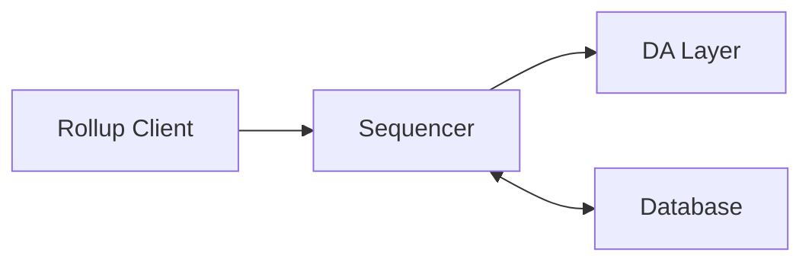
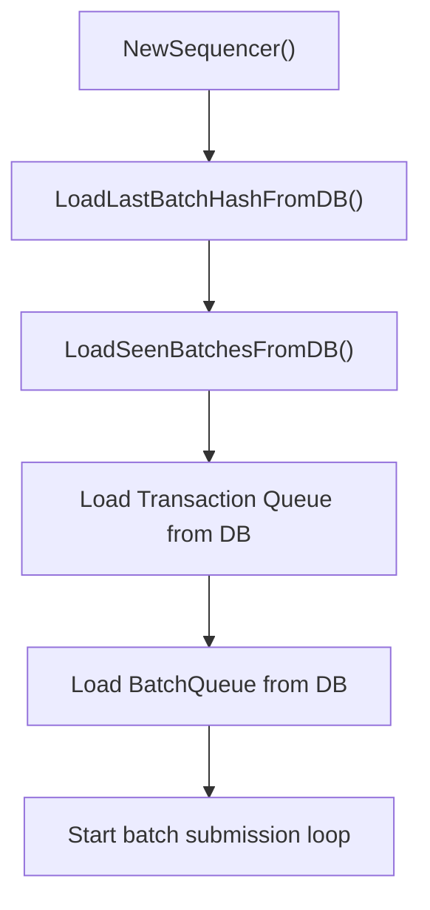
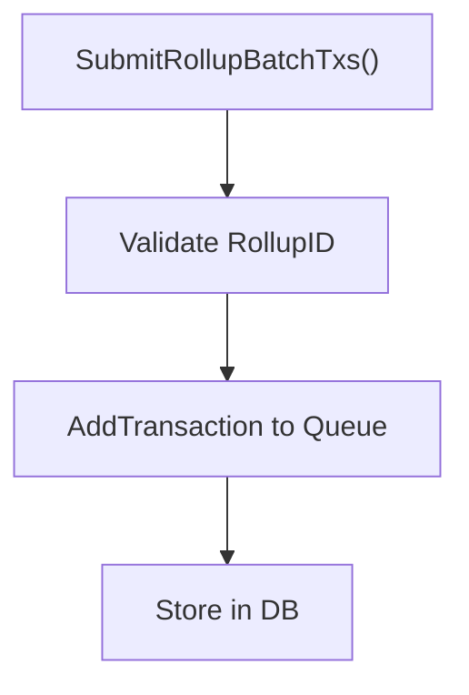
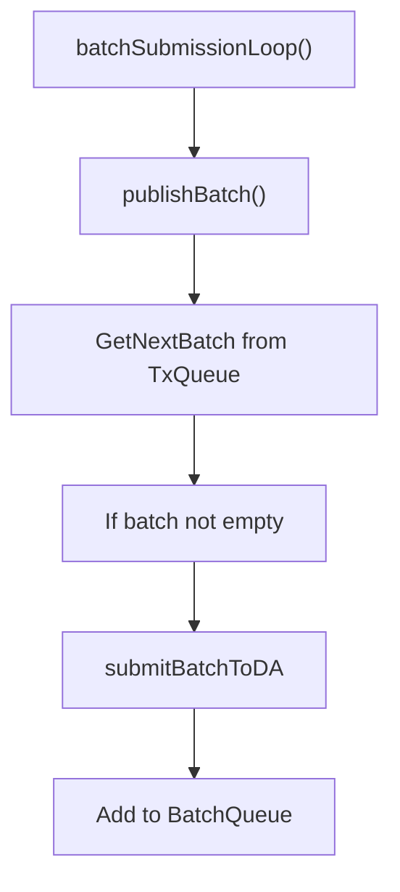
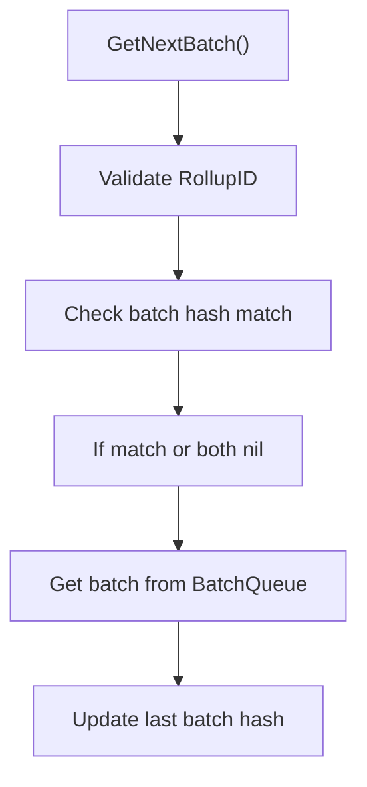
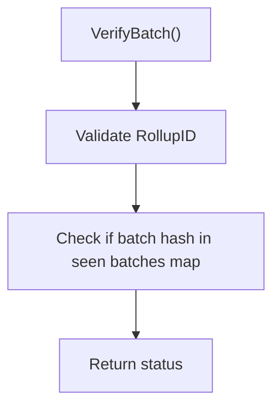

# Centralized Sequencer

The centralized sequencer is a component of the Rollkit framework that handles transaction ordering and batch submission to a Data Availability (DA) layer. It provides a reliable way to sequence transactions for rollups in a centralized manner.

## Overview

The centralized sequencer receives transactions from rollup clients, batches them together, and submits these batches to a Data Availability layer. It maintains transaction and batch queues, handles recovery from crashes, and provides verification mechanisms for batches.



## Components

### Sequencer

The main component that orchestrates the entire sequencing process. It:

- Receives transactions from rollup clients
- Maintains transaction and batch queues
- Periodically creates and submits batches to the DA layer
- Handles recovery from crashes
- Provides verification mechanisms for batches

### TransactionQueue

Manages the queue of pending transactions:

- Stores transactions in memory and in the database
- Provides methods to add transactions and extract batches
- Handles recovery of transactions from the database after a crash

### BatchQueue

Manages the queue of batches:

- Stores batches in memory and in the database
- Provides methods to add and retrieve batches
- Handles recovery of batches from the database after a crash

### DAClient

Handles communication with the Data Availability layer:

- Submits batches to the DA layer
- Retrieves batch status from the DA layer

## Flow of Calls

### Initialization Flow



### Transaction Submission Flow



### Batch Creation and Submission Flow



### Batch Retrieval Flow



### Batch Verification Flow



## Database Layout

The centralized sequencer uses a key-value database to store transactions, batches, and metadata. Here's the layout of the database:

### Keys

| Key Pattern               | Description                                             |
|---------------------------|---------------------------------------------------------|
| `l`                       | Last batch hash                                         |
| `seen:<hex_encoded_hash>` | Marker for seen batch hashes                            |
| `<hex_encoded_hash>`      | Batch data (hash is the batch hash)                     |
| `tx:<tx_hash>`            | Transaction data (hash is SHA-256 of transaction bytes) |

### Key Details

#### Last Batch Hash Key (`l`)

- Stores the hash of the last processed batch
- Used for recovery after a crash
- Value: Raw bytes of the hash

#### Seen Batch Hash Keys (`seen:<hex_encoded_hash>`)

- Marks batches that have been seen and processed
- Used for batch verification
- Value: `1` (presence indicates the batch has been seen)

#### Batch Keys (`<hex_encoded_hash>`)

- Stores the actual batch data
- Key is the hex-encoded hash of the batch
- Value: Protobuf-encoded batch data

#### Transaction Keys (`tx:<tx_hash>`)

- Stores individual transactions
- Key is prefixed with `tx:` followed by the SHA-256 hash of the transaction bytes
- Value: Raw transaction bytes

## Recovery Mechanism

The centralized sequencer implements a robust recovery mechanism to handle crashes:

1. On startup, it loads the last batch hash from the database
2. It loads all seen batch hashes into memory
3. It loads all pending transactions from the database into the transaction queue
4. It loads all pending batches from the database into the batch queue
5. It resumes normal operation, continuing from where it left off

This ensures that no transactions are lost in case of a crash, and the sequencer can continue operating seamlessly.

## Metrics

The sequencer exposes the following metrics:

| Metric                  | Description                                      |
|-------------------------|--------------------------------------------------|
| `gas_price`             | The gas price of DA                              |
| `last_blob_size`        | The size in bytes of the last DA blob            |
| `transaction_status`    | Count of transaction statuses for DA submissions |
| `num_pending_blocks`    | The number of pending blocks for DA submission   |
| `included_block_height` | The last DA included block height                |

These metrics can be used to monitor the health and performance of the sequencer.

## Usage

To create a new centralized sequencer:

```go
seq, err := NewSequencer(
    context.Background(),
    logger,
    database,
    daLayer,
    namespace,
    rollupId,
    batchTime,
    metrics,
)
```

To submit transactions:

```go
response, err := seq.SubmitRollupBatchTxs(
    context.Background(),
    coresequencer.SubmitRollupBatchTxsRequest{
        RollupId: rollupId,
        Batch: &coresequencer.Batch{
            Transactions: [][]byte{transaction},
        },
    },
)
```

To get the next batch:

```go
response, err := seq.GetNextBatch(
    context.Background(),
    coresequencer.GetNextBatchRequest{
        RollupId: rollupId,
        LastBatchHash: lastHash,
    },
)
```

To verify a batch:

```go
response, err := seq.VerifyBatch(
    context.Background(),
    coresequencer.VerifyBatchRequest{
        RollupId: rollupId,
        BatchHash: batchHash,
    },
)
``` 