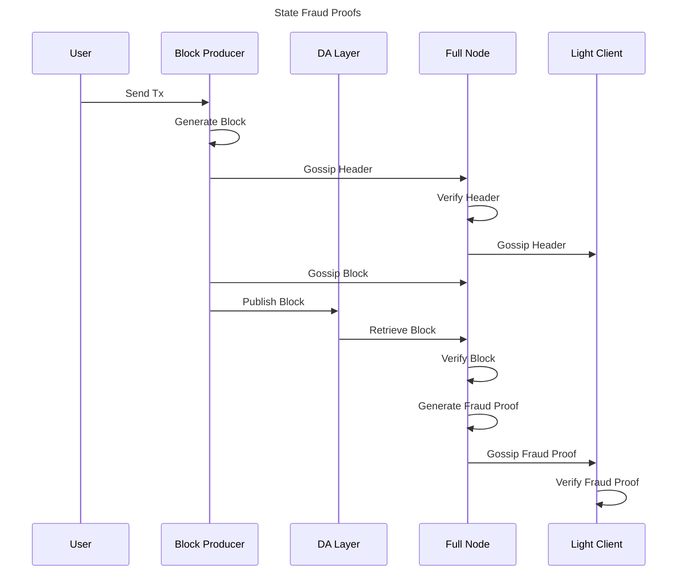

# ADR 009: State Fraud Proofs

## Changelog

- 2022-11-03: Initial draft
- 2023-02-02: Update design with Deep Subtrees and caveats

## Authors

Manav Aggarwal (@Manav-Aggarwal)

## Context

This ADR introduces a design for state fraud proofs in optimistic cosmos-sdk rollups using Rollkit.
It implements parts of Section 4 (Fraud Proofs) of Al-Bassam et al’s paper [“Fraud and Data Availability Proofs: Detecting Invalid Blocks in Light Clients”](http://www0.cs.ucl.ac.uk/staff/M.AlBassam/publications/fraudproofs.pdf).
Some previous notes regarding this topic in the context of cosmos-sdk are described in Matthew Di Ferrante's [notes](https://github.com/rollkit/rollkit/issues/132).

Rollkit's design consists of a single sequencer that posts blocks to the DA layer, and multiple (optional) full nodes. Sequencers gossip block headers to full nodes and full nodes fetch posted blocks from the DA layer. Full nodes then execute transactions in these blocks to update their state, and gossip block headers over P2P to Rollkit light nodes. Once State Fraud Proofs are enabled, when a block contains a fraudulent state transition, Rollkit full nodes can detect it by comparing intermediate state roots (ISRs) between transactions, and generate a state fraud proof that can be gossiped over P2P to Rollkit light nodes. These Rollkit light nodes can then use this state fraud proof to verify whether a fraudulent state transition occurred or not by themselves.

Overall, State Fraud Proofs will enable trust-minimization between full nodes and light node as long as there is at least one honest full node in the system that will generate state fraud proofs.

Note that Rollkit State Fraud Proofs are still a work in progress and will require new methods on top of ABCI, specifically, `GenerateFraudProof`, `VerifyFraudProof`, and `GetAppHash`.

List of caveats and required modifications to push State Fraud Proofs towards completion:

- Add ability for light nodes to receive and verify state fraud proofs.
- Add inclusion proofs over transactions so fraud proof verifiers have knowledge over which rollup transaction is being fraud proven.
- Check for badly formatted underlying rollup data before verifying state transition inside the State Machine.
- Limit number of state witnesses permissible in a state fraud proof since state keys accessed by a transaction can be limited by the state machine.
- Write end to end network tests covering different scenarios that can occur in case of state fraud proof submission by a full node.
- Support for multiple sequencers, in which case, fraud proof detection works the same as described above.
- Support more ABCI-compatible State Machines, in addition to the Cosmos SDK state machine.



## Alternative Approaches

For light clients to detect invalid blocks and verify it themselves, alternatives include downloading the whole state themselves or using zero-knowledge validity proof systems.

## Detailed Design

### Detecting Fraudulent State Transitions

Rollkit blocks contain a field called `Intermediate State Roots` in block data:

```go

// Data defines Rollkit block data.
type Data struct {
	Txs                    Txs
	IntermediateStateRoots IntermediateStateRoots
}
```

These Intermediate State Roots (ISRs) are initially generated by a Rollkit sequencer during block execution which uses the ABCI interface.

The following ABCI methods are called during block execution:
`BeginBlock` at the start of a block
`DeliverTx` for each transaction
`EndBlock` at the end of a block

After each of the above ABCI method calls, we generate an intermediate state root using a new ABCI method we introduce:

```protobuf
service ABCIApplication {
    rpc GetAppHash(RequestGetAppHash) returns (ResponseGetAppHash);
}

message RequestGetAppHash {}

message ResponseGetAppHash {
  bytes app_hash = 1;
}
```

This `GetAppHash` ABCI method returns an equivalent of `CommitID` hash in the ABCI method `Commit` and thus provides a way to extract ISRs from an app without doing any disk write operations.

Full nodes use these ISRs to detect fraudulent state transitions. A full node must also execute all state transitions (`BeginBlock`, `DeliverTx`, and `EndBlock` calls) and compute its own Intermediate State Roots (ISRs). After each state transition, a full node compares the corresponding ISR with the ISR given by the Sequencer. If it finds a mismatch between its own computed ISR and and one given by the Sequencer, a fraudulent transition is detected and it moves on to generate a State Fraud Proof.

### Generating State Fraud Proofs

Note: Starting from this section, this ADR refers to State Fraud Proofs simply as Fraud Proofs.

We introduce the following ABCI method to enable Fraud Proof Generation in the Cosmos SDK:

```protobuf
service ABCIApplication {
    rpc GenerateFraudProof(RequestGenerateFraudProof) returns (ResponseGenerateFraudProof);
}
```

With this new ABCI method, a Rollkit Full Node can send a request to a Cosmos SDK app to generate a Fraud Proof. In this request, it includes a list of all the state transitions from the start of the block upto the fraudulent state transition. The last non-nil state transition in this list corresponds to the fraudulent state transition.

```protobuf
message RequestGenerateFraudProof {
  // All state transitions upto and including the fraudulent state transition
  RequestBeginBlock begin_block_request = 1 [(gogoproto.nullable) = false];
  repeated RequestDeliverTx deliver_tx_requests = 2;
  RequestEndBlock end_block_request = 3;
}
```

The `GenerateFraudProof` method in the Cosmos SDK app receives this list of state transitions and takes the following steps to generate a fraud proof:

- Revert local state to the last committed state
- Execute all the non-fraudulent state transitions
- Enable tracing and execute the fraudulent state transition. Tracing stores logs of what state, specifically key/value pairs, is accessed during this fraudulent state transition and generates corresponding merkle inclusion proofs of each action (read, write, delete) log. These logs correspond to state witnesses needed to re-execute this state transition.
- Revert local state back to the last committed state
- Execute all the non-fraudulent state transitions again
- Construct a State Fraud Proof with the state witnesses generated earlier which looks like this:

```protobuf

// Represents a single-round state fraudProof
message FraudProof {
  // The block height during which the fraudulent state transition occurred
  uint64 block_height = 1;
  // Intermediate State Root right before the fraudulent state transition
  bytes pre_state_app_hash = 2;
  // Intermediate State Root right after the fraudulent state transition
  bytes expected_valid_app_hash = 3;

  // Map from an app module name to a State Witness
  map<string, StateWitness> state_witness = 4;

  // Fraudulent state transition has to be one of these
  // Only one of these three can be non-nil
  RequestBeginBlock fraudulent_begin_block = 5;
  RequestDeliverTx fraudulent_deliver_tx = 6;
  RequestEndBlock fraudulent_end_block = 7;
}

// State witness with a list of all witness data
message StateWitness {
  // store level merkle inclusion proof
  tendermint.crypto.ProofOp proof = 1;
  // merkle root hash of the substore
  bytes root_hash = 2;
  // List of witness data
  repeated WitnessData witness_data = 3;
}

// Witness data containing operation, a key/value pair, and Merkle 
// inclusion proofs needed for corresponding operation for key/value pair
message WitnessData {
  Operation operation = 1;
  bytes key = 2;
  // only set for "write" operation
  bytes value = 3;
  repeated tendermint.crypto.ProofOp proofs = 4;
}

enum Operation {
   WRITE     = 0 [(gogoproto.enumvalue_customname) = "write"];
   READ      = 1 [(gogoproto.enumvalue_customname) = "read"];
   DELETE    = 2 [(gogoproto.enumvalue_customname) = "delete"];
}
```

Finally, return this generated state fraud proof back to the Rollkit Full Node:

```protobuf
message ResponseGenerateFraudProof {
  FraudProof fraud_proof = 1;
}
```

Note that currently the only underlying store supported by Cosmos SDK is the Merkle IAVL+ tree. As part of generating state witnesses, we added preliminary support for Deep Subtrees to this library [here](https://github.com/rollkit/iavl/tree/deepsubtrees_0.19.x). It enables import and export of partial state and adds tracing to IAVL trees. Note that documentation and exploring optimizations of Deep Subtrees is a work in progress.

### Gossiping Fraud Proofs

After a Rollkit Full Node generates a Fraud Proof, it gossips the Fraud Proof over P2P to Rollkit light clients.

### Verifying Fraud Proofs

Rollkit light clients should be able to use these gossiped state fraud proofs to verify whether a fraudulent state transition occurred or not by themselves.

There are four stages of verification that must occur for a Fraud Proof. The first three stages take place in Rollkit and verify that the fraud proof itself was generated correctly. The fourth stage takes place in a Cosmos SDK app to actually execute the fraudulent state transition embedded in the fraud proof.

#### **Stage One**

Verify that both the `appHash` (ISR) and the fraudulent state transition in the `FraudProof` exist as part of a block published on the DA layer within a specified fraud proof window. This involves verifying that the blob corresponding to the block is posted on the DA layer via a Blob Inclusion Proof and verifying the share(s) containing the fraudulent state transition and `appHash` were part of that blob via Share Inclusion Proof(s).

#### **Stage Two**

Go through the `state_witness` list in the `FraudProof` and verify that all the store level merkle inclusion proofs are valid: the corresponding `root_hash` was included in a merkle tree with root `appHash`.

#### **Stage Three**

Go through the `WitnessData` in each `StateWitness` and verify that the first substore level merkle inclusion proof is valid: the corresponding `key` was included in a merkle tree with root `root_hash`. Note that we can only verify the first witness in this witnessData with current root hash. Other proofs are verified in the IAVL tree when re-executing operations in the underlying IAVL Deep Subtree.

#### **Stage Four**

Spin up a new Cosmos SDK app and initialize its store with Deep Subtrees constructed using witness data in the `FraudProof`. After this initialization, the app hash representing the state of the app should match the `appHash` inside the `FraudProof`. This store should now contain all the key/value pairs and underlying tree structure necessary to execute the fraudulent state transition contained in the `FraudProof`.

We introduce the following ABCI method to enable Fraud Proof Verification in the Cosmos SDK:

```protobuf
service ABCIApplication {
    rpc VerifyFraudProof(RequestVerifyFraudProof) returns (ResponseVerifyFraudProof);
}
```

With this new ABCI method, a Rollkit light client can send a request to a newly initialized Cosmos SDK app to verify whether executing a state transition on the app would lead to a particular app hash. In this request, it includes the fraudulent state transition and an expected app hash to match against.

```protobuf
message RequestVerifyFraudProof {
  FraudProof fraud_proof = 1;

  // Note: to be removed. Moved inside state fraud proof
  bytes expected_valid_app_hash = 2;
}
```

The `VerifyFraudProof` method in the Cosmos SDK app receives this fraudulent state transition and expected app hash, and takes the following steps to complete this verification step:

- Execute the provided fraudulent state transition
- Get the app hash and compare it against the expected app hash
- Return a boolean representing whether the two app hashes above match or not.

```protobuf
message ResponseVerifyFraudProof {
  bool success = 1;
}
```

If a fraud proof is successfully verified, the Rollkit light client can halt and wait for an off-chain social recovery process. Otherwise, it ignores the Fraud Proof and proceeds as usual.

## Status

Proposed

## Consequences

### Positive

- Enables trust-minimization between Rollkit Full nodes and Light clients.
- Introduces an honest minority assumption for Rollkit full nodes.

### Negative

- Breaks ABCI compatibility and requires maintaining an ABCI version specific to Rollkit.

<!--- ### Neutral -->

## Working Branches

A prototype implementation of the above design is available in the following working branches:

- [Rollkit](https://github.com/rollkit/rollkit/releases/tag/v0.6.0): Contains fraud proof detection and gossiping logic. As fraud proofs are currently a work in progress, this logic can be toggled using a flag `--rollkit.experimental_insecure_fraud_proofs`. By default, this flag is set to `false`.
- [Cosmos-SDK](https://github.com/rollkit/cosmos-sdk-old/tree/manav/fraudproof_iavl_prototype): Implements the new ABCI methods described.
- [Tendermint](https://github.com/rollkit/tendermint/tree/abci_fraud_proofs): Contains modifications to the ABCI interface described.
- [IAVL](https://github.com/rollkit/iavl/tree/deepsubtrees_0.19.x): Adds support for Deep Subtrees and tracing.

## References

> Are there any relevant PR comments, issues that led up to this, or articles referenced for why we made the given design choice? If so link them here!

- <http://www0.cs.ucl.ac.uk/staff/M.AlBassam/publications/fraudproofs.pdf>
- <https://github.com/rollkit/rollkit/issues/132>
- <https://github.com/rollkit/rollkit/issues/514>
