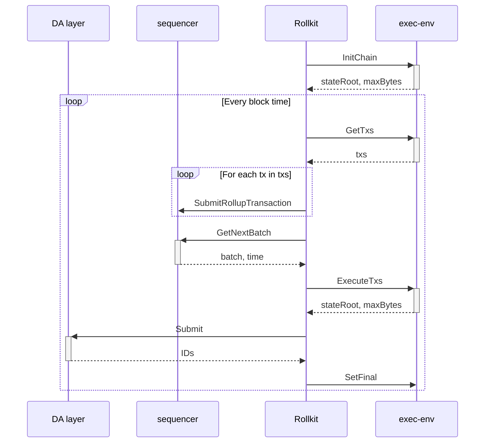
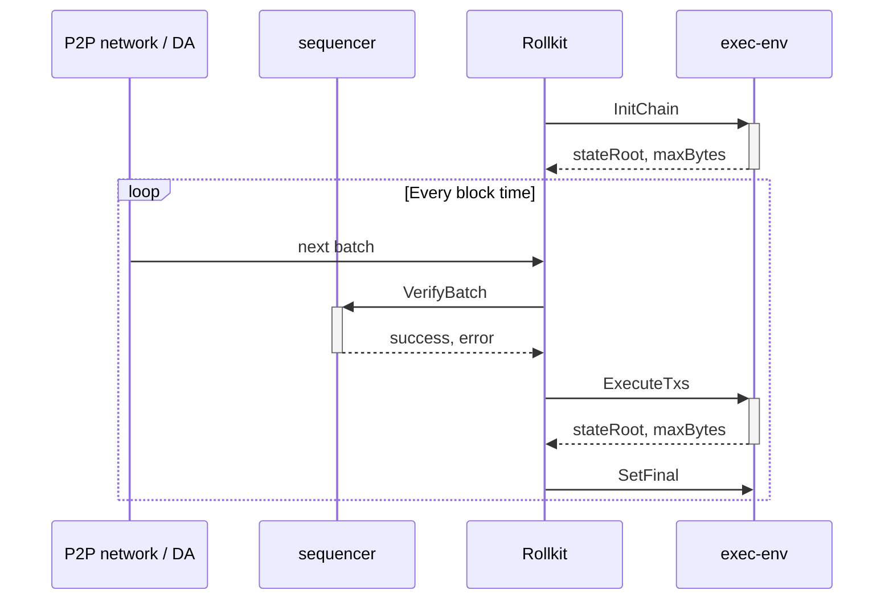

# ADR 10: Execution API

## Changelog

- 2025.01.13: Initial draft

## Context

Introduction of the Execution API makes rollkit very generic and execution-environment agnostic.
It removes all ABCI-centric code for full interoperability with other types of VMs.

## Alternative Approaches

1. Maintain current state: keep ABCI interface and implement other VMs inside ABCI application.
2. Migrate to Engine API.
3. Create new API generic enough to handle any arbitrary VM.

## Decision

New generic Execution API is proposed.
It was designed to accommodate ABCI, Engine API, and any other VM / execution environment.

## Detailed Design

> This section does not need to be filled in at the start of the ADR, but must be completed prior to the merging of the implementation.
>
> Here are some common questions that get answered as part of the detailed design:
>
> - What are the user requirements?
>
> - What systems will be affected?
>
> - What new data structures are needed, what data structures will be changed?
>
> - What new APIs will be needed, what APIs will be changed?
>
> - What are the efficiency considerations (time/space)?
>
> - What are the expected access patterns (load/throughput)?
>
> - Are there any logging, monitoring or observability needs?
>
> - Are there any security considerations?
>
> - Are there any privacy considerations?
>
> - How will the changes be tested?
>
> - If the change is large, how will the changes be broken up for ease of review?
>
> - Will these changes require a breaking (major) release?
>
> - Does this change require coordination with the LazyLedger fork of the SDK or lazyledger-app?

### API

Execution API consist of 4 methods defined in [go-execution](https://github.com/rollkit/go-execution) repository.

```go
// Executor defines a common interface for interacting with the execution client.
type Executor interface {
	// InitChain initializes the blockchain with genesis information.
	InitChain(ctx context.Context, genesisTime time.Time, initialHeight uint64, chainID string) (stateRoot types.Hash, maxBytes uint64, err error)

	// GetTxs retrieves all available transactions from the execution client's mempool.
	GetTxs(ctx context.Context) ([]types.Tx, error)

	// ExecuteTxs executes a set of transactions to produce a new block header.
	ExecuteTxs(ctx context.Context, txs []types.Tx, blockHeight uint64, timestamp time.Time, prevStateRoot types.Hash) (updatedStateRoot types.Hash, maxBytes uint64, err error)

	// SetFinal marks a block at the given height as final.
	SetFinal(ctx context.Context, blockHeight uint64) error
}
```

### API Methods specification

#### `InitChain`

##### Description

Initializes the blockchain's state based on genesis information. This method is invoked at the beginning of the blockchain's lifecycle to prepare the execution environment for subsequent operations.

##### Inputs

- `ctx` (`context.Context`): Context for managing request timeouts and cancellations.
- `genesisTime` (`time.Time`): The initial timestamp of the rollup.
- `initialHeight` (`uint64`): The starting height of the rollup.
- `chainID` (`string`): A unique identifier of the rollup network.

##### Outputs

- `stateRoot` (`types.Hash`): The resulting state root after initializing the chain.
- `maxBytes` (`uint64`): Maximum block size in bytes, as defined by the genesis configuration.
- `err` (`error`): An error, if the initialization process fails.

##### Expected Behavior

- Initialize rollup according to the genesis.
- Generate an initial `stateRoot` representing the genesis state of the rollup.
- Return the maximum allowable block size (`maxBytes`).

#### `GetTxs`

##### Description

Fetches all pending transactions from the execution client's mempool.
Transactions returned by execution client will be passed by rollkit to sequencer.

##### Inputs

- `ctx` (`context.Context`): Context for managing request timeouts and cancellations.

##### Outputs

- `txs` (`[]types.Tx`): Slice of transactions retrieved from the execution client's mempool; ordering doesn't matter.
- `err` (`error`): An error, if any, while retrieving transactions.

##### Expected Behavior

- Access the mempool and retrieve all available transactions.
- If no transactions are available, return an empty slice without error.
- Do not remove ("reap") transactions from mempool.

#### `ExecuteTxs`

##### Description

Executes a given set of transactions, updating the blockchain state.

##### Inputs

- `ctx` (`context.Context`): Context for managing request timeouts and cancellations.
- `txs` (`[]types.Tx`): A slice of transactions to be executed.
- `blockHeight` (`uint64`): The height of the block these transactions belong to.
- `timestamp` (`time.Time`): The block's timestamp.
- `prevStateRoot` (`types.Hash`): The state root of the rollup before applying the transactions.

##### Outputs

- `updatedStateRoot` (`types.Hash`): The resulting state root after applying the transactions.
- `maxBytes` (`uint64`): Maximum block size in bytes, as allowed for the block being produced.
- `err` (`error`): An error, if any, during the execution process.

##### Expected Behavior

- Validate and apply the provided transactions to the current blockchain state.
- Generate an updated `stateRoot` reflecting changes introduced by the transactions.
- Enforce block size and validity limits, returning errors if constraints are violated.
- Respect the ordering of transactions.
- Update the mempool to remove all executed transactions.

#### `SetFinal`

##### Description

Marks a block at the specified height as final, guaranteeing immutability for consensus purposes.

##### Inputs

- `ctx` (`context.Context`): Context for managing request timeouts and cancellations.
- `blockHeight` (`uint64`): The height of the block to be finalized.

##### Outputs

- `err` (`error`): An error, if any, during the finalization process.

##### Expected Behavior

- Update the execution client's internal state to reflect that the specified block is final and immutable.
- Ensure additional guarantees like cleaning up unnecessary resources associated with blocks deemed final.

#### General Notes

1. **Thread-Safety**: All methods are not expected to be thread-safe, concurrent calls are not planned.
2. **Error Handling**: All methods should follow robust error handling practices, ensuring meaningful errors are returned when issues occur.
3. **Context Usage**: Methods should respect context-based deadlines and cancellations for long-running operations.

### Sequence Diagrams

#### Block production



#### Block sync from P2P network or DA



### Changes in Rollkit

Because of improved separation of concerns, logic related to actual execution can be removed from rollkit.
Rollkit will turn from fully-fledged ABCI client to kind of orchestrator, gluing together multiple modules.
The role of Rollkit is coordination of Sequencer and Execution Environment and recording results in Data Availability layer.

Currently, Rollkit exposes ABCI and CometBFT compatible RPCs, manages genesis processing and mempool.
This logic belongs to Execution Environment, and will be moved to Execution API implementations.

Removal of this logic from Rollkit enables further refactoring, for example removing all CometBFT dependencies.

#### Main changes in Rollkit packages

##### `block`

1. New processing in `Manager` - move from ABCI to Execution API oriented processing.

##### `node`

1. Simplification of `Node` interface.
2. Removal of `LightClient` and `FullClient`.
3. Cleanup/simplification of `FullNode` and `LightNode`.

##### `rpc`

1. Removal of ABCI and CometBFT methods.
2. Introduction of Rollkit specific methods.

##### Other packages
Probably all the packages will be affected by cleanup and refactoring.

## Status

Accepted

## Consequences

### Positive

1. Simplification of rollkit's logic.
2. Better separation of concerns.
3. Removal of ABCI dependencies.

### Negative

1. More difficult deployment (another binary is needed).
2. Need to reimplement ABCI execution environment.

### Neutral

1. Need to introduce new API exposed by rollkit.

## References

- [Rollkit EPIC for Execution API](https://github.com/rollkit/rollkit/issues/1802)
