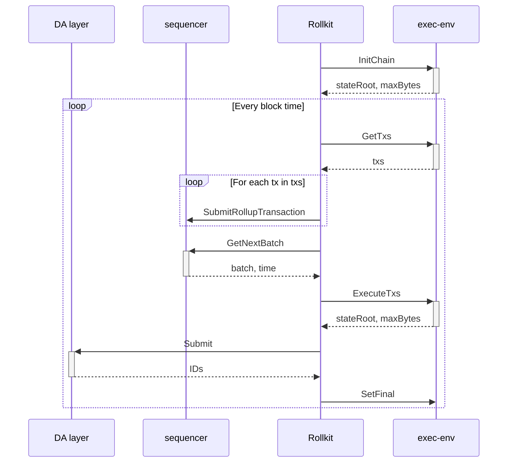
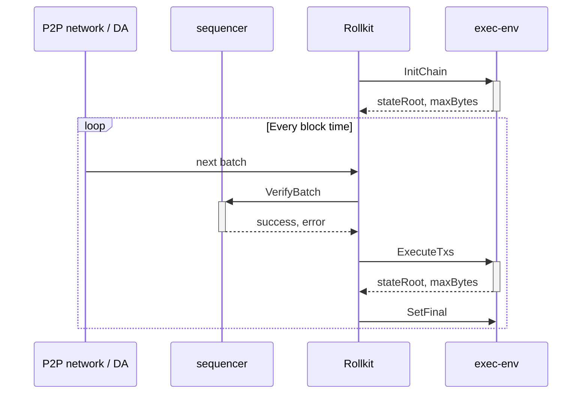

# ADR 10: Execution API

## Changelog

- 2025.01.13: Initial draft

## Context

Introduction of the Execution API makes rollkit very generic and execution-environment agnostic.
It removes all ABCI-centric code for full interoperability with other types of VMs.

## Alternative Approaches

1. Maintain current state: keep ABCI interface and implement other VMs inside ABCI application.
2. Migrate to Engine API.
3. Create new API generic enough to handle any arbitrary VM.

## Decision

New generic Execution API is proposed.
It was designed to accommodate ABCI, Engine API, and any other VM / execution environment.

## Detailed Design

> This section does not need to be filled in at the start of the ADR, but must be completed prior to the merging of the implementation.
>
> Here are some common questions that get answered as part of the detailed design:
>
> - What are the user requirements?
>
> - What systems will be affected?
>
> - What new data structures are needed, what data structures will be changed?
>
> - What new APIs will be needed, what APIs will be changed?
>
> - What are the efficiency considerations (time/space)?
>
> - What are the expected access patterns (load/throughput)?
>
> - Are there any logging, monitoring or observability needs?
>
> - Are there any security considerations?
>
> - Are there any privacy considerations?
>
> - How will the changes be tested?
>
> - If the change is large, how will the changes be broken up for ease of review?
>
> - Will these changes require a breaking (major) release?
>
> - Does this change require coordination with the LazyLedger fork of the SDK or lazyledger-app?

### API

Execution API consist of 4 methods defined in [go-execution](https://github.com/rollkit/go-execution) repository.

```go
// Executor defines a common interface for interacting with the execution client.
type Executor interface {
	// InitChain initializes the blockchain with genesis information.
	InitChain(ctx context.Context, genesisTime time.Time, initialHeight uint64, chainID string) (stateRoot types.Hash, maxBytes uint64, err error)

	// GetTxs retrieves all available transactions from the execution client's mempool.
	GetTxs(ctx context.Context) ([]types.Tx, error)

	// ExecuteTxs executes a set of transactions to produce a new block header.
	ExecuteTxs(ctx context.Context, txs []types.Tx, blockHeight uint64, timestamp time.Time, prevStateRoot types.Hash) (updatedStateRoot types.Hash, maxBytes uint64, err error)

	// SetFinal marks a block at the given height as final.
	SetFinal(ctx context.Context, blockHeight uint64) error
}
```

### API Methods

#### `InitChain`

#### `GetTxs`

#### `ExecuteTxs`

#### `SetFinal`

### Sequence Diagrams 

#### Block production


#### Block sync from P2P network or DA


## Status

Accepted

## Consequences

### Positive

1. Simplification of rollkit's logic.
2. Better separation of concerns.
3. Removal of ABCI dependencies.

### Negative

1. More difficult deployment (another binary is needed).
2. Need to reimplement ABCI execution environment. 

### Neutral

1. Need to introduce new API exposed by rollkit.

## References

- https://github.com/rollkit/rollkit/issues/1802
