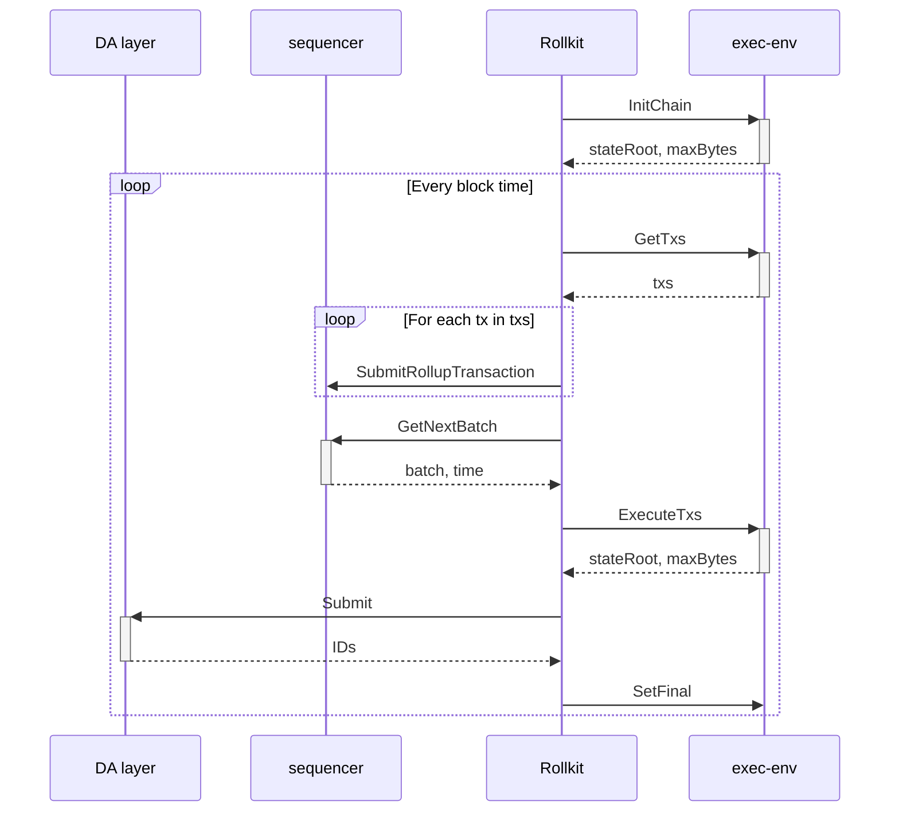
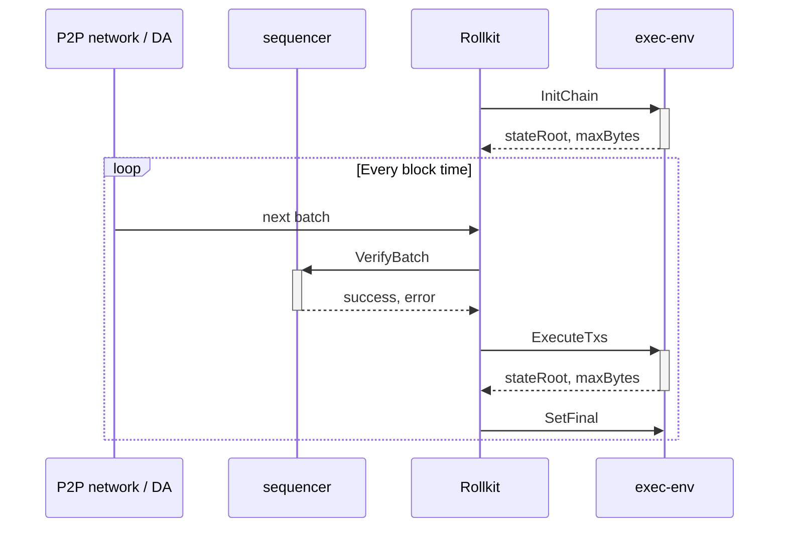

# ADR 10: Execution API

## Changelog

- 2025.01.13: Initial draft
- 2025.04.24: Various improvements

## Context

Introduction of the Execution API makes rollkit very generic and execution-environment agnostic.
It removes all ABCI-centric code for full interoperability with other types of VMs.

The Execution API serves as a bridge between Rollkit and various execution environments (VMs),
allowing Rollkit to remain agnostic to the specific implementation details of the execution layer.
This separation enables:

1. Support for multiple VM types (EVM, WASM, etc.)
2. Easier integration with different execution environments
3. Cleaner separation of concerns between consensus and execution
4. More flexible and maintainable architecture

## Alternative Approaches

1. Maintain current state: keep ABCI interface and implement other VMs inside ABCI application.
   - Pros: No changes required to existing code
   - Cons: ABCI-specific code remains, limiting flexibility
2. Migrate to Engine API.
   - Pros: Standard interface for EVM-based chains
   - Cons: Too specific to EVM, not suitable for other VMs

## Decision

New generic Execution API is proposed.
It was designed to accommodate ABCI, Engine API, and any other VM / execution environment.

## Detailed Design

### API

Execution API consist of 4 methods defined in [go-execution](https://github.com/rollkit/go-execution) repository.

```go
// Executor defines a common interface for interacting with the execution client.
type Executor interface {
	// InitChain initializes the blockchain with genesis information.
	InitChain(ctx context.Context, genesisTime time.Time, initialHeight uint64, chainID string) (stateRoot types.Hash, maxBytes uint64, err error)

	// GetTxs retrieves all available transactions from the execution client's mempool.
	GetTxs(ctx context.Context) ([]types.Tx, error)

	// ExecuteTxs executes a set of transactions to produce a new block header.
	ExecuteTxs(ctx context.Context, txs []types.Tx, blockHeight uint64, timestamp time.Time, prevStateRoot types.Hash) (updatedStateRoot types.Hash, maxBytes uint64, err error)

	// SetFinal marks a block at the given height as final.
	SetFinal(ctx context.Context, blockHeight uint64) error
}
```

### API Methods specification

#### `InitChain`

##### Description

Initializes the blockchain's state based on genesis information. This method is invoked at the beginning of the blockchain's lifecycle to prepare the execution environment for subsequent operations.

##### Inputs

- `ctx` (`context.Context`): Context for managing request timeouts and cancellations.
- `genesisTime` (`time.Time`): The initial timestamp of the rollup.
- `initialHeight` (`uint64`): The starting height of the rollup.
- `chainID` (`string`): A unique identifier of the rollup network.

##### Outputs

- `stateRoot` (`types.Hash`): The resulting state root after initializing the chain.
- `maxBytes` (`uint64`): Maximum block size in bytes, as defined by the execution client's genesis configuration.
- `err` (`error`): An error, if the initialization process fails.

##### Expected Behavior

- Initialize rollup according to the genesis.
- Generate an initial `stateRoot` representing the genesis state of the rollup.
- Return the maximum allowable block size (`maxBytes`).
- Ensure all necessary state is initialized for subsequent operations.

#### `GetTxs`

##### Description

Fetches all pending transactions from the execution client's mempool.
Transactions returned by execution client will be passed by rollkit to sequencer.

##### Inputs

- `ctx` (`context.Context`): Context for managing request timeouts and cancellations.

##### Outputs

- `txs` (`[]types.Tx`): Slice of transactions retrieved from the execution client's mempool; ordering doesn't matter.
- `err` (`error`): An error, if any, while retrieving transactions.

##### Expected Behavior

- Access the mempool and retrieve all available transactions.
- If no transactions are available, return an empty slice without error.
- Do not remove ("reap") transactions from mempool.
- Ensure transactions are valid and properly formatted.

#### `ExecuteTxs`

##### Description

Executes a given set of transactions, updating the blockchain state.

##### Inputs

- `ctx` (`context.Context`): Context for managing request timeouts and cancellations.
- `txs` (`[]types.Tx`): A slice of transactions to be executed.
- `blockHeight` (`uint64`): The height of the block these transactions belong to.
- `timestamp` (`time.Time`): The block's timestamp.
- `prevStateRoot` (`types.Hash`): The state root of the rollup before applying the transactions.

##### Outputs

- `updatedStateRoot` (`types.Hash`): The resulting state root after applying the transactions.
- `maxBytes` (`uint64`): Maximum block size in bytes, as allowed for the block being produced.
- `err` (`error`): An error, if any, during the execution process.

##### Expected Behavior

- Validate and apply the provided transactions to the current blockchain state.
- Generate an updated `stateRoot` reflecting changes introduced by the transactions.
- Enforce block size and validity limits, returning errors if constraints are violated.
- Respect the ordering of transactions.
- Update the mempool to remove all executed transactions.
- Ensure atomic execution - either all transactions succeed or none do.

#### `SetFinal`

##### Description

Marks a block at the specified height as final, guaranteeing immutability for consensus purposes.

##### Inputs

- `ctx` (`context.Context`): Context for managing request timeouts and cancellations.
- `blockHeight` (`uint64`): The height of the block to be finalized.

##### Outputs

- `err` (`error`): An error, if any, during the finalization process.

##### Expected Behavior

- Update the execution client's internal state to reflect that the specified block is final and immutable.
- Ensure additional guarantees like cleaning up unnecessary resources associated with blocks deemed final.
- Prevent any modifications to finalized blocks.
- Optimize storage for finalized blocks if possible.

#### General Notes

1. **Thread-Safety**: All methods are not expected to be thread-safe, concurrent calls are not planned.
2. **Error Handling**: All methods should follow robust error handling practices, ensuring meaningful errors are returned when issues occur.
3. **Context Usage**: Methods should respect context-based deadlines and cancellations for long-running operations.
4. **State Management**: The execution environment is responsible for maintaining its own state and ensuring consistency.
5. **Atomicity**: Operations that modify state should be atomic - either fully succeed or fully fail.

### Types

The Execution API was designed to be highly generic. As a result, the types introduced in the API are intentionally abstract to ensure compatibility across various virtual machines and execution environments.

1. `types.Hash` represents a cryptographic hash. To maintain generality, it is implemented as an alias for `[]byte`.
2. `types.Tx` represents a transaction in the most basic form. It is also defined as an alias for `[]byte`.

This design choice ensures maximum flexibility and allows the API to remain independent of specific implementations or formats. It facilitates interoperability across different execution environments while keeping the API lightweight and adaptable.

### Block Size Management

The Execution API includes `maxBytes` as a return value in both `InitChain` and `ExecuteTxs` methods. This parameter plays a crucial role in block size management:

1. **Initial Configuration**: During `InitChain`, the execution environment returns the maximum block size allowed by its genesis configuration. This value is used by Rollkit to enforce block size limits during block production.

2. **Dynamic Adjustment**: In `ExecuteTxs`, the execution environment can return an updated `maxBytes` value. This allows for dynamic adjustment of block size limits based on:
   - Network conditions
   - Resource availability
   - Protocol-specific requirements
   - Other runtime factors

3. **Implementation Requirements**:
   - The execution environment must ensure that blocks produced do not exceed the returned `maxBytes` value
   - If a block would exceed the limit, the execution environment should return an error
   - The value should be consistent with the execution environment's capabilities and constraints
   - A protocol overhead buffer is subtracted from the DA layer's max blob size to account for block headers and encoding

4. **System-wide Coordination**:
   - Rollkit gets the initial `maxBytes` value from the DA layer and passes it to the sequencer
   - The sequencer uses this value to limit the size of transaction batches it creates
   - The sequencer's `PopUpToMaxBytes` method ensures transactions don't exceed the size limit
   - This coordination ensures consistent block size constraints across the entire system

5. **Usage in Rollkit**:
   - Rollkit uses this value to validate block sizes before submission
   - Helps prevent oversized blocks from being produced
   - Enables dynamic adjustment of block size limits without protocol changes

### Implementation Guidelines

1. **State Management**:
   - Execution environments must maintain their own state
   - State transitions should be atomic
   - State should be persisted appropriately
   - State should be recoverable after crashes

2. **Error Handling**:
   - Return meaningful error messages
   - Handle context cancellations gracefully
   - Ensure proper cleanup on errors
   - Maintain state consistency even after errors

3. **Performance Considerations**:
   - Optimize for common operations
   - Consider caching where appropriate
   - Handle large state sizes efficiently
   - Minimize unnecessary state transitions

4. **Security**:
   - Validate all inputs thoroughly
   - Prevent unauthorized state modifications
   - Ensure proper access control
   - Handle sensitive data appropriately

### Sequence Diagrams

#### Block production



#### Block sync from P2P network or DA



## Status

Accepted

## Consequences

### Positive

1. Simplification of rollkit's logic.
2. Better separation of concerns.
3. Removal of ABCI dependencies.
4. Increased flexibility for different execution environments.
5. Cleaner architecture with well-defined boundaries.

### Negative

1. More difficult deployment (another binary is needed).
2. Need to reimplement ABCI execution environment.
3. Additional complexity in coordinating between components.
4. Potential performance overhead from additional abstraction layer.

### Neutral

1. Need to introduce new API exposed by rollkit.
2. Changes to existing deployment procedures.
3. Updates to documentation and tooling required.

## References

- [Rollkit EPIC for Execution API](https://github.com/rollkit/rollkit/issues/1802)
- [go-execution repository](https://github.com/rollkit/go-execution)
