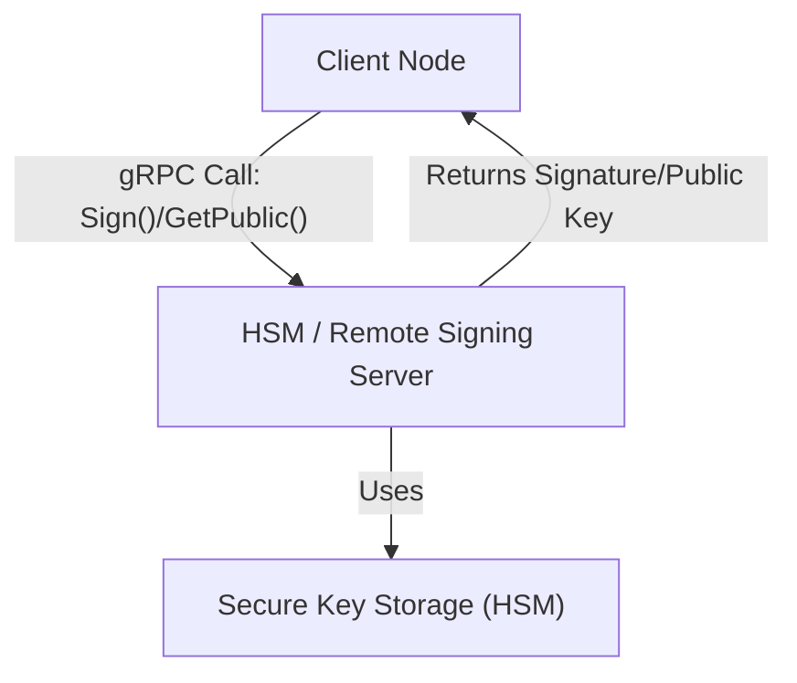

# ADR 010: Remote Signing Service for Fast and Secure Digital Signatures

## Changelog

- 2025-03-14: Initial ADR creation including remote and local signing implementations, gRPC client/server flow.

## Context

Rollkit with single or multiple signers requires a fast, secure, and flexible digital signing solution. Currently, nodes perform local signing using keys stored on disk, in plain. However, this approach distributes private keys across many nodes, increasing the risk of compromise. By centralizing the signing process behind a remote service—ideally backed by an HSM (Hardware Security Module)—we can both secure our keys and achieve high availability. This remote signing service will also allow clients written in different languages to use a unified API through gRPC.

## Alternative Approaches

- **Local File-Based Signing Only:**
    While simpler to implement and sufficient for development, this approach requires each node to hold a copy of the private key, increasing the risk of key compromise and reducing overall system security.

- **REST API for Remote Signing:**
    A RESTful service could be implemented for signing, but it would likely have higher latency and overhead compared to gRPC. Additionally, REST is less efficient for binary data transfers required for cryptographic operations.

- **Direct HSM Integration at Each Node:**
    Integrating HSMs directly with every node would be secure but expensive and complex to manage at scale.

The chosen approach of a centralized, remote signing service via gRPC offers a balance of security, performance, and ease of multi-language support.

## Decision

We will implement a remote signing service that uses gRPC to communicate between the client node and the signing server. The signing server will act as a front for our secure key storage (which could be an HSM or similar secure system) to sign messages on demand. Additionally, a local file-based signing implementation will be provided for development and fallback scenarios. The interface for signing remains consistent across implementations:



```go
type Signer interface {
    // Cryptographically sign the given bytes.
    Sign(message []byte) ([]byte, error)

    // Return a public key paired with this private key.
    GetPublic() ([]byte, error)
}
```

## Detailed Design

### GRPC API

```proto
syntax = "proto3";
package signer;
import "google/protobuf/empty.proto";
// The SignRequest holds the bytes we want to sign.
message SignRequest {
  bytes message = 1;
}
// The SignResponse returns the signature bytes.
message SignResponse {
  bytes signature = 1;
}
// GetPublicRequest requests the public key
message GetPublicRequest {}
// The GetPublicResponse returns the public key.
message GetPublicResponse {
  bytes public_key = 1;
}
// The SignerService defines the RPCs to sign and to retrieve the public key.
service SignerService {
  rpc Sign(SignRequest) returns (SignResponse);
  rpc GetPublic(GetPublicRequest) returns (GetPublicResponse);
}
```
Signing operations will typically require very high throughput and minimal latency. Nodes frequently request digital signatures, expecting quick responses. Public key retrievals, while less frequent than signatures, still occur regularly for validation purposes.


## Status

Proposed

## Consequences

## Positive

 • Enhanced Security: Private keys remain secure on a centralized, controlled system.
 • High Availability: Multiple instances of the signing service behind a load balancer can provide failover.
 • Language Agnosticism: gRPC allows clients in multiple programming languages to use the same service.

## Negative

 • Increased Complexity: Additional operational overhead for managing a remote service.
 • Network Dependency: Nodes depend on network connectivity to access the signing service.
 • Potential Latency: Although gRPC is optimized, remote calls add a slight delay compared to local signing.

## Neutral

 • Fallback Capability: The availability of both local and remote implementations ensures flexibility during development and production.