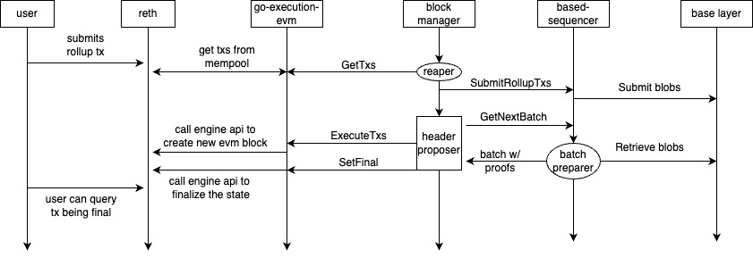

# ADR 011: Based Sequencing

## Changelog

- 2025-03-11: Initial draft

## Context

This ADR provides details regarding based sequencing using Celestia as base layer, Rollkit as rollup consensus layer, and EVM as execution layer.

### Based Sequencing or Based Rollups

Based rollups, also known as L1-sequenced rollups, are a category of layer 2 scaling solutions that delegate their transaction sequencing directly to the base layer (L1) blockchain.

Advantages:

- Liveness: By inheriting the base layer’s liveness guarantees, based rollups avoid issues like degraded settlement guarantees and potential network disruptions that can occur in other rollup designs during sequencer failures.
- Decentralization: They leverage the decentralization of the base layer, utilizing existing L1 infrastructure for searchers, builders, and proposers, thus enhancing overall system robustness.
- Simplicity and Cost Efficiency: The design eliminates the need for additional sequencer signature verifications or external consensus mechanisms, reducing complexity and associated costs. This streamlined approach also minimizes the potential for bugs related to sequencing.  
- Economic Alignment with L1: By allowing Maximum Extractable Value (MEV) to flow naturally to the base layer, based rollups strengthen the economic security of L1 and can contribute to the scarcity and value of the native L1 token.

Disadvantages:

- Forgone MEV Income: Based rollups sacrifice potential MEV revenue to the base layer, limiting their income primarily to base fees. However, this trade-off may be offset by achieving greater adoption due to enhanced security and simplicity.
- Reduced Sequencing Flexibility: Relying on L1 for sequencing can constrain the rollup’s ability to offer services like rapid pre-confirmations or first-come-first-served transaction ordering, which are more straightforward in centralized sequencing models.

Further details can be found in [Justin Drake's post about based rollups](https://ethresear.ch/t/based-rollups-superpowers-from-l1-sequencing/15016).

Examples of based rollups:
- [Taiko](https://taiko.mirror.xyz/7dfMydX1FqEx9_sOvhRt3V8hJksKSIWjzhCVu7FyMZU)
- [Surge](https://www.surge.wtf/)
- [Spire](https://www.spire.dev/)
- [Unifi from Puffer](https://www.puffer.fi/unifi)

### Rollkit

Is a combination of three layers:

- Sequencing layer
- Consensus layer
- Execution layer

#### Sequencing layer

- Implements sequencing interface
- Popular implementations are centralized sequencing and based sequencing

#### Consensus layer

- Two types of nodes: Proposer (aka header producer) and full node.
- Proposer provides a soft-commitment (or state preconfs) by preparing the batch (according to the global forkchoice rule that is acceptable by all nodes in the rollup network, e.g., full nodes), executing it, producing the update state root, and proposing a header with updated state root and proof data for verification for later hard-confirmation. Same for both centralized and based sequencing.
- Full node receives transaction batches and headers via p2p gossip (state preconf from the proposer). Using the proof data in the header, full node can perform full verification to hard confirm.

#### Execution layer

- Implements the execution interface
- Popular implementations are evm and abci
- Mempool and RPC are part of the execution layer, hence if a user submits a rollup transaction, it gets to the mempool on the execution layer, which then pulled by the consensus layer (by calling GetTxs) to submit to sequencing layer, which finally submits the transaction to based layer.

### EVM

- We use reth as underlying evm execution environment.
- Use op-geth which provides extended (backwards compatible) engine api that allows for supplying the sequenced transaction batches (pure geth can only allow for batch creation using the mempool transactions).

### Sequencing Interface

These methods are implemented in the sequencing layer of Rollkit (based-sequencer, which connects to Celestia as base layer). Rollkit node (consensus layer) is going to invoke these functions.

- SubmitRollupTxs: for submitting user rollup transactions to base layer.
- GetNextBatch(lastBatchData): for preparing batches using the base layer rollup transactions by following a gobal forkchoice rule.
- VerifyBatch(batchData): for validating the batches if prepared by a proposer.

### Execution Interface

These methods are implemented in the execution layer of Rollkit (go-execution-evm which runs reth for execution). Rollkit node (consensus layer) is going to invoke these functions.

- GetTxs: for fetching rollup mempool transactions (resides in the execution layer) and submitting to the base layer.
- ExecuteTxs(txs): given the batch of transactions, execute them using the execution layer to obtain the updated state root.
- SetFinal(block): after the batches are validated (inclusion and state update confirmed), instruct the execution layer to mark as finalized.

## Alternative Approaches

There are two approaches to implementing the based sequencing rollups:
- No proposer, every node creates batches by pulling the base layer transactions (included and sequenced) by following the global forkchoice rule (e.g., max bytes supported by the execution layer).
- a proposer can be utilized for efficiency purposes without introducing additional security assumptions where the proposer front-runs the batch preparation and provides (in the p2p layer) the prepared batch along with the updated state and proofs of inclusion and state update.

## Decision

A based sovereign evm rollup using Rollkit.

Components:
- Celestia for based sequencing
- Rollkit for consensus
- EVM for execution (reth and op-geth to allow sequenced transaction submission)

We decide to use the proposer based approach for efficiency reason as well as utilizing the single sequencer implementation that already exists with minimal configurational changes.

## Detailed Design

### Sequence diagram

The sequence digram below demostrates the interactions between the user, the execution layer, the sequencing layer, and the consensus layer (rollkit's block manager). In the no-proposer mode, every node (propose or full node) will follow all the interactions, whereas in case of proposer mode, the full nodes will follow all the interactions, however, they p2p layer front runs the sharing of the batch (created by the proposer) and state updates (in the form of headers).

### Transaction submission

- User can directly submit the rollup transaction to base layer. User need to compose a base layer transaction using the signed bytes of the rollup transaction. User also need to have access to base layer light node and an account for paying the base layer fee for transaction submission.
- Rollkit node (proposer or fullnode) can relay user transaction to base layer. Rollkit nodes won't gossip the transactions (to prevent duplicate submissions, run geth/reth with `--txpool.nogossip`). Rollkit nodes will have a light node connection with a base layer account for paying the fees. Rollup nodes (proposer or full node) that relays user transaction to base layer can be paid (to cover the DA expense) via rollup transaction fee. For example, in case of evm rollup, the base fee of the evm transaction can be utilized to include this DA fee. Other innovative ways can be discovered later on.

### Transaction Processing

- The user rollup transaction can be directly submitted to base layer, hence no expectation that the transaction exists in rollup mempool. As part of the execute transactions, the transactions listed in the payload attributes will automatically gets included by the execution layer for payload preparation and these transactions (that are not in the mempool) need not be added to the mempool.

### How the various rollkit nodes implement the sequencing interface?

Header Producer (aka. Proposer):
- `SubmitRollupTxs([][]byte)` returns `nil`: directly post the txs to da (split to multiple blobs submission, if exceeds da maxblobsize limit)
- `GetNextBatch(lastBatchData, maxBytes)` returns `batch, timestamp, batchData`: using lastBatchData find the last da height, fetch all blobs check to see if there were any pending blobs to be included in the next batch. Also, search for next height to add more blobs until maxBytes.
- `VerifyBatch(lastBatchData)`: noop

Full node:
- `SubmitRollupTxs`: directly post the txs to da (split to multiple blobs submission, if exceeds da maxblobsize limit)
- `GetNextBatch`: using lastBatchData find the last da height, fetch all blobs check to see if there were any pending blobs to be included in the next batch. Also, search for next height to add more blobs until maxBytes.
- `VerifyBatch`: using the batchData, getProofs from da and then call validate using batchData and proofs.

For convenience, the proposer can front-run the batch creation (pulling the sequenced transaction from base layer) for execution. The proposer can p2p gossip the batch along with the corresponding header (that contains the state update and batch inclusion proof data) for full nodes to quickly process the batched transactions. However, the full nodes can run both GetNextBatch and VerifyBatch in the background to mark the transactions (or batch/header) as final. This will prevent the proposer from maliciously behaving (skipping sequenced txs or including more txs).

### State Preconf and Forkchoice rule

Proposer is not necessary for based sequencing rollups, however they can be used for efficiency purposes. Every node in the rollup network will follow a global forkchoice rule for forming batches (aka computing rollup state updates) using the selected & ordered (by the base layer) transactions. A simple forkchoice rule can simply be based on the max bytes or gas limits of the execution layer. For example, every batch needs to be under 2 megabytes in size or 2 million gas units. Gas estimations can be complicated at the sequencing layer of Rollkit, hence we use max bytes, where every continuous batch does not exceed max bytes in size.

While every rollkit node can independently prepare the batch by itself (meaning every node is a proposer) and if all of them follow the global forkchoice rule, the state updates should be consistent across all the nodes. An alternative implementation could simple elect a proposer (similar to single sequencer mode) with state preconf to quickly accept the p2p shared batches (by the proposer) along with state updates and inclusion proof data to later hard confirm. Note that, this optimization differs from the single sequencer in key ways listed below:
- the full nodes prepare batches according to the global forkchoice rule in the background and not solely rely on the proposer. This will help catch if the proposer skips any transaction in the base layer.
- the full nodes can also relay the user transaction to base layer unlike in case of single sequencer where the proposer batches user transactions which then later published to the data availability layer.
- no trust requirement on the proposer as every full node does the full verification (which includes, preparing the batches from the base layer by following the global forkchoice rule, applies the batch to validate the state update, validates the proposer shared batch data which includes the inclusions proofs of the base layer transactions used to prepare the batch).

### Rollup Blocks (or Batches) from Base layer blobs

A rollup block (or batch, aka header) can be prepared using one or more base layer blobs that contains rollup transactions. At the same time, multiple rollup blocks can be formed using a base layer blob that contains rollup transactions. This is purely dependent on the global forkchoice rule that is selected for forming the batches. In our case it is the max bytes that the execution layer can support, hence, a batch , up to the max bytes may be formed using the rollup transactions in the base layer.

## Status

Proposed and under implementation.

## Consequences

### Positive

### Negative

### Neutral

## References

> Are there any relevant PR comments, issues that led up to this, or articles referenced for why we made the given design choice? If so link them here!

- [go-sequencing](https://github.com/rollkit/go-sequencing)
- [go-da](https://github.com/rollkit/go-da)
