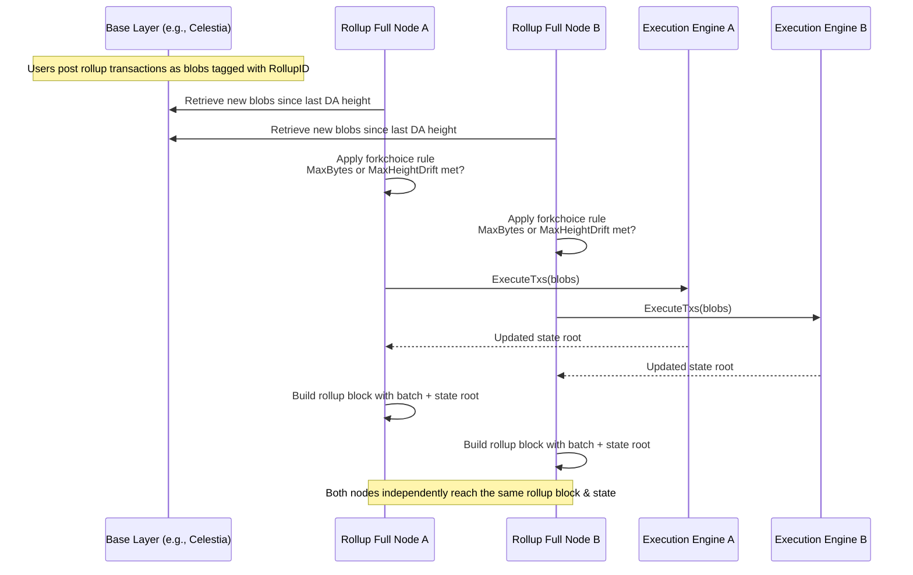
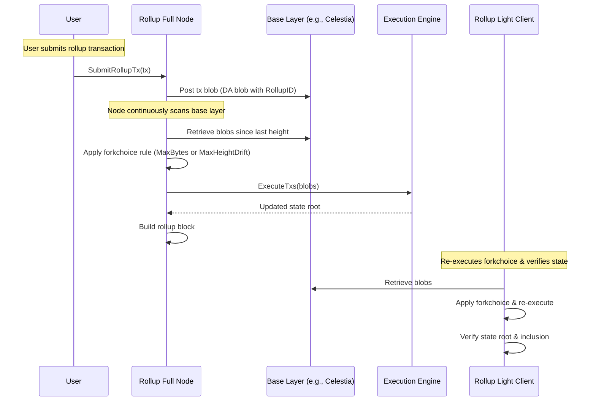

# ADR 012: Fully Decentralized Based Sequencing

## Changelog

- 2025-04-09: Initial draft
- 2025-04-09: Added optional UX optimization where full nodes can relay user rollup txs to base layer
- 2025-04-09: Added rationale for VerifyBatch utility in fully decentralized setup
- 2025-04-09: Reworded forkchoice rule to use maxHeightDrift instead of time-based maxLatency
- 2025-04-10: Added Relaying Costs and Fee Compensation via EVM

## Context

Most rollups today rely on centralized or semi-centralized sequencers to form batches of user transactions, despite the availability of base layers (like Celestia) that provide data availability and canonical ordering guarantees. Centralized sequencers introduce liveness and censorship risks, as well as complexity in proposer election, fault tolerance, and bridge security.

Based sequencing eliminates this reliance by having the base layer determine transaction ordering. However, previous implementations still assumed the existence of a proposer to prepare rollup batches.

This ADR proposes a **fully decentralized based sequencing model** in which **every full node acts as its own proposer** by independently:
- Reading rollup blobs from the base layer
- Applying a deterministic forkchoice rule
- Constructing rollup blocks
- Executing batches to compute state updates

This approach ensures consistency, removes the need for trusted intermediaries, and improves decentralization and resilience.

## Alternative Approaches

### Centralized Sequencer
- A designated sequencer collects rollup transactions and publishes them to the base layer.
- Simpler for UX and latency control, but introduces centralization and failure points.

### Leader-Elected Proposer (e.g., BFT committee or rotating proposer)
- Some nodes are elected to act as proposers for efficiency.
- Still introduces trust assumptions, coordination complexity, and MEV-related risks.

### Trusted Rollup Light Client Commitments
- Rollup blocks are committed to L1 (e.g., Ethereum) and verified by a light client.
- Adds delay and dependency on L1 finality, and often still relies on centralized proposers.

None of these provide the decentralization and self-sovereignty enabled by a fully deterministic, proposerless, based sequencing model.

## Decision

We adopt a fully decentralized based sequencing model where **every full node in the rollup network acts as its own proposer** by deterministically deriving the next batch using only:
- Base-layer data (e.g., Celestia blobs tagged by rollup ID)
- A forkchoice rule: MaxBytes + Bounded L1 Height Drift (maxHeightDrift)
- Local execution (e.g., EVM via reth)

This model removes the need for:
- A designated sequencer
- Coordination mechanisms
- Sequencer signatures

The canonical rollup state becomes a **function of the base layer** and a well-defined forkchoice rule.

Additionally, to improve UX for users who do not operate a base layer client or wallet, **full nodes may optionally relay user-submitted rollup transactions to the base layer**. This maintains decentralization while improving accessibility.

The following sequence diagram demonstrates two rollup fullnodes independently preparing batches and rollup states that are identical using the user transactions that are directly submitted to the base layer.

The following sequence diagram shows the case where the user utilizes the full node to relay the transaction to the base layer and the rollup light client in action.

## Detailed Design

### User Requirements
- Users submit transactions by:
  - Posting them directly to the base layer in tagged blobs, **or**
  - Sending them to any full node's RPC endpoint, which will relay them to the base layer on their behalf
- Users can verify finality by checking rollup light clients or DA inclusion

### Systems Affected
- Rollup full nodes
- Rollup light clients
- Batch building and execution logic

### Forkchoice Rule
A batch is constructed when:
1. The accumulated size of base-layer blobs >= `MAX_BYTES`
2. OR the L1 height difference since the last batch exceeds `MAX_HEIGHT_DRIFT`

All rollup full nodes:
- Track base-layer heights and timestamps
- Fetch all rollup-tagged blobs
- Apply the rule deterministically
- Execute batches to update state

Without forkchoice parameters, full nodes cannot independently produce identical rollup blocks (i.e., matching state roots or headers), as they wouldn’t know how to consistently form batches—specifically, how many transactions to include per batch. The maxHeightDrift parameter addresses this by enabling progress when the maxBytes threshold isn’t met, without relying on global time synchronization. Relying on timestamps could lead to inconsistencies due to clock drift between nodes, so using L1-based timestamps or heights provides a reliable and deterministic reference for batching.

### Rollup Light Clients

Rollup light clients (once implemented) are not expected to re-execute transactions to derive rollup headers. Instead, they will perform verification only. These clients will typically receive headers either:
	•	via the p2p network along with accompanying proofs, or
	•	from a connected full node, in which case they will still require validity proofs for the received headers.

This design ensures that rollup light clients remain lightweight and efficient, relying on cryptographic proofs rather than execution to validate the rollup state.

### Data Structures
- Blob index: to track rollup blobs by height and timestamp
- Batch metadata: includes L1 timestamps, blob IDs, and state roots

### APIs
- `GetNextBatch(lastBatchData, maxBytes, maxHeightDrift)`: deterministically builds batch, `maxHeightDrift` can be configured locally instead of passing on every call.
- `VerifyBatch(batchData)`: re-derives and checks state
- `SubmitRollupBatchTxs(batch [][]byte)`: relays a user transaction(s) to the base layer

In fully decentralized based sequencing, full nodes do not need VerifyBatch to participate in consensus or build the canonical rollup state — because they derive everything deterministically from L1. However, VerifyBatch may still be useful in sync, light clients, testing, or cross-domain verification.

* Light Clients: L1 or cross-domain light clients can use VerifyBatch to validate that a given rollup state root or message was derived according to the forkchoice rule and execution logic.

* Syncing Peers: During peer synchronization or state catch-up, nodes may download batches and use VerifyBatch to confirm correctness before trusting the result.

* Auditing / Indexers: Off-chain services may verify batches as part of building state snapshots, fraud monitoring, or historical replays.

* Testing: Developers and test frameworks can validate batch formation correctness and execution determinism using VerifyBatch.

In all of these cases, VerifyBatch acts as a stateless, replayable re-computation check using base-layer data and rollup rules.

### Relaying Costs and Fee Compensation via EVM

In a fully decentralized based sequencing architecture, users may choose to submit their rollup transactions directly to the base layer (e.g., Celestia) or rely on full nodes to relay the transactions on their behalf. When full nodes act as relayers, they are responsible for covering the base layer data availability (DA) fees. To make this economically viable and decentralized, the protocol must include a mechanism to compensate these full nodes for their relaying service—ideally without modifying the EVM or execution engine.

To achieve this, we leverage existing EVM transaction fee mechanisms and Engine API standards. Specifically, we utilize the suggestedFeeRecipient field in the engine_forkchoiceUpdatedV3 call. This field is included in the PayloadAttributes sent by the consensus client (Rollkit) to the execution client (reth) when proposing a new block payload. By setting suggestedFeeRecipient to the full node’s address, we instruct the execution engine to assign the transaction priority fees (tip) and base fees to the relaying full node when the payload is created.

The user transaction itself includes a maxFeePerGas and maxPriorityFeePerGas—standard EIP-1559 fields. These fees are used as usual by the execution engine during payload construction. Since the full node is named as the fee recipient, it directly receives the gas fees when the transaction is executed, effectively covering its cost of DA submission on the user’s behalf. This approach requires no changes to the EVM engine, remains backward compatible with Ethereum infrastructure, and aligns incentives for honest full nodes to participate in relaying and batching.

This design ensures:
* Fee accountability: Users pay for DA inclusion via standard gas fees.
* Node neutrality: Any full node can relay a transaction and get compensated.
* No execution-layer changes: Works with unmodified reth/op-geth clients.
* Security: Users retain flexibility to either self-submit or rely on decentralized relayers.

Additional enhancements like dynamic fee markets, relayer reputation, or rollup-native incentives can be layered atop this base mechanism in the future.

### Efficiency
- Deterministic block production without overhead of consensus
- Bound latency ensures timely progress even with low traffic

### Observability
- Each node can log forkchoice decisions, skipped blobs, and batch triggers

### Security
- No sequencer key or proposer trust required
- Replayable from public data (DA layer)
- Optional transaction relay must not allow censorship or injection

### Privacy
- No privacy regressions; same as base-layer visibility

### Testing
- Unit tests for forkchoice implementation
- End-to-end replay tests against base-layer data
- Mocked relayer tests for SubmitRollupTx

### Deployment
- No breaking changes to existing based rollup logic
- Can be rolled out by disabling proposer logic
- Optional relayer logic gated by config flag

## Status

Proposed

## Consequences

### Positive
- Removes centralized sequencer
- Fully deterministic and transparent
- Enables trustless bridges and light clients
- Optional relayer support improves UX for walletless or mobile users

### Negative
- Slight increase in complexity in forkchoice validation
- Must standardize timestamp and blob access for determinism
- Must prevent relayer misuse or spam

### Neutral
- Shifts latency tuning from proposer logic to forkchoice parameters

## References

- [EthResearch: Based Rollups](https://ethresear.ch/t/based-rollups-superpowers-from-l1-sequencing/15016)
- [Taiko](https://taiko.mirror.xyz/7dfMydX1FqEx9_sOvhRt3V8hJksKSIWjzhCVu7FyMZU)
- [Surge](https://www.surge.wtf/)
- [Spire](https://www.spire.dev/)
- [Unifi from Puffer](https://www.puffer.fi/unifi)

