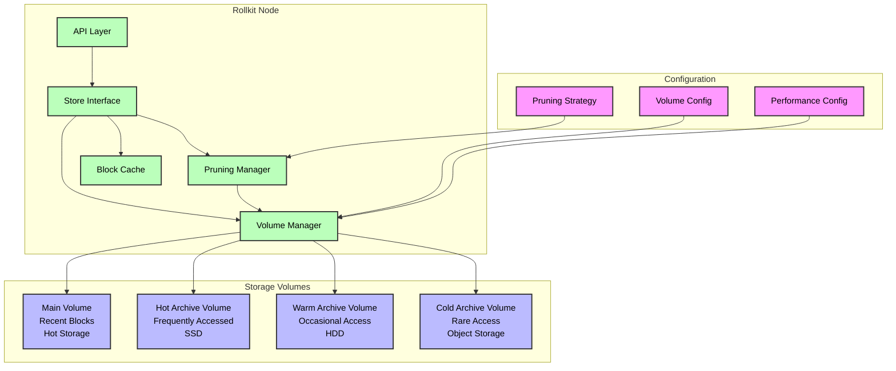

# ADR 017: Node Pruning

## Changelog

- 2025-03-22: Initial draft

## Context

Rollkit currently stores all historical blocks, headers, and state data in the node's local storage without any mechanism to prune old data. As chains grow, this leads to increasing storage requirements that can become challenging to manage for node operators, especially for long-running chains.

The current storage implementation in Rollkit uses a key-value store (BadgerDB) to persist blockchain data. The `DefaultStore` implementation in the `store` package maintains blocks, headers, signatures, and state with no built-in mechanism for removing old data that may no longer be needed for node operation.

It's worth noting that in the header and data sync service, the store is primarily used for P2P gossiping purposes. Since the retrieved headers and data are already cached in `headerCache` and `dataCache` respectively, the contents in the store can be safely deleted once they have been retrieved and processed.

For chains that have been operational for a significant period or have high transaction throughput, the storage requirements can grow substantially, leading to:

1. Increased disk space requirements for node operators
2. Longer startup times as the node loads and processes more data
3. Potential performance degradation as the database size grows
4. Higher resource requirements for deploying new nodes

A pruning mechanism would allow node operators to reduce storage requirements while maintaining the ability to serve recent chain data and participate in consensus. Additionally, providing support for attaching external volumes for specific block height ranges would allow for more flexible storage management over extended periods of time.

## High-Level Architecture



## Alternative Approaches

### 1. Full Historical Node / Archive Node (Status Quo)

Continue with the current approach where nodes store the entire history of the blockchain. This approach ensures that any historical data can be queried but requires ever-increasing storage capacity.

### 2. Pruning with Height-Based Retention

Implement a pruning mechanism that retains blocks and associated data only up to a certain number of blocks from the current height. This is the most common approach in blockchain systems and balances storage efficiency with access to recent history.

### 3. Pruning with State Snapshots

Create periodic state snapshots and prune all block data except for the snapshots. This approach dramatically reduces storage requirements but limits the ability to query historical transactions or state transitions.

### 4. External Volume Storage

Store historical blocks in separate external volumes that can be mounted and unmounted as needed. This allows for flexible storage management but adds complexity to the implementation and operation.

### 5. Configurable Pruning Strategies with Volume Support (Chosen)

Implement a flexible pruning system that allows node operators to choose from different pruning strategies based on their needs, with added support for external volume management:

- **None** (default): No pruning, keep all data (archive mode)
- **Default**: Keep recent blocks (configurable, e.g., last 100 blocks) and periodic snapshots
- **Custom**: Allow specifying exact retention policies for blocks, snapshots, and other data
- **Volume-Based**: Allow specifying block height ranges to be stored in separate volumes

## Decision

We will implement a configurable pruning system that allows node operators to choose from different pruning strategies, with added support for external volume storage for specific block height ranges. This approach provides flexibility while addressing the storage concerns for long-running chains and enables efficient long-term data management.

The pruning system will be implemented as an extension to the existing `DefaultStore` in the `store` package, with configuration options available through the node configuration.

## Detailed Design

### Volume Types and Storage Systems

The pruning system is designed to work with various types of storage volumes and systems:

1. **Local Storage Volumes**:
   - **Linux Logical Volumes (LVM)**:
     - Flexible volume management allowing dynamic resizing
     - Ability to stripe data across multiple physical devices
     - Snapshot capabilities for backup purposes
   - **Direct Mount Points**:
     - Traditional filesystem mounts (ext4, xfs, etc.)
     - Direct attached storage devices
     - RAID arrays
   - **Bind Mounts**:
     - Remapping directories to different locations
     - Useful for reorganizing storage without changing physical layout

2. **Network Storage**:
   - **NFS (Network File System)**:
     - Remote filesystem mounts
     - Shared storage across multiple nodes
     - Suitable for warm storage tiers
   - **SAN (Storage Area Network)**:
     - High-performance block storage
     - Suitable for hot storage tiers
     - iSCSI or Fiber Channel connectivity

3. **Cloud Storage Systems**:
   - **Object Storage**:
     - Amazon S3 and compatible systems
     - Google Cloud Storage
     - Azure Blob Storage
     - Suitable for cold storage tiers
   - **Archive Storage**:
     - Amazon S3 Glacier
     - Google Cloud Archive Storage
     - Azure Archive Storage
     - Lowest cost, highest latency
   - **File Storage**:
     - Amazon EFS
     - Google Filestore
     - Azure Files
     - Mountable as network filesystems

4. **Volume Performance Classifications**:
   - **Hot Storage** (Lowest Latency):
     - Local NVMe SSDs
     - High-performance SAN volumes
     - Used for recent blocks and frequently accessed data
   - **Warm Storage** (Medium Latency):
      - Local HDDs
      - NFS mounts
      - Network block storage
      - Used for moderately old or occasionally accessed data
   - **Cold Storage** (High Latency):
      - Object storage
      - Archive storage
      - Used for historical data with infrequent access

5. **Implementation Considerations**:
   - **Local Volumes**:
      - Direct filesystem access
      - Native OS-level caching
      - Immediate consistency
   - **Network Volumes**:
      - Connection management
      - Caching strategies
      - Network latency handling
   - **Cloud Storage**:
      - API-based access
      - Eventual consistency
      - Bandwidth costs
      - Lifecycle management

6. **Volume Interface Requirements**:
   Each volume type must implement:

   ```go
   type VolumeInterface interface {
       // Core operations
       Read(ctx context.Context, key []byte) ([]byte, error)
       Write(ctx context.Context, key []byte, value []byte) error
       Delete(ctx context.Context, key []byte) error

       // Performance metrics
       GetLatency() time.Duration
       GetThroughput() int64

       // Storage type
       GetStorageType() StorageType
       GetTier() StorageTier

       // Lifecycle
       Mount(ctx context.Context) error
       Unmount(ctx context.Context) error
   }
   ```

7. **Storage Type Configuration**:

   ```yaml
   volumes:
     - path: "/data/rollkit/volumes/volume-hot-1"
       type: "local"  # local, nfs, san, s3, glacier, etc.
       storage_class: "nvme"  # nvme, ssd, hdd, etc.
       performance:
         tier: "nvme"
         estimated_latency_ms: 5
     - path: "s3://my-bucket/archive"
       type: "s3"
       storage_class: "standard"
       performance:
         tier: "cold"
         estimated_latency_ms: 500
       credentials:
         profile: "archive-storage"
   ```

This variety of storage options allows node operators to:

- Implement cost-effective tiered storage strategies
- Scale storage capacity independently of compute resources
- Optimize for different performance requirements
- Leverage existing storage infrastructure
- Use cloud storage for long-term archival

### Pruning Configuration

The pruning configuration will be added to the node's configuration file with the following options:

```go
type PruningConfig struct {
    // Strategy determines the pruning approach
    // Options: "none", "default", "custom", "volume-based"
    Strategy string `mapstructure:"strategy"`

    // KeepRecent specifies the number of recent blocks to keep (used in "default" and "custom" strategies)
    KeepRecent uint64 `mapstructure:"keep_recent"`

    // KeepEvery specifies the periodic blocks to keep for historical reference (used in "custom" strategy)
    // For example, if set to 100, every 100th block will be kept
    KeepEvery uint64 `mapstructure:"keep_every"`

    // SnapshotInterval specifies how often to create state snapshots (used in "default" and "custom" strategies)
    // For example, if set to 1000, a snapshot will be created every 1000 blocks
    SnapshotInterval uint64 `mapstructure:"snapshot_interval"`

    // PruneInterval specifies how often (in blocks) the pruning process should run
    PruneInterval uint64 `mapstructure:"prune_interval"`

    // VolumeConfig specifies configuration for volume-based storage
    VolumeConfig *VolumeStorageConfig `mapstructure:"volume_config"`
}

// VolumeStorageConfig defines how block data is distributed across different volumes
type VolumeStorageConfig struct {
    // Enabled indicates whether volume-based storage is enabled
    Enabled bool `mapstructure:"enabled"`

    // MainVolumePath is the path to the main storage volume (for recent blocks)
    MainVolumePath string `mapstructure:"main_volume_path"`

    // Volumes is a list of archive volumes for specific block height ranges
    Volumes []ArchiveVolume `mapstructure:"volumes"`

    // TargetMaxVolumeSize is the target maximum size in bytes for a single volume
    // Used for determining when to create new volumes and calculating max block heights
    TargetMaxVolumeSize int64 `mapstructure:"target_max_volume_size"`

    // SizeMonitoringInterval is how often (in blocks) to recalculate volume statistics
    // and adjust max block heights based on current block sizes
    SizeMonitoringInterval uint64 `mapstructure:"size_monitoring_interval"`

    // AutoCreateVolumes indicates whether new volumes should be created automatically
    // when a volume approaches TargetMaxVolumeSize
    AutoCreateVolumes bool `mapstructure:"auto_create_volumes"`

    // VolumesDirectory is the base directory where new volumes will be created
    // This directory should be managed by the node operator, with different storage devices
    // mounted as subdirectories following a specific pattern (e.g., "volume-*")
    // The application will only create new volumes in empty subdirectories that match this pattern
    VolumesDirectory string `mapstructure:"volumes_directory"`

    // VolumePattern is the pattern used to identify volume directories (e.g., "volume-*")
    VolumePattern string `mapstructure:"volume_pattern"`
}

// ArchiveVolume defines a single archive volume for a specific block height range
type ArchiveVolume struct {
    // Path is the filesystem path to the volume
    Path string `mapstructure:"path"`

    // StartHeight is the inclusive starting block height for this volume
    StartHeight uint64 `mapstructure:"start_height"`

    // EndHeight is the inclusive ending block height for this volume
    // If 0, the volume extends indefinitely
    EndHeight uint64 `mapstructure:"end_height"`

    // ReadOnly indicates whether this volume is read-only
    ReadOnly bool `mapstructure:"read_only"`

    // Performance characteristics of the volume for query optimization
    // This helps the system make intelligent decisions about data placement and retrieval
    Performance VolumePerformance `mapstructure:"performance"`
}

// VolumePerformance defines the performance characteristics of a volume
type VolumePerformance struct {
    // Tier indicates the storage tier of this volume (e.g., "fast", "standard", "cold")
    // Used for optimizing query routing and data placement
    Tier string `mapstructure:"tier"`

    // EstimatedLatencyMs is the estimated average latency for read operations in milliseconds
    // This is calculated based on historical access patterns and updated periodically
    EstimatedLatencyMs int64 `mapstructure:"estimated_latency_ms"`

    // QueryStats tracks query patterns and performance metrics for this volume
    // These statistics are built over time and used for optimization
    QueryStats *VolumeQueryStats `mapstructure:"query_stats"`
}

// VolumeQueryStats tracks query patterns and performance for a volume
type VolumeQueryStats struct {
    // Average query latency over time
    AvgQueryLatencyMs int64 `mapstructure:"avg_query_latency_ms"`

    // Query frequency by block height ranges
    QueryFrequencyByRange map[string]int64 `mapstructure:"query_frequency_by_range"`

    // Last updated timestamp
    LastUpdated int64 `mapstructure:"last_updated"`
}
```

### Volume Directory Management

The volume management system is designed to work in harmony with node operators' disk management practices. Here's how it works:

1. **Base Volume Directory Structure**:
   - Node operators specify a base `VolumesDirectory` in the configuration
   - This directory serves as the root for all volume management operations
   - Subdirectories must follow a specific pattern (e.g., `volume-*`) for automatic discovery
   - A single physical device can host multiple logical volumes

2. **Multi-Tiered Archive System**:
   - Volumes can be flagged with performance characteristics
   - Performance tiers (e.g., "fast" for SSD, "standard" for HDD, "cold" for archival storage)
   - Query statistics are built over time to optimize data placement and retrieval
   - System automatically routes queries to the most appropriate volume based on:
      - Query patterns
      - Data access frequency
      - Volume performance characteristics
      - Historical latency measurements

3. **Node Operator Responsibilities**:
   - Create the base volume directory structure
   - Mount different storage devices as subdirectories under `VolumesDirectory`
   - Ensure subdirectories follow the required naming pattern
   - Manage disk mounts and unmounts at the system level
   - Configure performance characteristics for volumes based on underlying hardware

4. **Volume Discovery and Creation**:
   - The application scans `VolumesDirectory` for subdirectories matching the pattern
   - Only empty subdirectories are considered for new volume creation
   - This ensures the application respects the disk management strategy defined by operators
   - Multiple volumes can be created on the same physical device

5. **Volume Creation Process**:
   When AutoCreateVolumes is enabled:
   - System monitors volume utilization
   - When a new volume is needed, it searches for empty subdirectories matching the pattern
   - Creates new volume only in qualifying empty subdirectories
   - Logs warning if no suitable subdirectory is found
   - Node operator must ensure appropriate devices are mounted before volumes can be created

   Example directory structure with performance tiers:

   ```bash
   /data/rollkit/volumes/  # VolumesDirectory
   ├── volume-main/        # Main volume (fast tier - NVMe SSD)
   ├── volume-hot-1/      # Hot data volume (fast tier - SSD)
   ├── volume-hot-2/      # Hot data volume (fast tier - SSD)
   ├── volume-warm-1/     # Warm data volume (standard tier - HDD)
   ├── volume-warm-2/     # Warm data volume (standard tier - HDD)
   └── volume-cold-1/     # Cold storage volume (cold tier - HDD)
   ```

6. **Configuration Example with Performance Tiers**:

   ```yaml
   pruning:
   volume_config:
      enabled: true
      main_volume_path: "/data/rollkit/volumes/volume-main"
      volumes_directory: "/data/rollkit/volumes"
      volume_pattern: "volume-*"
      auto_create_volumes: true
      target_max_volume_size: 1099511627776  # 1 TB
      size_monitoring_interval: 1000
      volumes:
         - path: "/data/rollkit/volumes/volume-hot-1"
         performance:
            tier: "fast"
            estimated_latency_ms: 5
         - path: "/data/rollkit/volumes/volume-warm-1"
         performance:
            tier: "standard"
            estimated_latency_ms: 20
         - path: "/data/rollkit/volumes/volume-cold-1"
         performance:
            tier: "cold"
            estimated_latency_ms: 100
   ```

7. **Query Optimization**:
   - System maintains statistics about query patterns per volume
   - Frequently accessed data can be automatically migrated to faster volumes
   - Less frequently accessed data can be moved to slower, higher-capacity volumes
   - Query routing takes into account both data location and volume performance
   - Multiple volumes on the same physical device share underlying performance characteristics

This approach ensures:

- Clear separation of concerns between system-level disk management and application-level volume management
- Node operators maintain control over physical storage allocation
- Application remains storage-agnostic while respecting operator's disk management choices
- Predictable and safe volume creation process
- Optimal query performance through intelligent data placement
- Efficient use of storage tiers based on access patterns
- Support for multiple volumes per physical device
- Automatic performance optimization based on real usage patterns

### Store Interface Extension

The `Store` interface in `store/types.go` will be extended to include pruning and volume management functionality:

```go
type Store interface {
    // ... existing methods ...

    // PruneBlocks removes block data up to the specified height based on the pruning strategy
    PruneBlocks(ctx context.Context, height uint64) error

    // SetPruningStrategy sets the pruning strategy for the store
    SetPruningStrategy(strategy PruningStrategy) error

    // GetPruningStrategy returns the current pruning strategy
    GetPruningStrategy() PruningStrategy

    // AddVolume adds a new volume for a specific block height range
    AddVolume(ctx context.Context, volume ArchiveVolume) error

    // RemoveVolume removes a volume from the store configuration
    RemoveVolume(ctx context.Context, volumePath string) error

    // ListVolumes returns a list of all configured volumes
    ListVolumes(ctx context.Context) ([]ArchiveVolume, error)

    // MoveBlocksToVolume moves blocks within specified height range to a target volume
    MoveBlocksToVolume(ctx context.Context, startHeight, endHeight uint64, targetVolume string) error

    // GetVolumeStats returns statistics for a specific volume
    GetVolumeStats(ctx context.Context, volumePath string) (*VolumeStats, error)

    // GetAllVolumeStats returns statistics for all volumes
    GetAllVolumeStats(ctx context.Context) (map[string]*VolumeStats, error)

    // MonitorVolumeSize starts monitoring volume size and triggers volume creation when needed
    MonitorVolumeSize(ctx context.Context) error

    // GetVolumePerformance returns performance metrics for a specific volume
    GetVolumePerformance(ctx context.Context, volumePath string) (*VolumePerformance, error)
}
```

### Multi-Volume Store Implementation

To support external volumes, we will implement a `MultiVolumeStore` that wraps the `DefaultStore`:

```go
type MultiVolumeStore struct {
    // The main store (for recent blocks)
    mainStore *DefaultStore

    // Archive stores mapped by path
    archiveStores map[string]*DefaultStore

    // Volume configuration
    volumeConfig *VolumeStorageConfig

    // Maps block heights to volume paths for quick lookups
    heightToVolume map[uint64]string

    // Mutex for concurrent access
    mu sync.RWMutex
}
```

This implementation will:

1. Route read requests to the appropriate volume based on the requested block height
2. Handle write operations to the main volume
3. Manage opening and closing volumes as needed
4. Implement background processes for moving data between volumes based on the configuration

### Volume Management

The volume management system will include:

1. **Volume Registry**: A component that tracks which block heights are stored in which volumes
2. **Volume Router**: Logic to direct read/write operations to the appropriate volume
3. **Volume Migration**: Tools to move blocks between volumes
4. **Auto-Volume Creation**: Optionally create new volumes when existing ones reach capacity

### Volume Size Monitoring and Dynamic Block Height Calculation

The Volume Registry will implement a size-based monitoring system to manage volume capacity:

1. **Size Monitoring**:
   - Track current volume size and block sizes
   - Calculate average block size over configurable window
   - Monitor growth rate and project volume utilization

2. **Dynamic Block Height Calculation**:

   ```go
   type VolumeStats struct {
       CurrentSize        int64
       AvgBlockSize      int64
       BlockSizeWindow   []int64
       ProjectedMaxHeight uint64
   }
   ```

   The registry will periodically:
   - Calculate remaining capacity: `remainingBytes = targetMaxVolumeSize - currentVolumeSize`
   - Estimate blocks that can fit: `remainingBlocks = remainingBytes / avgBlockSize`
   - Set projected max height: `projectedMaxHeight = currentHeight + remainingBlocks`
   - Apply safety margin to account for block size variance

3. **Volume Transition Planning**:
   - Trigger new volume creation when projected to reach `targetMaxVolumeSize` within configurable threshold
   - Smooth transition by pre-allocating new volumes before current volume is full
   - Consider block size trends when planning transitions

4. **Monitoring Metrics**:
   - Current volume utilization percentage
   - Projected blocks until volume full
   - Block size statistics (min, max, average, trend)
   - Volume growth rate

This approach provides several advantages:

- More accurate capacity planning based on actual data size
- Adaptation to varying block sizes
- Early warning for volume transitions
- Better resource utilization through dynamic adjustment

#### Volume Mounting and Unmounting

The store will support dynamically mounting and unmounting volumes:

```go
// MountVolume mounts a volume for read/write operations
func (s *MultiVolumeStore) MountVolume(ctx context.Context, volume ArchiveVolume) error {
    // Implementation details
}

// UnmountVolume safely unmounts a volume
func (s *MultiVolumeStore) UnmountVolume(ctx context.Context, volumePath string, force bool) error {
    // Implementation details
}
```

This will allow for efficient resource usage by only keeping actively needed volumes mounted.

### Block Lookup and Retrieval

The block lookup process will be updated to check multiple volumes:

1. First, check if the requested block is in the main volume
2. If not, consult the volume registry to determine which archive volume contains the block
3. If the volume is mounted, retrieve the block from there
4. If the volume is not mounted, automatically mount it, retrieve the block, and optionally unmount it after use

### Pruning Implementation With Volume Support

The pruning system will be enhanced to work with the multi-volume setup:

1. **Volume-Aware Pruning**: The pruning process will be aware of volumes and their configuration
2. **Block Migration**: Instead of deletion, blocks can be migrated to archive volumes
3. **Volume Rotation**: Full volumes can be archived and replaced with new volumes
4. **Volume Consolidation**: Multiple sparse volumes can be consolidated into a single volume

The pruning manager will implement these strategies based on the configuration.

### Data Organization Within Volumes

Each volume will have a standardized internal structure:

```bash
/volume_root
    /blocks          # Block data organized by height
    /headers         # Block headers
    /signatures      # Block signatures
    /state           # State snapshots
    /indexes         # Index files for quick lookups
    /metadata.json   # Volume metadata (height range, creation time, etc.)
```

This structure ensures consistency across volumes and simplifies migration operations.

### Volume-Based Pruning Strategy

A new "volume-based" pruning strategy will be implemented with the following behavior:

1. Keep recent blocks (configurable number) in the main volume
2. Automatically migrate older blocks to archive volumes based on the configuration
3. Create new archive volumes when existing ones reach capacity
4. Optionally compress older volumes to save space

This strategy provides a balance between accessibility and storage efficiency.

### API Extensions for Volume Management

The node's API will be extended to include endpoints for volume management:

1. List all configured volumes and their status
2. Add/remove volumes
3. Mount/unmount volumes
4. Move blocks between volumes
5. Query volume statistics (usage, block range, etc.)

These endpoints will enable operators to manage storage resources effectively.

### Performance Considerations

To maintain performance with the multi-volume setup:

1. **Caching**: Frequently accessed blocks will be cached in memory regardless of their source volume
2. **Prefetching**: When retrieving blocks from archive volumes, nearby blocks will be prefetched
3. **Background Processing**: Data migration between volumes will happen in the background to minimize impact on node performance
4. **Index Optimization**: Each volume will maintain optimized indexes for fast lookups

### Migration Path

For existing nodes transitioning to the multi-volume setup:

1. An upgrade procedure will create the initial volume configuration
2. Existing block data will remain in the main volume
3. A migration tool will be provided to redistribute blocks according to the new configuration
4. The migration can be performed online with minimal disruption

### Migration CLI Tool Design

To facilitate the transition of existing nodes to the new pruning system, we will provide a dedicated CLI tool as part of the Rollkit binary. This tool will enable safe and controlled migration while addressing potential challenges.

#### CLI Structure

The migration tool will be accessible through the main Rollkit command:

```bash
rollkit migrate-storage [subcommand] [flags]
```

##### Subcommands

1. **analyze**: Scans existing data and plans migration

   ```bash
   rollkit migrate-storage analyze [--data-dir=<path>]
   ```

   - Estimates storage requirements
   - Generates migration plan with volume configuration
   - Reports potential issues
   - Estimates duration and resource needs

2. **backup**: Creates pre-migration backup

   ```bash
   rollkit migrate-storage backup [--data-dir=<path>] [--backup-dir=<path>]
   ```

   - Full backup with checksums
   - Backup metadata and manifest generation

3. **execute**: Performs migration

   ```bash
   rollkit migrate-storage execute [--config=<path>] [--data-dir=<path>] [--dry-run] [--parallel=<n>]
   ```

   - Supports resumable operations
   - Dry-run mode for testing
   - Configurable parallelism

4. **verify**: Validates migration

   ```bash
   rollkit migrate-storage verify [--data-dir=<path>]
   ```

   - Data integrity checks
   - Block height continuity validation
   - Volume configuration verification

5. **rollback**: Reverts migration

   ```bash
   rollkit migrate-storage rollback [--data-dir=<path>] [--backup-dir=<path>]
   ```

   - Restores from backup
   - Validates restoration

#### Migration Configuration

The tool uses a YAML configuration file:

```yaml
migration:
  source_dir: /path/to/existing/data
  
  target:
    strategy: "volume-based"
    volumes:
      - path: /path/to/main/volume
        type: "main"
        target_max_volume_size: 1099511627776  # 1 TB
        performance:
          tier: "fast"
          estimated_latency_ms: 5
      - path: /path/to/archive/volume1
        type: "archive"
        start_height: 0
        end_height: 0  # Will be dynamically calculated
        target_max_volume_size: 1099511627776  # 1 TB
        performance:
          tier: "cold"
          estimated_latency_ms: 100

  settings:
    parallel_workers: 4
    batch_size: 10000
    checkpoint_interval: 1000
    validate_checksums: true
    size_monitoring_interval: 1000

  backup:
    enabled: true
    path: /path/to/backup
    compress: true

  monitoring:
    log_level: "info"
    metrics_enabled: true
    progress_report_interval: 60
    volume_stats_enabled: true
```

```go
type MigrationConfig struct {
    SourceDir string `mapstructure:"source_dir"`
    Target    TargetConfig `mapstructure:"target"`
    Settings  MigrationSettings `mapstructure:"settings"`
    Backup    BackupConfig `mapstructure:"backup"`
    Monitoring MonitoringConfig `mapstructure:"monitoring"`
}

type TargetConfig struct {
    Strategy string `mapstructure:"strategy"`
    Volumes  []VolumeConfig `mapstructure:"volumes"`
}

type VolumeConfig struct {
    Path               string `mapstructure:"path"`
    Type              string `mapstructure:"type"`
    StartHeight       uint64 `mapstructure:"start_height"`
    EndHeight         uint64 `mapstructure:"end_height"`
    TargetMaxVolumeSize int64 `mapstructure:"target_max_volume_size"`
    Performance       VolumePerformance `mapstructure:"performance"`
}

type MigrationSettings struct {
    ParallelWorkers       int  `mapstructure:"parallel_workers"`
    BatchSize            int  `mapstructure:"batch_size"`
    CheckpointInterval   int  `mapstructure:"checkpoint_interval"`
    ValidateChecksums    bool `mapstructure:"validate_checksums"`
    SizeMonitoringInterval int `mapstructure:"size_monitoring_interval"`
}

type BackupConfig struct {
    Enabled  bool   `mapstructure:"enabled"`
    Path     string `mapstructure:"path"`
    Compress bool   `mapstructure:"compress"`
}

type MonitoringConfig struct {
    LogLevel             string `mapstructure:"log_level"`
    MetricsEnabled       bool   `mapstructure:"metrics_enabled"`
    ProgressReportInterval int  `mapstructure:"progress_report_interval"`
    VolumeStatsEnabled    bool   `mapstructure:"volume_stats_enabled"`
}
```

#### Safety Features

1. **Checkpointing**
   - Progress checkpoints at configurable intervals
   - Resume capability after interruption
   - Transaction logs for all operations

2. **Validation**
   - Data checksums
   - Block height continuity checks
   - State consistency verification
   - Configuration validation

3. **Performance**
   - Parallel data movement
   - Batch processing
   - Progress tracking
   - Resource monitoring

4. **Monitoring**
   - Detailed operation logs
   - Progress metrics
   - Error diagnostics
   - Performance statistics

#### Migration Process Example

1. Pre-migration analysis and backup:

   ```bash
   # Analyze existing data
   rollkit migrate-storage analyze --data-dir=/path/to/node

   # Create backup
   rollkit migrate-storage backup --data-dir=/path/to/node --backup-dir=/path/to/backup
   ```

2. Execute migration and verify:

   ```bash
   # Perform migration
   rollkit migrate-storage execute --config=migration-config.yaml

   # Verify results
   rollkit migrate-storage verify --data-dir=/path/to/node
   ```

3. Rollback if needed:

   ```bash
   # Revert changes
   rollkit migrate-storage rollback --data-dir=/path/to/node --backup-dir=/path/to/backup
   ```

   This CLI-based approach provides a structured and safe way to migrate existing nodes while addressing key challenges:

   - Data integrity through validation
   - Rollback capability via backups
   - Resumable operations for large datasets
   - Progress monitoring and tracking
   - Pre-migration configuration validation
   - Parallel processing for performance

## Status

Proposed

## Consequences

### Positive

1. **Reduced Storage Requirements**: Nodes will require less disk space, especially for long-running chains
2. **Improved Performance**: Database operations may become faster with a smaller dataset and optimized volume management
3. **Lower Barrier to Entry**: New node operators can join with less storage overhead
4. **Flexible Storage Management**:
   - Operators can choose pruning strategies that fit their needs
   - Support for multiple storage tiers (hot, warm, cold)
   - Dynamic volume management based on access patterns
5. **Cost Optimization**:
   - Efficient use of available storage resources
   - Less frequently accessed data can be stored on cheaper storage tiers
   - Automatic data placement based on access patterns
6. **Historical Data Management**:
   - Important historical blocks can be preserved in dedicated volumes
   - Configurable retention policies for different data types
   - Support for external archival storage

### Negative

1. **Limited Historical Queries**:
   - Depending on the pruning strategy, some historical data may not be immediately available
   - Increased latency for accessing archived data
2. **Implementation Complexity**:
   - Added complexity in the storage layer
   - More complex failure recovery scenarios
   - Need for careful coordination between pruning and volume management
3. **Operational Considerations**:
   - Additional operational knowledge required for volume management
   - More complex monitoring and maintenance requirements
   - Need for careful capacity planning
4. **Migration Challenges**:
   - Existing nodes may face challenges during migration to the new system
   - Potential downtime during initial setup
   - Need for careful backup procedures
5. **Resource Overhead**:
   - Additional CPU/memory usage for pruning operations
   - Network bandwidth for data migration between volumes
   - Storage overhead for maintaining multiple volume metadata

### Neutral

1. **Configuration Requirements**:
   - Node operators need to understand and configure pruning options
   - Need to define appropriate storage tiers and volume strategies
   - Regular review and adjustment of configurations may be necessary
2. **Network Diversity**:
   - Network may consist of both archive nodes and pruned nodes
   - Different nodes may implement different pruning strategies
   - Varying data availability across the network
3. **Infrastructure Dependencies**:
   - Success depends on underlying storage infrastructure capabilities
   - May require specific storage hardware for optimal performance
   - Network requirements for distributed storage solutions
4. **Monitoring and Maintenance**:
   - Regular monitoring of pruning operations required
   - Need to track volume usage and performance metrics
   - Periodic review of pruning effectiveness

## References

- [Rollkit Store Implementation](https://github.com/rollkit/rollkit/blob/main/pkg/store/store.go)
- [Block Manager](https://github.com/rollkit/rollkit/blob/main/block/manager.go)
- [Store Interface](https://github.com/rollkit/rollkit/blob/main/pkg/store/types.go)
