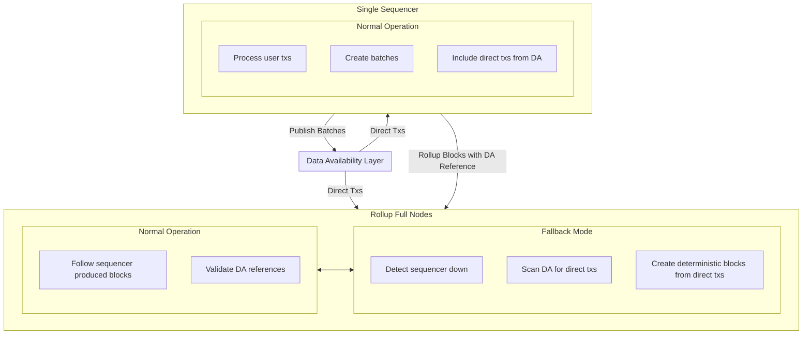
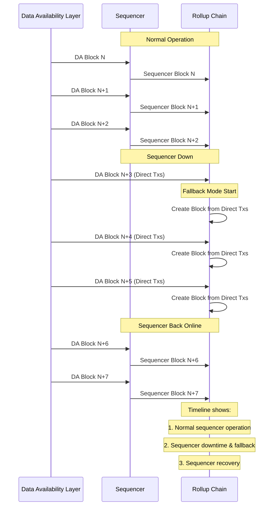

# ADR 018: Forced Inclusion Mechanism

## Changelog

- 2025-03-24: Initial draft

## Context

Rollkit currently supports a single sequencer implementation as described in ADR-013. While this approach provides a simple and efficient solution, it introduces a single point of failure that can impact the liveness of the rollup network. If the sequencer goes down or becomes unresponsive, the rollup chain cannot progress.

To address this limitation and improve the liveness properties of rollups built with Rollkit, we propose implementing a forced inclusion mechanism. This mechanism will allow transactions to be included directly from the Data Availability (DA) layer when the sequencer is unresponsive, creating an "unstoppable" property for Rollkit-based chains.

This enhancement aligns with the requirements defined in the [L2 Beat framework](https://forum.l2beat.com/t/the-stages-framework/291#p-516-stage-1-requirements-3) for Stage 1 L2s, advancing Rollkit's capabilities as a robust rollup framework.

## Alternative Approaches

### Decentralized Sequencer

A fully decentralized sequencer could solve the liveness issue by distributing sequencing responsibilities across multiple nodes. However, this approach introduces significant complexity in terms of consensus, leader election, and coordination between nodes. It would require substantial development effort and resources, making it less suitable as an immediate solution.

### Automatic Sequencer Failover

Another approach would be to implement an automatic failover mechanism where backup sequencers take over when the primary sequencer fails. While simpler than a fully decentralized solution, this approach still requires managing multiple sequencers and introduces complexity in coordination and state transfer between them.

## Decision

We will implement a forced inclusion mechanism for the Rollkit single sequencer architecture that:

1. Modifies the chain's fork choice rule to deterministically derive the canonical state by examining both sequencer-posted batches and direct transactions on the DA layer
2. Requires the sequencer to include direct transactions from the DA layer in rollup blocks
3. Implements validation rules around DA layer block references and timestamps
4. Provides a fallback mechanism for network progression when the sequencer is unresponsive

The mechanism will be designed to maintain backward compatibility with existing Rollkit deployments while providing enhanced liveness guarantees.

### High-Level Architecture

The following diagram illustrates the high-level architecture of the forced inclusion mechanism:



## Detailed Design

### User Requirements

- Rollup developers need a mechanism to ensure their chains can progress even when the single sequencer is unavailable
- The system should maintain a deterministic and consistent state regardless of sequencer availability
- The transition between sequencer-led and forced inclusion modes should be seamless

### Systems Affected

The implementation of the forced inclusion mechanism will affect several components of the Rollkit framework:

1. **Single Sequencer**: Must be modified to track and include direct transactions from the DA layer
2. **Full Node**: Must be updated to recognize and validate blocks with forced inclusions
3. **Block Processing Logic**: Must implement the modified fork choice rule
4. **DA Client**: Must be enhanced to scan for direct transactions
5. **Transaction Validation**: Must validate both sequencer-batched and direct transactions

### Data Structures

#### Leveraging ExtraData in Block Header

As defined in ADR-015 (Rollkit Minimal Header), the Rollkit minimal header already includes an `ExtraData` field designed for additional metadata. We will leverage this field instead of adding new explicit fields to the header structure:

```go
type Header struct {
    // Existing fields as defined in ADR-015
    ParentHash Hash
    Height uint64
    Timestamp uint64
    ChainID string
    DataCommitment []byte
    StateRoot Hash
    ExtraData []byte // Will contain DA reference information in a structured format
}
```

For the forced inclusion mechanism, we will encode the following information in the `ExtraData` field:

```go
type ForcedInclusionExtraData struct {
    DAOriginHeight    uint64         // Height of the DA layer block this rollup block derives from
    DAOriginHash      []byte         // Hash of the DA layer block this rollup block derives from
    DAOriginTimestamp uint64         // Timestamp of the DA layer block
    DirectTxsIncluded []common.Hash  // Hashes of direct transactions included from the DA layer
    // Other existing extraData fields, such as sequencer information
}
```

This approach maintains compatibility with the minimal header structure while adding the necessary information for forced inclusion.

#### Direct Transaction Tracking

```go
type DirectTransaction struct {
    TxHash       common.Hash  // Hash of the transaction
    DAHeight     uint64       // Height at which it was included in the DA layer
    DAHash       []byte       // Hash of the DA block
    Included     bool         // Whether it has been included in a rollup block
    IncludedAt   uint64       // Height at which it was included in the rollup
}

type DirectTxTracker struct {
    txs         map[common.Hash]DirectTransaction  // Map of direct transactions
    mu          sync.RWMutex                       // Mutex for thread-safe access
    latestDAHeight uint64                          // Latest DA block height scanned
}
```

#### Sequencer Status Tracking

```go
type SequencerStatus struct {
    IsActive          bool      // Whether the sequencer is considered active
    LastActiveHeight  uint64    // Last DA height where sequencer posted a batch
    InactiveBlocks    uint64    // Number of DA blocks since last sequencer activity
}
```

### APIs and Interfaces

#### Enhanced DA Client Interface

```go
type DAClient interface {
    // Existing methods
    // ...
    
    // New method for forced inclusion
    GetDirectTransactions(ctx context.Context, fromHeight, toHeight uint64) ([][]byte, error)
    // Note: SubmitDirectTransaction is removed as it's not a responsibility of the rollup node
}
```

#### Sequencer Interface Extensions

```go
// New methods added to the Sequencer interface
func (s *Sequencer) ScanDALayerForDirectTxs(ctx context.Context) error
func (s *Sequencer) IncludeDirectTransactions(ctx context.Context, batch *Batch) error
```

#### Full Node Interface Extensions

```go
// New methods added to the Node interface
func (n *Node) CheckSequencerStatus(ctx context.Context) (bool, error)
func (n *Node) ProcessDirectTransactions(ctx context.Context) error
func (n *Node) ValidateBlockWithDAReference(ctx context.Context, block *types.Block) error
```

### Implementation Changes

#### Single Sequencer Node Changes

1. **DA Layer Scanner**:
   - Implement a periodic scanner that queries the DA layer for direct transactions
   - Track all direct transactions in the DirectTxTracker data structure
   - Update the latest scanned DA height after each scan

2. **Transaction Inclusion Logic**:
   - Modify the batch creation process to include direct transactions from the DA layer
   - Ensure all direct transactions from a DA block are included before moving to the next DA block
   - Add the DA block reference information (height, hash, timestamp) to the `ExtraData` field in the rollup block header

3. **Validation Rules**:
   - Implement timestamp validation to ensure the rollup block's timestamp is not significantly higher than the referenced DA block
   - Ensure the referenced DA block height never decreases (monotonically increasing or equal)

4. **Recovery Mechanism**:
   - Add logic to detect when the sequencer comes back online after downtime
   - Implement state synchronization to catch up with any forced inclusions that occurred during downtime
   - Resume normal operation by building on top of the canonical chain tip

#### Sequencer Operation Flow

The following diagram illustrates the operation flow for the sequencer with forced inclusion:

```
┌─────────────────────────────────────────────────────────────────────────────────┐
│                           Sequencer Operation Flow                              │
└─────────────────┬───────────────────────────────────────────────────────────────┘
                  │
                  ▼
┌─────────────────────────────────┐      ┌────────────────────────────────────────┐
│ 1. Process User Transactions    │      │ 2. Periodic DA Layer Scanning          │
│                                 │      │                                        │
│ - Accept transactions from users│      │ - Query DA layer for direct txs        │
│ - Validate and queue txs        │      │ - Update DirectTxTracker               │
│ - Process queue based on policy │      │ - Track latest scanned DA height       │
└─────────────────┬───────────────┘      └────────────────────┬───────────────────┘
                  │                                           │
                  ▼                                           ▼
┌─────────────────────────────────┐      ┌────────────────────────────────────────┐
│ 3. Batch Creation               │      │ 4. Direct Transaction Inclusion        │
│                                 │      │                                        │
│ - Create batch of txs           │◄─────┤ - Include unprocessed direct txs       │
│ - Apply ordering policy         │      │ - Prioritize by DA height and order    │
│ - Calculate batch metadata      │      │ - Mark included txs as processed       │
└─────────────────┬───────────────┘      └────────────────────────────────────────┘
                  │
                  ▼
┌─────────────────────────────────┐      ┌────────────────────────────────────────┐
│ 5. DA Reference Creation        │      │ 6. Block Production                    │
│                                 │      │                                        │
│ - Select DA block to reference  │      │ - Create rollup block with batch       │
│ - Validate timestamp constraints│─────►│ - Add DA reference to extraData        │
│ - Ensure all direct txs included│      │ - Sign and publish block               │
└─────────────────────────────────┘      └────────────────────┬───────────────────┘
                                                             │
                                                             ▼
                                         ┌────────────────────────────────────────┐
                                         │ 7. DA Batch Submission                 │
                                         │                                        │
                                         │ - Submit batch to DA layer             │
                                         │ - Track submission status              │
                                         │ - Handle retry on failure              │
                                         └────────────────────────────────────────┘
```

#### Full Node Operation Flow

The following diagram illustrates the operation flow for full nodes with forced inclusion support:

```
┌─────────────────────────────────────────────────────────────────────────────────┐
│                           Full Node Operation Flow                              │
└─────────────────────────────────────────────────────────────────────────────────┘
                                        │
                                        ▼
┌─────────────────────────────────┐     ┌────────────────────────────────────────┐
│ 1. Normal Operation Mode        │     │ 2. Sequencer Status Monitoring         │
│                                 │     │                                        │
│ - Receive blocks from sequencer │     │ - Monitor sequencer activity on DA     │
│ - Validate blocks and headers   │◄───►│ - Track time since last sequencer batch│
│ - Apply state transitions       │     │ - Check against downtime threshold     │
└─────────────────────────────────┘     └────────────────────┬───────────────────┘
                                                            │
                                                            ▼
                                        ┌────────────────────────────────────────┐
                                        │ Is Sequencer Down?                     │
                                        │ (Based on configurable threshold)      │
                                        └────────────┬───────────────┬───────────┘
                                                    │               │
                                                    │ Yes           │ No
                                                    ▼               │
                                        ┌────────────────────────┐  │
                                        │ 3. Enter Fallback Mode │  │
                                        │                        │  │
                                        │ - Switch to direct tx  │  │
                                        │   processing          │  │
                                        │ - Notify subsystems   │  │
                                        └──────────┬─────────────┘  │
                                                  │                │
                                                  ▼                │
                                        ┌────────────────────────┐  │
                                        │ 4. DA Layer Scanning   │  │
                                        │                        │  │
                                        │ - Scan DA for direct   │  │
                                        │   transactions        │  │
                                        │ - Track latest DA     │  │
                                        │   height             │  │
                                        └──────────┬─────────────┘  │
                                                  │                │
                                                  ▼                │
                                        ┌────────────────────────┐  │
                                        │ 5. Deterministic Block │  │
                                        │    Creation           │  │
                                        │                        │  │
                                        │ - Create blocks with   │  │
                                        │   direct txs only     │  │
                                        │ - Add DA reference    │  │
                                        │ - Apply deterministic │  │
                                        │   ordering rules     │  │
                                        └──────────┬─────────────┘  │
                                                  │                │
                                                  ▼                ▼
┌─────────────────────────────────────────────────────────────────────────────────┐
│ 6. Block Processing and State Update                                            │
│                                                                                 │
│ - Execute transactions                                                          │
│ - Update state                                                                  │
│ - Persist blocks and state                                                      │
└─────────────────────────────────────────────────────────────────────────────────┘
```

### Fallback Mode Transition

The following diagram illustrates the transition between normal operation and fallback mode:



### Configuration

The forced inclusion mechanism will be configurable with the following parameters:

```go
type ForcedInclusionConfig struct {
    Enabled                   bool          // Whether forced inclusion is enabled
    SequencerDownBlocks      uint64        // Number of DA blocks after which the sequencer is considered down
    MaxTimestampDrift         time.Duration // Maximum allowed drift between rollup and DA timestamps
}
```

### Efficiency Considerations

- DA layer scanning is integrated into the core block processing pipeline for continuous monitoring
- Direct transactions are indexed by hash for quick lookups
- The sequencer status is tracked by DA block heights rather than wall clock time
- Using the existing `ExtraData` field instead of adding new header fields reduces overhead

### Security Considerations

- The mechanism ensures that only valid direct transactions can be included in the chain
- Timestamp validation prevents replay attacks where the sequencer could reference old DA blocks
- The configurable block height threshold prevents premature switching to fallback mode due to temporary sequencer issues
- All transactions, whether sequencer-batched or direct, undergo the same validation rules

### Privacy Considerations

- Direct transactions posted to the DA layer are publicly visible, just like sequencer-batched transactions
- No additional privacy concerns are introduced beyond the existing model

### Testing Strategy

1. **Unit Tests**:
   - Test individual components of the forced inclusion mechanism
   - Verify timestamp validation logic
   - Test the DA scanner functionality
   - Test the encoding and decoding of forced inclusion data in the `ExtraData` field

2. **Integration Tests**:
   - Test the interaction between the sequencer and the DA layer
   - Verify correct inclusion of direct transactions in rollup blocks

3. **End-to-End Tests**:
   - Simulate sequencer downtime and verify chain progression
   - Test the transition between normal and fallback modes
   - Verify the sequencer's recovery process after downtime

4. **Performance Testing**:
   - Measure the overhead introduced by the DA scanner
   - Benchmark the system's performance in fallback mode
   - Evaluate the impact of storing forced inclusion data in the `ExtraData` field

### Breaking Changes

This enhancement introduces no breaking changes to the existing API or data structures. It extends the current functionality by utilizing the existing `ExtraData` field in the minimal header, without modifying the core interfaces that rollup developers interact with.

## Status

Proposed

## Consequences

### Positive

- Improves the liveness guarantees of Rollkit-based chains
- Provides a path for Rollkit to meet Stage 1 L2 requirements per the L2 Beat framework
- Creates an "unstoppable" property for rollups, enhancing their reliability
- Maintains a deterministic chain state regardless of sequencer availability
- Utilizes the existing header structure without requiring explicit changes

### Negative

- Adds complexity to the block processing and validation logic
- Introduces overhead from scanning the DA layer for direct transactions
- Could potentially slow block production during fallback mode
- Requires additional processing to encode and decode forced inclusion data in the `ExtraData` field

### Neutral

- Requires rollup developers to consider both sequencer-batched and direct transaction flows
- Introduces configuration options that rollup developers need to understand and set appropriately
- Changes the mental model of how the chain progresses, from purely sequencer-driven to a hybrid approach
- Users will need to use external tools or services to submit direct transactions to the DA layer during sequencer downtime

## References

- [Rollkit Single Sequencer ADR-013](https://github.com/rollkit/rollkit/blob/main/specs/lazy-adr/adr-013-single-sequencer.md)
- [Rollkit Minimal Header ADR-015](https://github.com/rollkit/rollkit/blob/main/specs/lazy-adr/adr-015-rollkit-minimal-header.md)
- [L2 Beat Stages Framework](https://forum.l2beat.com/t/the-stages-framework/291#p-516-stage-1-requirements-3)
- [GitHub Issue #1914: Add Forced Inclusion Mechanism from the DA layer](https://github.com/rollkit/rollkit/issues/1914) 