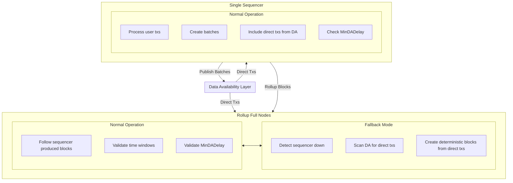
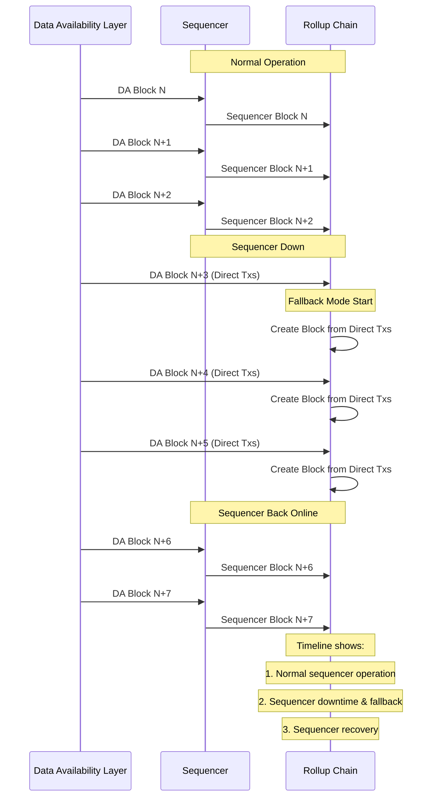

# ADR 018: Forced Inclusion Mechanism

## Changelog

- 2025-03-24: Initial draft

## Context

Rollkit currently supports a single sequencer implementation as described in ADR-013. While this approach provides a simple and efficient solution, it introduces a single point of failure that can impact the liveness of the rollup network. If the sequencer goes down or becomes unresponsive, the rollup chain cannot progress.

To address this limitation and improve the liveness properties of rollups built with Rollkit, we propose implementing a forced inclusion mechanism. This mechanism will allow transactions to be included directly from the Data Availability (DA) layer when the sequencer is unresponsive, creating an "unstoppable" property for Rollkit-based chains.

This enhancement aligns with the requirements defined in the [L2 Beat framework](https://forum.l2beat.com/t/the-stages-framework/291#p-516-stage-1-requirements-3) for Stage 1 L2s, advancing Rollkit's capabilities as a robust rollup framework.

## Alternative Approaches

### Decentralized Sequencer

A fully decentralized sequencer could solve the liveness issue by distributing sequencing responsibilities across multiple nodes. However, this approach introduces significant complexity in terms of consensus, leader election, and coordination between nodes. It would require substantial development effort and resources, making it less suitable as an immediate solution.

### Automatic Sequencer Failover

Another approach would be to implement an automatic failover mechanism where backup sequencers take over when the primary sequencer fails. While simpler than a fully decentralized solution, this approach still requires managing multiple sequencers and introduces complexity in coordination and state transfer between them.

## Decision

We will implement a forced inclusion mechanism for the Rollkit single sequencer architecture that uses a time-based inclusion delay approach. This approach will:

1. Track when transactions are first seen in terms of DA block time
2. Require a minimum number of DA blocks to pass before including a direct transaction
3. Let full nodes enforce inclusion within a fixed period of time window

The mechanism will be designed to maintain backward compatibility with existing Rollkit deployments while providing enhanced liveness guarantees.

### High-Level Architecture

The following diagram illustrates the high-level architecture of the forced inclusion mechanism:



## Detailed Design

### User Requirements

- Rollup developers need a mechanism to ensure their chains can progress even when the single sequencer is unavailable
- The system should maintain a deterministic and consistent state regardless of sequencer availability
- The transition between sequencer-led and forced inclusion modes should be seamless
- Transactions must be included within a fixed time window from when they are first seen
- Direct transactions must wait for a minimum number of DA blocks before inclusion

### Systems Affected

The implementation of the forced inclusion mechanism will affect several components of the Rollkit framework:

1. **Single Sequencer**: Must be modified to track and include direct transactions from the DA layer within the time window and after minimum DA block delay
2. **Full Node**: Must be updated to recognize and validate blocks with forced inclusions
3. **Block Processing Logic**: Must implement the modified fork choice rule
4. **DA Client**: Must be enhanced to scan for direct transactions
5. **Transaction Validation**: Must validate both sequencer-batched and direct transactions

### Data Structures

#### Direct Transaction Tracking

```go
type ForcedInclusionConfig struct {
    MaxInclusionDelay uint64    // Max inclusion time in DA block time units
    MinDADelay       uint64    // Minimum number of DA blocks before including a direct tx
}

type DirectTransaction struct {
    TxHash          common.Hash
    FirstSeenAt     uint64      // DA block time when the tx was seen
    Included        bool        // Whether it has been included in a rollup block
    IncludedAt      uint64      // Height at which it was included in the rollup
}

type DirectTxTracker struct {
    txs             map[common.Hash]DirectTransaction  // Map of direct transactions
    mu              sync.RWMutex                       // Mutex for thread-safe access
    latestSeenTime  uint64                            // Latest DA block time scanned
    latestDAHeight  uint64                            // Latest DA block height
}
```

#### Sequencer Status Tracking

```go
type SequencerStatus struct {
    IsActive          bool      // Whether the sequencer is considered active
    LastActiveTime    uint64    // Last DA block time where sequencer posted a batch
    InactiveTime      uint64    // Time since last sequencer activity
}
```

### APIs and Interfaces

#### Enhanced DA Client Interface

```go
type DAClient interface {
    // Existing methods
    // ...
    
    // New method for forced inclusion
    GetDirectTransactions(ctx context.Context, fromTime, toTime uint64) ([][]byte, error)
    // Note: SubmitDirectTransaction is removed as it's not a responsibility of the rollup node
}
```

#### Sequencer Interface Extensions

```go
// New methods added to the Sequencer interface
func (s *Sequencer) ScanDALayerForDirectTxs(ctx context.Context) error
func (s *Sequencer) IncludeDirectTransactions(ctx context.Context, batch *Batch) error
```

#### Full Node Interface Extensions

```go
// New methods added to the Node interface
func (n *Node) CheckSequencerStatus(ctx context.Context) (bool, error)
func (n *Node) ProcessDirectTransactions(ctx context.Context) error
func (n *Node) ValidateBlockTimeWindow(ctx context.Context, block *types.Block) error
```

### Implementation Changes

#### Single Sequencer Node Changes

1. **DA Layer Scanner**:
   - Implement a periodic scanner that queries the DA layer for direct transactions
   - Track all direct transactions in the DirectTxTracker data structure
   - Update the latest seen DA block time and height after each scan

2. **Transaction Inclusion Logic**:
   - Modify the batch creation process to include direct transactions from the DA layer
   - Ensure all direct transactions are included within the MaxInclusionDelay time window
   - Check that transactions have waited for MinDADelay DA blocks
   - Track transaction inclusion times and enforce both delay constraints

3. **Validation Rules**:
   - Implement time window validation to ensure transactions are included within MaxInclusionDelay
   - Implement DA block delay validation to ensure transactions wait for MinDADelay blocks
   - Track both time-based and DA block-based delays for each transaction

4. **Recovery Mechanism**:
   - Add logic to detect when the sequencer comes back online after downtime
   - Implement state synchronization to catch up with any forced inclusions that occurred during downtime
   - Resume normal operation by building on top of the canonical chain tip

#### Sequencer Operation Flow

The following diagram illustrates the operation flow for the sequencer with forced inclusion:

```
┌─────────────────────────────────────────────────────────────────────────────────┐
│                           Sequencer Operation Flow                              │
└─────────────────┬───────────────────────────────────────────────────────────────┘
                  │
                  ▼
┌─────────────────────────────────┐      ┌────────────────────────────────────────┐
│ 1. Process User Transactions    │      │ 2. Periodic DA Layer Scanning          │
│                                 │      │                                        │
│ - Accept transactions from users│      │ - Query DA layer for direct txs        │
│ - Validate and queue txs        │      │ - Update DirectTxTracker               │
│ - Process queue based on policy │      │ - Track latest seen DA block time      │
└─────────────────┬───────────────┘      └────────────────────┬───────────────────┘
                  │                                           │
                  ▼                                           ▼
┌─────────────────────────────────┐      ┌────────────────────────────────────────┐
│ 3. Batch Creation               │      │ 4. Direct Transaction Inclusion        │
│                                 │      │                                        │
│ - Create batch of txs           │◄─────┤ - Include unprocessed direct txs       │
│ - Apply ordering policy         │      │ - Prioritize by first seen             │
│ - Calculate batch metadata      │      │ - Mark included txs as processed       │
└─────────────────┬───────────────┘      └────────────────────────────────────────┘
                  │
                  ▼
┌──────────────────────────────────┐      ┌────────────────────────────────────────┐
│ 5. Time Window Validation        │      │ 6. Block Production                    │
│                                  │      │                                        │
│ - Check transaction timestamps   │      │ - Create rollup block with batch       │
│ - Ensure within MaxInclusionDelay│─────►│ - Sign and publish block               │
│ - Track inclusion times          │      │                                        │
└──────────────────────────────────┘      └─────────────────┬──────────────────────┘
                                                            │
                                                            ▼
                                          ┌────────────────────────────────────────┐
                                          │ 7. DA Batch Submission                 │
                                          │                                        │
                                          │ - Submit batch to DA layer             │
                                          │ - Track submission status              │
                                          │ - Handle retry on failure              │
                                          └────────────────────────────────────────┘
```

#### Full Node Operation Flow

The following diagram illustrates the operation flow for full nodes with forced inclusion support:

```
┌─────────────────────────────────────────────────────────────────────────────────┐
│                           Full Node Operation Flow                              │
└─────────────────────────────────────────────────────────────────────────────────┘
                                        │
                                        ▼
┌─────────────────────────────────┐     ┌────────────────────────────────────────┐
│ 1. Normal Operation Mode        │     │ 2. Sequencer Status Monitoring         │
│                                 │     │                                        │
│ - Receive blocks from sequencer │     │ - Monitor sequencer activity on DA     │
│ - Validate time windows         │◄───►│ - Track time since last sequencer batch│
│ - Apply state transitions       │     │ - Check against downtime threshold     │
└─────────────────────────────────┘     └───────────────────┬────────────────────┘
                                                            │
                                                            ▼
                                        ┌────────────────────────────────────────┐
                                        │ Is Sequencer Down?                     │
                                        │ (Based on configurable threshold)      │
                                        └───────────┬───────────────┬────────────┘
                                                    │               │
                                                    │ Yes           │ No
                                                    ▼               │
                                        ┌────────────────────────┐  │
                                        │ 3. Enter Fallback Mode │  │
                                        │                        │  │
                                        │ - Switch to direct tx  │  │
                                        │   processing           │  │
                                        │ - Notify subsystems    │  │
                                        └──────────┬─────────────┘  │
                                                  │                 │
                                                  ▼                 │
                                        ┌────────────────────────┐  │
                                        │ 4. DA Layer Scanning   │  │
                                        │                        │  │
                                        │ - Scan DA for direct   │  │
                                        │   transactions         │  │
                                        │ - Track latest seen    │  │
                                        │   DA block time        │  │
                                        └──────────┬─────────────┘  │
                                                   │                │
                                                   ▼                │
                                        ┌────────────────────────┐  │
                                        │ 5. Deterministic Block │  │
                                        │    Creation            │  │
                                        │                        │  │
                                        │ - Create blocks with   │  │
                                        │   direct txs only      │  │
                                        │ - Apply deterministic  │  │
                                        │   ordering rules       │  │
                                        └──────────┬─────────────┘  │
                                                   │                │
                                                   ▼                ▼
┌─────────────────────────────────────────────────────────────────────────────────┐
│ 6. Block Processing and State Update                                            │
│                                                                                 │
│ - Execute transactions                                                          │
│ - Update state                                                                  │
│ - Persist blocks and state                                                      │
└─────────────────────────────────────────────────────────────────────────────────┘
```

### Fallback Mode Transition

The following diagram illustrates the transition between normal operation and fallback mode:



### Configuration

The forced inclusion mechanism will be configurable with the following parameters:

```go
type ForcedInclusionConfig struct {
    Enabled                   bool          // Whether forced inclusion is enabled
    MaxInclusionDelay         uint64        // Maximum time window for transaction inclusion
    SequencerDownTime         uint64        // Time after which the sequencer is considered down
    MinDADelay               uint64        // Minimum number of DA blocks before including a direct tx
}
```

### Efficiency Considerations

- DA layer scanning is integrated into the core block processing pipeline for continuous monitoring
- Direct transactions are indexed by hash for quick lookups
- The sequencer status is tracked by DA block time rather than block heights
- Time-based tracking simplifies the implementation and reduces overhead
- DA block height tracking adds minimal overhead to existing block processing

### Security Considerations

- The mechanism ensures that only valid direct transactions can be included in the chain
- Time window validation prevents delayed inclusion of transactions
- The configurable time threshold prevents premature switching to fallback mode due to temporary sequencer issues
- All transactions, whether sequencer-batched or direct, undergo the same validation rules
- MinDADelay provides protection against DA layer censorship by requiring multiple block proposers to collude
- Block-based delay prevents single block proposer censorship by ensuring transactions must be visible across multiple DA layer blocks
- The delay mechanism is inspired by the "Based Sequencing with Soft Confirmations" design from [Sovereign SDK #408](https://github.com/Sovereign-Labs/sovereign-sdk/issues/408), which uses deferred execution to prevent DA layer block proposers from censoring transactions

### Privacy Considerations

- Direct transactions posted to the DA layer are publicly visible, just like sequencer-batched transactions
- No additional privacy concerns are introduced beyond the existing model

### Testing Strategy

1. **Unit Tests**:
   - Test individual components of the forced inclusion mechanism
   - Verify time window validation logic
   - Test the DA scanner functionality
   - Test transaction inclusion timing constraints
   - Test MinDADelay validation

2. **Integration Tests**:
   - Test the interaction between the sequencer and the DA layer
   - Verify correct inclusion of direct transactions within time windows
   - Test DA block delay validation
   - Verify both time and block delay constraints

3. **End-to-End Tests**:
   - Simulate sequencer downtime and verify chain progression
   - Test the transition between normal and fallback modes
   - Verify the sequencer's recovery process after downtime
   - Test transaction inclusion with various delay configurations

4. **Performance Testing**:
   - Measure the overhead introduced by the DA scanner
   - Benchmark the system's performance in fallback mode
   - Evaluate the impact of time-based tracking
   - Measure the performance impact of DA block delay validation

### Breaking Changes

This enhancement introduces no breaking changes to the existing API or data structures. It extends the current functionality by implementing time-based transaction tracking and inclusion rules, along with DA block-based delay validation, without modifying the core interfaces that rollup developers interact with.

## Status

Proposed

## Consequences

### Positive

- Improves the liveness guarantees of Rollkit-based chains
- Provides a path for Rollkit to meet Stage 1 L2 requirements per the L2 Beat framework
- Creates an "unstoppable" property for rollups, enhancing their reliability
- Maintains a deterministic chain state regardless of sequencer availability
- More predictable deadlines in DA time
- Easier to reason about for users and developers
- Prevents DA layer censorship by requiring multiple block proposers to collude

### Negative

- Adds complexity to the block processing and validation logic
- Introduces overhead from scanning the DA layer for direct transactions
- Could potentially slow block production during fallback mode
- May need careful tuning of time window parameters
- Could be affected by variations in block production rate
- Additional complexity from tracking DA block heights for delay validation

### Neutral

- Requires rollup developers to consider both sequencer-batched and direct transaction flows
- Introduces configuration options that rollup developers need to understand and set appropriately
- Changes the mental model of how the chain progresses, from purely sequencer-driven to a hybrid approach
- Users will need to use external tools or services to submit direct transactions to the DA layer during sequencer downtime

## References

- [Rollkit Single Sequencer ADR-013](https://github.com/rollkit/rollkit/blob/main/specs/lazy-adr/adr-013-single-sequencer.md)
- [Rollkit Minimal Header ADR-015](https://github.com/rollkit/rollkit/blob/main/specs/lazy-adr/adr-015-rollkit-minimal-header.md)
- [L2 Beat Stages Framework](https://forum.l2beat.com/t/the-stages-framework/291#p-516-stage-1-requirements-3)
- [GitHub Issue #1914: Add Forced Inclusion Mechanism from the DA layer](https://github.com/rollkit/rollkit/issues/1914)
