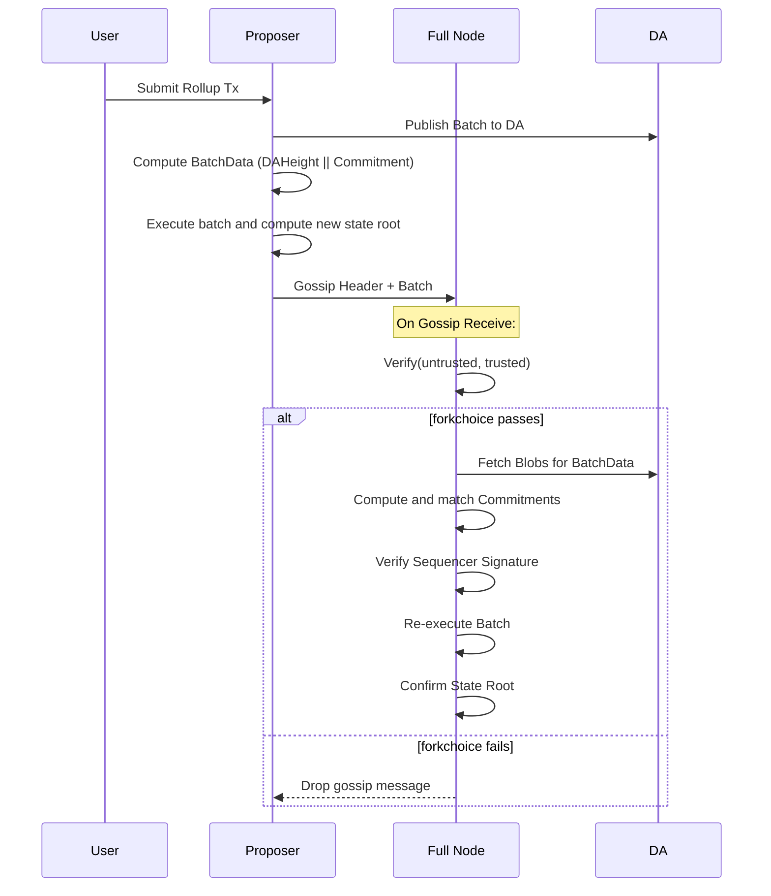

# ADR 020: Validation Flow for Single Sequencer Rollups

## Changelog

- 2025-04-08: Initial draft
- 2025-04-23: Renumbered from ADR-013 to ADR-020 to maintain chronological order.

## Context

In the single sequencer rollup model, a single trusted sequencer proposes rollup blocks. To ensure correctness and prevent censorship or fraud, full nodes independently verify proposed headers and associated batches. This ADR describes the validation process involved, both in terms of header/batch verification and forkchoice-safe propagation over the p2p network.

This model enables fast confirmation by gossiping proposed headers and batches, while allowing full nodes to maintain the security guarantees by performing their own validation and verification of data availability.

## Alternative Approaches

Other rollup models, such as fully decentralized based sequencing or leaderless batching, avoid reliance on a single sequencer but introduce latency or complexity. While decentralization is the long-term goal, this ADR focuses on a pragmatic and performant solution for single sequencer setups.

## Decision

We adopt a validation design that ensures safety through two layers of verification:

1. **Forkchoice verification** for p2p gossip safety.
2. **Header-batch consistency and signature validation** by full nodes.

## Detailed Design

### Entities Involved

- **Proposer (Sequencer):**
  - Collects user transactions
  - Builds a batch and submits it to the DA layer
  - Constructs batchData ([]ID), where each ID = DAHeight + Commitment
  - Applies batch to compute state update and forms a header, signs the header
  - Publishes header and batch via p2p gossip
  - Stores header on DA layer

- **Full Node:**
  - Receives the batch and header via gossip
  - Validates that the gossip update respects forkchoice
  - Checks the header signature
  - Verifies the batch against the header (DA proofs and commitments)
  - Applies the batch to recompute state root and match the state root in the proposed header

### Verification Pipeline

The full node performs the following validations:

#### 1. Forkchoice Safe Verification (for P2P Gossip)

P2P gossip propagation requires `Verify(untrusted, trusted)`:

- Verify that `untrusted.LastHash == trusted.Hash()`
- This check ensures linearity and prevents equivocation in gossip
- This forkchoice check is performed **before** header and batch validation

If this verification fails, the gossip update is dropped.

#### 2. Header vs Batch Validation

Once the gossip message passes forkchoice check:

- Signature Validation:
  - Check the signature of the sequencer (proposer) on the header
- Use `VerifyBatch(batchData)`:
  - Extract the `[]ID` from header
  - Each ID encodes DA height + commitment
  - Query DA layer to fetch proofs using `GetProofs(batch data, batch namespace)`
  - Calls `Validate(proofs, batch data, batch namespace)`
  - Reconstruct commitment locally and match it with commitment in ID to ensure that batch actually corresponds to the batch data in header
- State Root Verification:
  - Re-execute batch using local execution layer
  - Recompute state root and match with header's declared root

Only if all of the above pass, the header is marked as valid and added to forkchoice.

### Diagram

## Status

Proposed

## Consequences

### Positive

- Ensures full nodes validate every rollup state transition
- Forkchoice check ensures linear chain progression and safe gossip
- Protects against malicious proposers submitting invalid batches or headers

### Negative

- Still relies on a trusted sequencer for liveness
- Full validation increases complexity on full nodes

### Neutral

- This ADR aligns with current implementation direction for single-sequencer-based rollups

## References
