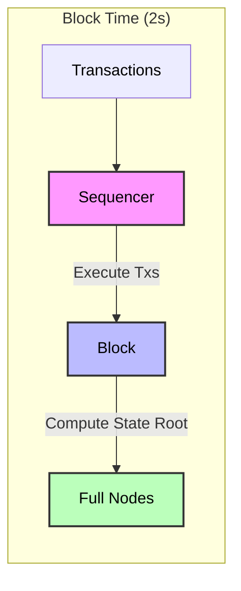
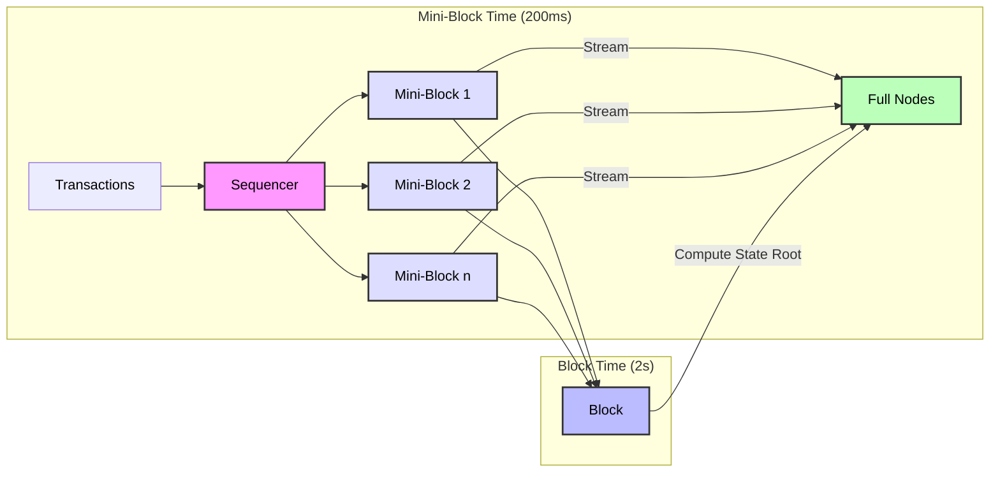

# ADR 021: Transaction Streaming via Mini Blocks from Single Sequencer

## Changelog

- 2025-04-28: Initial draft

## Context

Currently, in single sequencer mode in Rollkit, every configured block time, the sequencer produces blocks. This includes constructing a batch of transactions to put in a block, executing them, and producing a header with an updated state root. This process introduces latency between transaction submission and network-wide propagation, as transactions are only shared after full block production. This ADR proposes a design where the sequencer streams smaller transaction batches in the form of "mini blocks" sooner to full nodes via p2p so full nodes can receive transactions without waiting for execution or state root computation by the sequencer to reduce overall end-user latency and enhance UX.

### Current Architecture (Before)

### Proposed Architecture (After)

## Alternative Approaches

1. **Immediate Transaction Broadcasting**
   - Broadcast individual transactions immediately upon receipt
   - Pros: Lowest possible latency
   - Cons: Higher network overhead, potential complex coordination with execution layer

2. **Parallel Block Production**
   - Run block production in parallel while streaming transactions
   - Pros: Maintains traditional block structure
   - Cons: More complex implementation, potential consistency issues on handling transactions with state contention

3. **Variable Block Times**
   - Dynamically adjust block times based on transaction volume
   - Pros: Natural adaptation to network load
   - Cons: Less predictable finality times, more complex coordination

## Decision

The Rollkit sequencer can be extended to support streaming transaction batches as mini blocks to full nodes via p2p. These mini blocks:

- Consist of a batch of transactions received within a short time window.
- Are not executed by the sequencer before streaming and no state root is produced at this stage.
- Are propagated to full nodes as soon as they are formed
- Can be part of a single block header corresponding to a "full block" with an updated state root

Full nodes will receive, and apply the transactions in these mini blocks to their state just like soft-confirmations, but won't compute state roots until the full block header is received.

## Detailed Design

### Systems Affected

- Sequencer node logic (mini block formation and streaming)
- Full node p2p logic (mini block reception and handling)
- Full node batch validation logic (block header linking to multiple batches instead of one)

### Data Structures
- **MiniBlock:**
  - `mini_block_id`: Unique identifier (e.g., sequencer address + timestamp or a sub-block height like 1.2 for mini-block 2 as part of block height 1)
  - `txs`: List of transactions
  - `timestamp`: Time of mini-block formation
  - `sequencer_signature`: For authenticity

### Proposed Modifications

#### Sequencer

- Introduce a mini-block time in addition to block time that's much smaller than the block time that controls the rate at which transactions are reaped to produce mini-blocks are produced.

- Reuse the current channel for p2p batch propagation for propagating mini-blocks instead.

- Modify the header produced every regular block to link to all the mini-block transactions applied in that header.

#### Full Node

- Receive mini-blocks instead of one batch per header.
- Send the mini-block transactions to the execution layer to apply to state
- Modify batch validation logic to mark a regular block DA included only when all mini-blocks associated to the header are verified as published on the DA layer.

## Status

Proposed

## Considerations

Mini-blocks could be made optional and more opt-in by full nodes as well if we don't replace the existing p2p channel used for batch broadcasting and were to use a separate p2p channel/topic.

### Additional Considerations

1. **Network Impact**
   - Bandwidth usage monitoring
   - Peer connection management
   - Network congestion handling

2. **State Management**
   - Memory usage for pending mini-blocks
   - Garbage collection of obsolete mini-blocks
   - State sync optimization

3. **Backward Compatibility**
   - Support for older nodes
   - Gradual rollout strategy
   - Fallback mechanisms

## Consequences

### Positive
- Faster transaction propagation and improved UX
- No impact on consensus or state safety
- Removes the need for sequencer to execute transactions before gossiping them to full nodes

### Negative
- Slightly increased p2p bandwidth usage
- Potential for spam if not rate-limited or authenticated

### Neutral
- Requires more sophisticated peer management
- Could impact network topology design

## References

- [Base Flashbots/Flashblocks](https://flashblocks.base.org/)
- [Rollkit Single Sequencer ADR](./adr-013-single-sequencer.md)
- [Solana P2P Shred Specification](https://github.com/solana-foundation/specs/blob/main/p2p/shred.md)