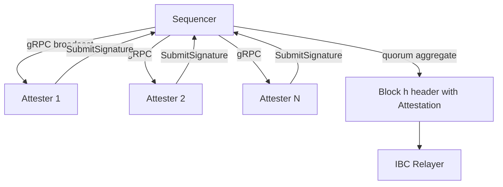

# 022 Validator Network

Date: 2025-05-25
Status: Draft

## Context

The validator network acts as an extra security layer and soft confirmation enabling the rollup to move faster than the underlying DA layer. Secondly a validator network introduces the opportunity to do more with the token of the chain.

The original design and implementation was centered around IBC and adding a extra layer of security for counter party chains, so that the user is not solely trusting the sequencer to act correctly

## Decision

### High-level workflow

 1. Block broadcast — For every height h the sequencer broadcasts the canonical BlockBundle(h) (header, transactions, state root) to all active attesters over gRPC/WebSocket.
 2. Local verification — Each attester independently:
 • validates header → parent → state transition;
 • (optionally) re-executes the block using a connected full node;
 • signs bytesToSign = SHA-256(height || blockHash || stateRoot) with its private key.
 3. Signature return — The attester sends SubmitSignature{height, blockHash, pubKey, signature} back to the sequencer (one-way unary gRPC).
 4. Aggregation & quorum — The sequencer collects signatures until ≥ ⅔ of current bonded voting power have signed. (Optionally this step can be done async)
 5. Final block commit — Sequencer writes the quorum attestation into BlockHeader.ValidatorHash and gossips the block via IBC.

### Signing schemes

Different signature schemes can be doused in conjunction with the validator network. To start we will support ED25519 and later one we plan on adding other signature schemes based on how user demand requires.

Some potential future additions could be BLS12-381 aggregate and/or a BLS threshold signature.

### Validator set & staking integration

The attester layer can plug into different validator‑set providers. Below we outline the existing Cosmos‑SDK flow and an alternative Reth / EVM flow patterned after UniChain’s staking design. Both share the same quorum rule (≥ ⅔ voting power) and slashing philosophy.

#### Option A – Cosmos‑SDK (current main‑net)

- The staking module is the single source of truth for membership and voting power.
- Create / Edit / Unbond msgs emit ValidatorSetUpdate events every block; sequencer & attesters rebuild the bitmap each height.
- Joining — once bonded, a validator runs the attester daemon; missed signatures trigger normal jailing & slashing.
- Leaving — when voting power reaches 0 the sequencer drops the validator from the next bitmap, ignoring late sigs.

#### Option B - Reth/EVM Rollup

- Stake manager contract holds the validator stake/weight and maps an address to a key. It will emit `StakeSnapshot(epoch)` events that will be consumed by the consensus client.
- Stake mirror listens for staking snapshot events in order to re build the validtor set. The proposer will always be the same, we do not support rotation at this time. Once the validator set is rebuilt any changes that are witnessed will be applied to the validator network.
-

Solidity Contract

```sol
contract StakeManager {
    struct Validator { uint96 power; bytes32 edKey; bytes blsKey; }
    mapping(address => Validator) public validators;

    function stake(uint96 amount, bytes32 edKey, bytes calldata blsKey) external;
    function unstake(uint96 amount) external;
    function slash(address val, uint96 amt) external /* onlyEvidence */;
    function snapshot() external returns (bytes32 root); // called by sequencer each epoch
}
```

In rollkit we will introduce a new state entry for epochs, active set, stake and a registry of all participants in the validator network.

```text
validators/stake/{addr}         → power | edKey | blsKey | missedCtr
validators/epochRoot/{epoch}    → bytes32
validators/activeSet/{epoch}    → addr[]
validators/registry             → addr[]          (permissioned only)
```

### Quorum and liveness

 • Quorum rule: signedVotingPower ≥ 2/3 * totalVotingPower
 • Timeouts
– AttesterTimeout = 2 s after broadcast.
– AggregationTimeout = 5 s; sequencer can still commit if quorum not met only in EmergencyMode (governance toggle) to avoid total halt.
 • Safety vs. liveness — Because verification is local and deterministic, equivocation is impossible: the worst failure mode is not reaching quorum (→ halt) which staking incentives should discourage.

## Architecture & Interfaces



### Sequencer additions

 • /broadcastBlock (server-stream): pushes BlockBundle(h) to every connected attester.
 • /SubmitSignature (rpc): receives SignatureMsg.
 • Aggregation cache: map[height]SignatureAccumulator with bitset of pubkeys.
 • State hooks: listens to staking.ValidatorSetUpdate to rebuild ActiveValidatorBitmap each height.

### Attester service

 • Conn manager — maintains persistent stream to /broadcastBlock and unary client to /SubmitSignature.
 • Verifier pipeline:

 1. basic header checks;
 2. optional re-execution (--verify-full=true flag);
 3. produce signature;
 4. async submit with retries.
 • Metrics / Prom: per-block verification time, submit latency, signed / missed counter.

## Security considerations

 • Double-sign protection — Deterministic bytesToSign makes replay impossible; Ed25519 prevents malleability.
 • Slashing — Existing Cosmos evidence (MsgEvidence) for missed or duplicate signatures applies unchanged.
 • Sybil resistance — validator power is staked; no separate token.

## Consequences

- Increased code complexity, more to maintain

## Future work

- Multi-sequencer fail-over — once fast-leader-election is required we can revisit consensus (e.g., HotStuff) purely for sequencer rotation.
- Light-client proofs — expose AttestationProof object so external bridges can verify signedVotingPower without full header.
- Bundle attestation & DA availability proof to offer optimistic fast-finality bridges.

## Appendix A — gRPC proto (excerpt)

```proto
service AttesterService {
  rpc BroadcastBlock(stream BlockBundle) returns (stream Empty) {}
  rpc SubmitSignature(SignatureMsg) returns (SubmitSignatureResponse) {}
}

message BlockBundle {
  uint64  height      = 1;
  bytes   block_hash  = 2;
  bytes   state_root  = 3;
  bytes   header      = 4; // protobuf-encoded header
  bytes   txs         = 5; // amino bz2 concatenated
}

message SignatureMsg {
  uint64  height     = 1;
  bytes   block_hash = 2;
  bytes   pub_key    = 3;
  bytes   signature  = 4; // ed25519 or bls
}

message SubmitSignatureResponse {
  bool ack = 1;
}
```
