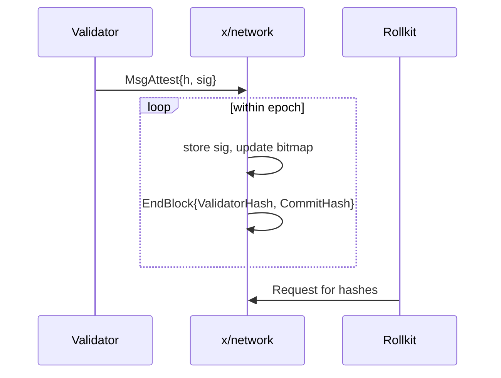
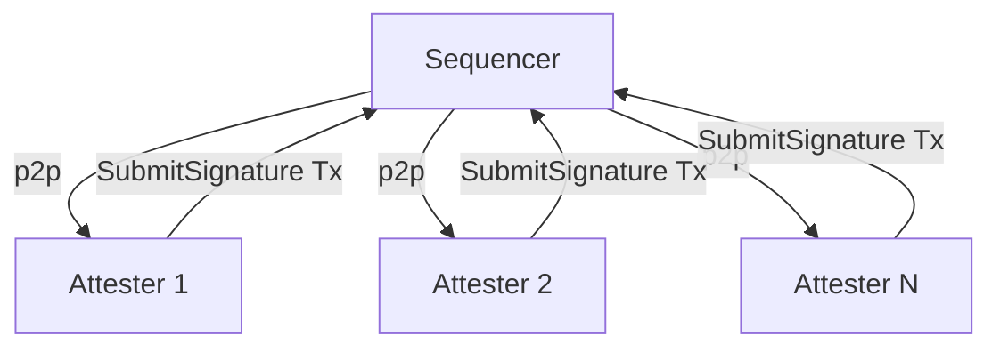

# 022 Validator Network

Date: 2025-05-25
Status: Draft

## Context

When a single sequencer is used there is a limited design space for the token and a limited set of security guarantees. The validator network offers an alternative to using a full consensus protocol, but offers security guarantees with more than one participant verifying the execution and ordering.

The validator network acts as an extra security layer and soft confirmation enabling the rollup to move faster than the underlying DA layer with added security. Secondly a validator network introduces the opportunity to do more with the token of the chain.

The original design and implementation was centered around IBC and adding an extra layer of security for counter party chains, so that the user is not solely trusting the sequencer to act correctly

## Decision

Rollkit will introduce a validator network in which there will be a set of validators verifying execution and construction.

Validators sign **one Attestation per epoch** that covers every block proposed inside that
epoch.  The Attestation must be broadcast as a transaction within a configurable
**SubmissionWindow** (measured in blocks and always ≤ `EpochLength`).
Missing the window does **not** incur slashing but the validator forfeits rewards for that
epoch.
If a validator fails to submit an Attestation for **NonParticipationEpochs** consecutive
epochs it is automatically removed from the active validator set (stake remains bonded
unless separate evidence triggers slashing).

The design is centered around the proposer producing blocks as fast as possible and asking
for signatures **after the fact, once per epoch**.  This maximises throughput while still
obtaining soft-finality from a multi-party validator set.

### High-level workflow

 1. Block broadcast — For every height h the sequencer broadcasts the canonical BlockBundle(h) (header, transactions, state root) to all active attesters over gRPC/WebSocket.
 2. Local verification — Each attester independently:
 • validates every block header in the epoch and the resulting state transition;
 • (optionally) re-executes the blocks using a connected full node;
 • after processing the last block of the epoch, what is signs is up to the execution environment.
 3. Attestation submission — The attester sends the epoch signature as a transaction
   **within SubmissionWindow**.
 4. Aggregation & quorum — The attester module / contract collects epoch signatures until
   ≥ ⅔ of current bonded voting power have signed, providing a soft confirmation of the
   whole epoch.
    - If quorum is not met by the epoch boundary, the network pauses new proposals until
      quorum is reached or **EmergencyMode** governance override is enabled.
 5. Final block commit — After the block is included in the DA layer it will be considered to have a hard confirmation.

### Signing schemes

Different signature schemes can be doused in conjunction with the validator network. To start we will support ED25519 and later one we plan on adding other signature schemes based on how user demand requires.

Some potential future additions could be BLS12-381 aggregate and/or a BLS threshold signature.

### Validator set & staking integration

The attester layer can plug into different validator‑set providers. Below we outline the existing Cosmos‑SDK flow and an alternative Reth / EVM flow patterned after UniChain’s staking design. Both share the same quorum rule (≥ ⅔ voting power) and slashing philosophy.

#### Cosmos‑SDK

Introduce a dedicated x/network module that completely owns the CommitHash and ValidatorHash that appear in every block‑header. Rollkit remains untouched; the logic lives entirely in the ABCI application.

Hashes produced in‑app During EndBlock, x/network gathers the attestation bitmap for height h, computes and returns them in ResponseEndBlock.

When a relayer queries /block or /header, the application serves the canonical valset hash and commit hash from its KV‑store, ensuring external clients see the attested header even though rollkit itself never verified the signatures.

Validatorset updates from the staking module (x/staking) remains the single source of truth for bonded power. Every block it emits a ValidatorSetUpdate event. x/network subscribes and mirrors
the active validator bitmap. On a set‑change (say at height 100) the EndBlock hook updates x/network's bitmap before computing the hashes for the next height.

##### Flow



Missing participation at the epoch boundary x/network evaluates participation:

- if validator power‑weighted participation < Quorum (default 2/3) ⇒ return ErrAttestationTimeout and halt new block production;
- validators whose participation < MinParticipation for the entire epoch are auto‑ejected from the attester set via an EditValidator emitted by x/network (their stake remains bonded but they cease to sign until they re‑declare).

#### Reth/EVM Rollup

- Stake manager contract holds the validator stake/weight and maps an address to a key. It will emit `StakeSnapshot(epoch)` events that will be consumed by the consensus client.
- Stake mirror listens for staking snapshot events in order to re build the validtor set. The proposer will always be the same, we do not support rotation at this time. Once the validator set is rebuilt any changes that are witnessed will be applied to the validator network.
- The EVM will work in the non blocking way. The validators will be able to join and leave as they please with the requirement that they submit attestations of execution in order to provide a soft confirmation within an epoch if they would like a reward for their work.

Solidity Contract

```sol
contract StakeManager {
    struct Validator { uint96 power; bytes32 edKey; bytes blsKey; }
    mapping(address => Validator) public validators;

    function stake(uint96 amount, bytes32 edKey, bytes calldata blsKey) external;
    function unstake(uint96 amount) external;
    function slash(address val, uint96 amt) external /* onlyEvidence */;
    function snapshot() external returns (bytes32 root); // called by sequencer each epoch
}
```

### Quorum and liveness

 • Quorum rule (per-epoch): `signedVotingPower ≥ 2/3 · totalVotingPower`
 • Timers
   – `SubmissionWindow` (blocks): max delay after epoch end to include an attestation.
   – `AggregationTimeout` (seconds): after window closes; sequencer can advance only if
     **EmergencyMode** is enabled, otherwise production halts.
 • Safety vs. liveness — Because verification is local and deterministic, equivocation is impossible: the worst failure mode is not reaching quorum (→ halt) which staking incentives should discourage.

## Architecture & Interfaces



### Attester service

 • Conn manager — maintains persistent stream to /broadcastBlock and unary client to /SubmitSignature.
 • Verifier pipeline:

 1. basic header checks;
 2. produce signature;
 3. async submit transaction with signautres

## Security considerations

 • Double-sign protection — Deterministic bytesToSign makes replay impossible; Ed25519 prevents malleability.
 • Slashing — Existing Cosmos evidence (MsgEvidence) for missed or duplicate signatures applies unchanged.
 • Sybil resistance — validator power is staked; no separate token.

## Consequences

- Increased code complexity, more to maintain

## Future work

- Multi-sequencer fail-over — once fast-leader-election is required we can revisit consensus purely for sequencer rotation.
