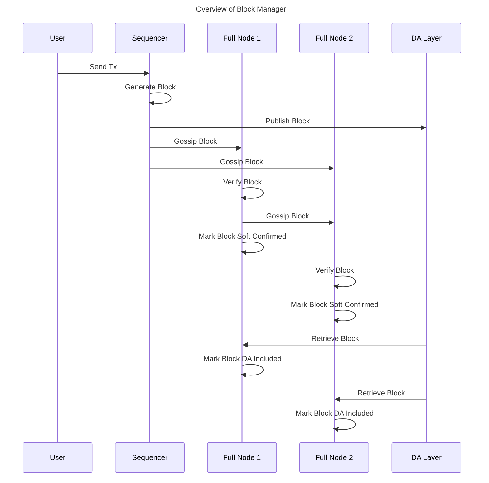
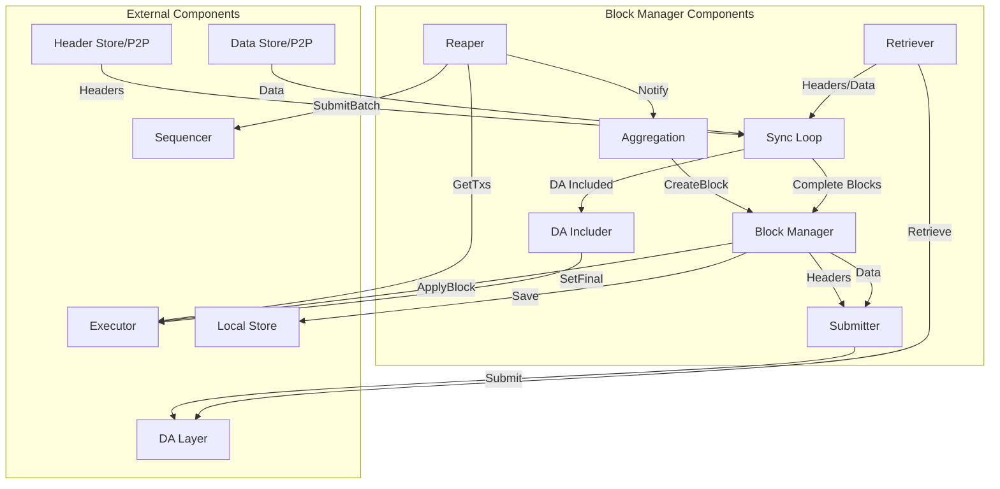
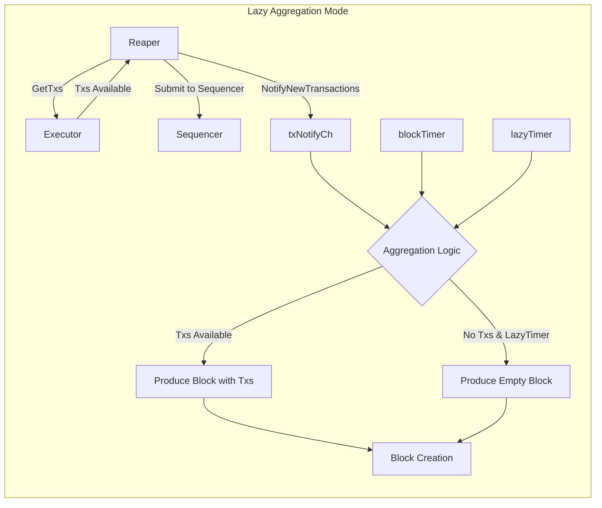
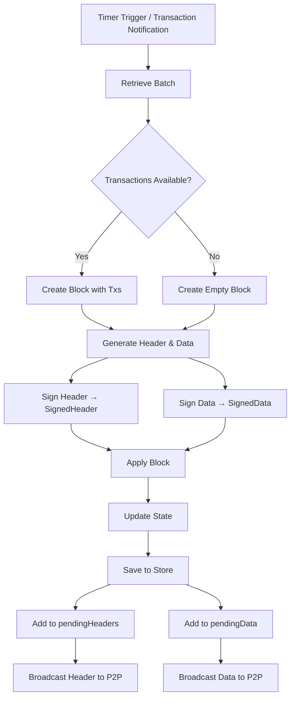
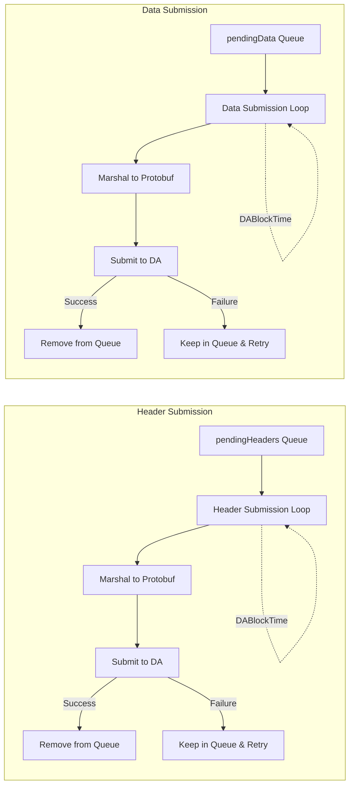
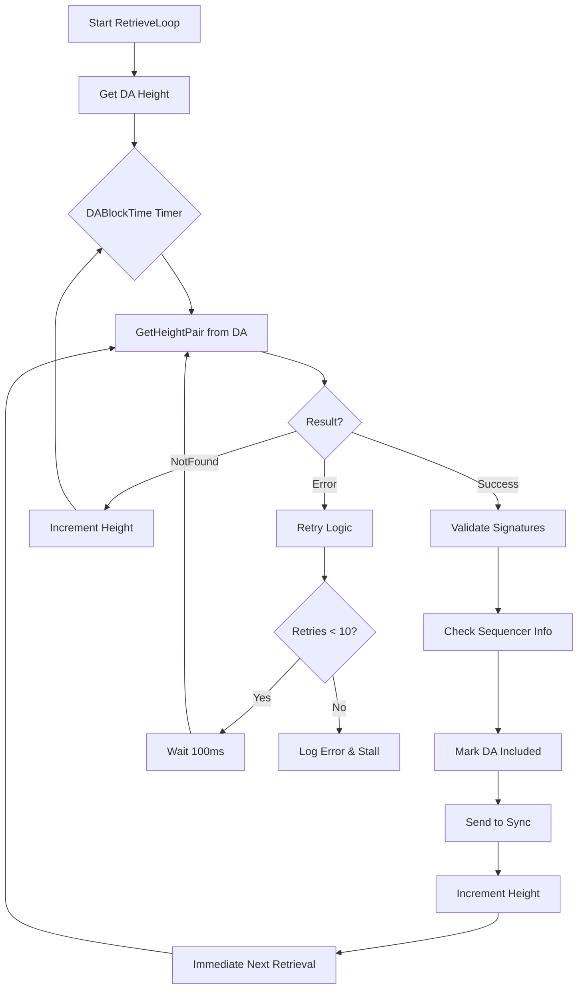
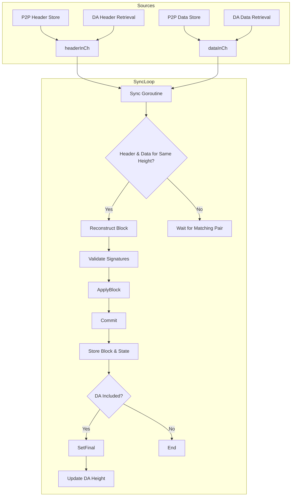

# Block Manager

## Abstract

The block manager is a key component of full nodes and is responsible for block production or block syncing depending on the node type: sequencer or non-sequencer. Block syncing in this context includes retrieving the published blocks from the network (P2P network or DA network), validating them to raise fraud proofs upon validation failure, updating the state, and storing the validated blocks. A full node invokes multiple block manager functionalities in parallel, such as:

* Block Production (only for sequencer full nodes)
* Block Publication to DA network
* Block Retrieval from DA network
* Block Sync Service
* Block Publication to P2P network
* Block Retrieval from P2P network
* State Update after Block Retrieval

### Component Architecture Overview

## Protocol/Component Description

The block manager is initialized using several parameters as defined below:

**Name**|**Type**|**Description**
|-----|-----|-----|
signing key|crypto.PrivKey|used for signing blocks and data after creation
config|config.BlockManagerConfig|block manager configurations (see config options below)
genesis|*cmtypes.GenesisDoc|initialize the block manager with genesis state (genesis configuration defined in `config/genesis.json` file under the app directory)
store|store.Store|local datastore for storing rollup blocks and states (default local store path is `$db_dir/rollkit` and `db_dir` specified in the `config.yaml` file under the app directory)
mempool, proxyapp, eventbus|mempool.Mempool, proxy.AppConnConsensus, *cmtypes.EventBus|for initializing the executor (state transition function). mempool is also used in the manager to check for availability of transactions for lazy block production
dalc|da.DAClient|the data availability light client used to submit and retrieve blocks to DA network
headerStore|*goheaderstore.Store[*types.SignedHeader]|to store and retrieve block headers gossiped over the P2P network
dataStore|*goheaderstore.Store[*types.SignedData]|to store and retrieve block data gossiped over the P2P network
signaturePayloadProvider|types.SignaturePayloadProvider|optional custom provider for header signature payloads
sequencer|core.Sequencer|used to retrieve batches of transactions from the sequencing layer
reaper|*Reaper|component that periodically retrieves transactions from the executor and submits them to the sequencer

Block manager configuration options:

|Name|Type|Description|
|-----|-----|-----|
|BlockTime|time.Duration|time interval used for block production and block retrieval from block store ([`defaultBlockTime`][defaultBlockTime])|
|DABlockTime|time.Duration|time interval used for both block publication to DA network and block retrieval from DA network ([`defaultDABlockTime`][defaultDABlockTime])|
|DAStartHeight|uint64|block retrieval from DA network starts from this height|
|LazyBlockInterval|time.Duration|time interval used for block production in lazy aggregator mode even when there are no transactions ([`defaultLazyBlockTime`][defaultLazyBlockTime])|
|LazyMode|bool|when set to true, enables lazy aggregation mode which produces blocks only when transactions are available or at LazyBlockInterval intervals|
|MaxPendingHeadersAndData|uint64|maximum number of pending headers and data blocks before pausing block production (default: 100)|
|GasPrice|float64|gas price for DA submissions (-1 for automatic/default)|
|GasMultiplier|float64|multiplier for gas price on DA submission retries (default: 1.3)|
|Namespace|da.Namespace|DA namespace ID for block submissions|

### Block Production

When the full node is operating as a sequencer (aka aggregator), the block manager runs the block production logic. There are two modes of block production, which can be specified in the block manager configurations: `normal` and `lazy`.

In `normal` mode, the block manager runs a timer, which is set to the `BlockTime` configuration parameter, and continuously produces blocks at `BlockTime` intervals.

In `lazy` mode, the block manager implements a dual timer mechanism:

1. A `blockTimer` that triggers block production at regular intervals when transactions are available
2. A `lazyTimer` that ensures blocks are produced at `LazyBlockInterval` intervals even during periods of inactivity

The block manager starts building a block when any transaction becomes available in the mempool via a notification channel (`txNotifyCh`). When the `Reaper` detects new transactions, it calls `Manager.NotifyNewTransactions()`, which performs a non-blocking signal on this channel. The block manager also produces empty blocks at regular intervals to maintain consistency with the DA layer, ensuring a 1:1 mapping between DA layer blocks and execution layer blocks.

The Reaper component periodically retrieves transactions from the executor and submits them to the sequencer. It runs independently and notifies the block manager when new transactions are available, enabling responsive block production in lazy mode.

#### Building the Block

The block manager of the sequencer nodes performs the following steps to produce a block:

* Retrieve a batch of transactions using `retrieveBatch()` which interfaces with the sequencer
* Call `CreateBlock` using executor with the retrieved transactions
* Create separate header and data structures from the block
* Sign the header using `signing key` to generate `SignedHeader`
* Sign the data using `signing key` to generate `SignedData` (if transactions exist)
* Call `ApplyBlock` using executor to generate an updated state
* Save the block, validators, and updated state to local store
* Add the newly generated header to `pendingHeaders` queue
* Add the newly generated data to `pendingData` queue (if not empty)
* Publish the newly generated header and data to channels to notify other components of the sequencer node (such as block and header gossip)

Note: When no transactions are available, the block manager creates blocks with empty data using a special `dataHashForEmptyTxs` marker. The header and data separation architecture allows headers and data to be submitted and retrieved independently from the DA layer.

### Block Publication to DA Network

The block manager of the sequencer full nodes implements separate submission loops for headers and data, both operating at `DABlockTime` intervals:

#### Header Submission Loop

The `HeaderSubmissionLoop` manages the submission of signed headers to the DA network:

* Retrieves pending headers from the `pendingHeaders` queue
* Marshals headers to protobuf format
* Submits to DA using the generic `submitToDA` helper
* On success, removes submitted headers from the pending queue
* On failure, headers remain in the queue for retry

#### Data Submission Loop

The `DataSubmissionLoop` manages the submission of signed data to the DA network:

* Retrieves pending data from the `pendingData` queue
* Marshals data to protobuf format
* Submits to DA using the generic `submitToDA` helper
* On success, removes submitted data from the pending queue
* On failure, data remains in the queue for retry

#### Generic Submission Logic

Both loops use a shared `submitToDA` function that provides:

* Retry logic with [`maxSubmitAttempts`][maxSubmitAttempts] attempts
* Exponential backoff starting at [`initialBackoff`][initialBackoff], doubling each attempt, capped at `DABlockTime`
* Gas price management with `GasMultiplier` applied on retries
* Comprehensive metrics tracking for attempts, successes, and failures
* Context-aware cancellation support

The manager enforces a limit on pending headers and data through `MaxPendingHeadersAndData` configuration. When this limit is reached, block production pauses to prevent unbounded growth of the pending queues.

### Block Retrieval from DA Network

The block manager implements a `RetrieveLoop` that regularly pulls headers and data from the DA network:

#### Retrieval Process

1. **Height Management**: Starts from the latest of:
   * DA height from the last state in local store
   * `DAStartHeight` configuration parameter
   * Maintains and increments `daHeight` counter after successful retrievals

2. **Retrieval Mechanism**:
   * Executes at `DABlockTime` intervals
   * Makes `GetHeightPair(daHeight)` request to get both header and data
   * Handles three possible outcomes:
     * `Success`: Process retrieved header and data
     * `NotFound`: No rollup block at this DA height (normal case)
     * `Error`: Retry with backoff

3. **Error Handling**:
   * Implements retry logic with 100ms delay between attempts
   * After 10 retries, logs error and stalls retrieval
   * Does not increment `daHeight` on persistent errors

4. **Processing Retrieved Blocks**:
   * Validates header and data signatures
   * Checks sequencer information
   * Marks blocks as DA included in caches
   * Sends to sync goroutine for state update
   * Successful processing triggers immediate next retrieval without waiting for timer

#### Header and Data Caching

The retrieval system uses persistent caches for both headers and data:

* Prevents duplicate processing
* Tracks DA inclusion status
* Supports out-of-order block arrival
* Enables efficient sync from P2P and DA sources

For more details on DA integration, see the [Data Availability specification](./da.md).

#### Out-of-Order Rollup Blocks on DA

Rollkit should support blocks arriving out-of-order on DA, like so:

#### Termination Condition

If the sequencer double-signs two blocks at the same height, evidence of the fault should be posted to DA. Rollkit full nodes should process the longest valid chain up to the height of the fault evidence, and terminate. See diagram:

### Block Sync Service

The block sync service manages the synchronization of headers and data through separate stores and channels:

#### Architecture

* **Header Store**: Uses `goheader.Store[*types.SignedHeader]` for header management
* **Data Store**: Uses `goheader.Store[*types.SignedData]` for data management
* **Separation of Concerns**: Headers and data are handled independently, supporting the header/data separation architecture

#### Synchronization Flow

1. **Header Sync**: Headers created by the sequencer are sent to the header store for P2P gossip
2. **Data Sync**: Data blocks are sent to the data store for P2P gossip
3. **Cache Integration**: Both header and data caches track seen items to prevent duplicates
4. **DA Inclusion Tracking**: Separate tracking for header and data DA inclusion status

### Block Publication to P2P network

The sequencer publishes headers and data separately to the P2P network:

#### Header Publication

* Headers are sent through the header broadcast channel
* Written to the header store for P2P gossip
* Broadcast to network peers via header sync service

#### Data Publication

* Data blocks are sent through the data broadcast channel
* Written to the data store for P2P gossip
* Broadcast to network peers via data sync service

Non-sequencer full nodes receive headers and data through the P2P sync service and do not publish blocks themselves.

### Block Retrieval from P2P network

Non-sequencer full nodes retrieve headers and data separately from P2P stores:

#### Header Store Retrieval Loop

The `HeaderStoreRetrieveLoop`:

* Operates at `BlockTime` intervals via `headerStoreCh` signals
* Tracks `headerStoreHeight` for the last retrieved header
* Retrieves all headers between last height and current store height
* Validates sequencer information using `isUsingExpectedSingleSequencer`
* Marks headers as "seen" in the header cache
* Sends headers to sync goroutine via `headerInCh`

#### Data Store Retrieval Loop

The `DataStoreRetrieveLoop`:

* Operates at `BlockTime` intervals via `dataStoreCh` signals
* Tracks `dataStoreHeight` for the last retrieved data
* Retrieves all data blocks between last height and current store height
* Validates data signatures using `isValidSignedData`
* Marks data as "seen" in the data cache
* Sends data to sync goroutine via `dataInCh`

#### Soft Confirmations

Headers and data retrieved from P2P are marked as soft confirmed until both:

1. The corresponding header is seen on the DA layer
2. The corresponding data is seen on the DA layer

Once both conditions are met, the block is marked as DA-included.

#### About Soft Confirmations and DA Inclusions

The block manager retrieves blocks from both the P2P network and the underlying DA network because the blocks are available in the P2P network faster and DA retrieval is slower (e.g., 1 second vs 6 seconds).  
The blocks retrieved from the P2P network are only marked as soft confirmed until the DA retrieval succeeds on those blocks and they are marked DA-included.  
DA-included blocks are considered to have a higher level of finality.

**DAIncluderLoop**:  
The `DAIncluderLoop` is responsible for advancing the `DAIncludedHeight` by:

* Checking if blocks after the current height have both header and data marked as DA-included in caches
* Stopping advancement if either header or data is missing for a height
* Calling `SetFinal` on the executor when a block becomes DA-included
* Storing the Rollkit height to DA height mapping for tracking
* Ensuring only blocks with both header and data present are considered DA-included

### State Update after Block Retrieval

The block manager uses a `SyncLoop` to coordinate state updates from blocks retrieved via P2P or DA networks:

#### Sync Loop Architecture

The `SyncLoop` processes headers and data from multiple sources:

* Headers from `headerInCh` (P2P and DA sources)
* Data from `dataInCh` (P2P and DA sources)
* Maintains caches to track processed items
* Ensures ordered processing by height

#### State Update Process

When both header and data are available for a height:

1. **Block Reconstruction**: Combines header and data into a complete block
2. **Validation**: Verifies header and data signatures match expectations
3. **ApplyBlock**:
   * Validates the block against current state
   * Executes transactions
   * Captures validator updates
   * Returns updated state
4. **Commit**:
   * Persists execution results
   * Updates mempool by removing included transactions
   * Publishes block events
5. **Storage**:
   * Stores the block, validators, and updated state
   * Updates last state in manager
6. **Finalization**:
   * When block is DA-included, calls `SetFinal` on executor
   * Updates DA included height

## Message Structure/Communication Format

The communication between the block manager and executor:

* `InitChain`: initializes the chain state with the given genesis time, initial height, and chain ID using `InitChainSync` on the executor to obtain initial `appHash` and initialize the state.
* `CreateBlock`: prepares a block with transactions from the provided batch data.
* `ApplyBlock`: validates the block, executes the block (apply transactions), captures validator updates, and returns updated state.
* `SetFinal`: marks the block as final when both its header and data are confirmed on the DA layer.
* `GetTxs`: retrieves transactions from the application (used by Reaper component).

The communication with the sequencer:

* `GetNextBatch`: retrieves the next batch of transactions to include in a block.
* `VerifyBatch`: validates that a batch came from the expected sequencer.

The communication with DA layer:

* `Submit`: submits headers or data blobs to the DA network.
* `Get`: retrieves headers or data blobs from the DA network.
* `GetHeightPair`: retrieves both header and data at a specific DA height.

## Assumptions and Considerations

* The block manager loads the initial state from the local store and uses genesis if not found in the local store, when the node (re)starts.
* The default mode for sequencer nodes is normal (not lazy).
* The sequencer can produce empty blocks.
* In lazy aggregation mode, the block manager maintains consistency with the DA layer by producing empty blocks at regular intervals, ensuring a 1:1 mapping between DA layer blocks and execution layer blocks.
* The lazy aggregation mechanism uses a dual timer approach:
  * A `blockTimer` that triggers block production when transactions are available
  * A `lazyTimer` that ensures blocks are produced even during periods of inactivity
* Empty batches are handled differently in lazy mode - instead of discarding them, they are returned with the `ErrNoBatch` error, allowing the caller to create empty blocks with proper timestamps.
* Transaction notifications from the `Reaper` to the `Manager` are handled via a non-blocking notification channel (`txNotifyCh`) to prevent backpressure.
* The block manager enforces `MaxPendingHeadersAndData` limit to prevent unbounded growth of pending queues during DA submission issues.
* Headers and data are submitted separately to the DA layer, supporting the header/data separation architecture.
* The block manager uses persistent caches for headers and data to track seen items and DA inclusion status.
* Gas price management includes automatic adjustment with `GasMultiplier` on DA submission retries.
* The block manager uses persistent storage (disk) when the `root_dir` and `db_path` configuration parameters are specified in `config.yaml` file under the app directory. If these configuration parameters are not specified, the in-memory storage is used, which will not be persistent if the node stops.
* The block manager does not re-apply blocks when they transition from soft confirmed to DA included status. The block is only marked DA included in the caches.
* Header and data stores use separate prefixes for isolation in the underlying database.
* The genesis `ChainID` is used to create separate `PubSubTopID`s for headers and data in go-header.
* Block sync over the P2P network works only when a full node is connected to the P2P network by specifying the initial seeds to connect to via `P2PConfig.Seeds` configuration parameter when starting the full node.
* Node's context is passed down to all components to support graceful shutdown and cancellation.
* The block manager supports custom signature payload providers for headers, enabling flexible signing schemes.
* The block manager supports the separation of header and data structures in Rollkit. This allows for expanding the sequencing scheme beyond single sequencing and enables the use of a decentralized sequencer mode. For detailed information on this architecture, see the [Header and Data Separation ADR](../../lazy-adr/adr-014-header-and-data-separation.md).
* The block manager processes blocks with a minimal header format, which is designed to eliminate dependency on CometBFT's header format and can be used to produce an execution layer tailored header if needed. For details on this header structure, see the [Rollkit Minimal Header](../../lazy-adr/adr-015-rollkit-minimal-header.md) specification.

## Metrics

The block manager exposes comprehensive metrics for monitoring:

### Block Production Metrics

* `last_block_produced_height`: Height of the last produced block
* `last_block_produced_time`: Timestamp of the last produced block
* `aggregation_type`: Current aggregation mode (normal/lazy)
* `block_size_bytes`: Size distribution of produced blocks
* `produced_empty_blocks_total`: Count of empty blocks produced

### DA Metrics

* `da_submission_attempts_total`: Total DA submission attempts
* `da_submission_success_total`: Successful DA submissions
* `da_submission_failure_total`: Failed DA submissions
* `da_retrieval_attempts_total`: Total DA retrieval attempts
* `da_retrieval_success_total`: Successful DA retrievals
* `da_retrieval_failure_total`: Failed DA retrievals
* `da_height`: Current DA retrieval height
* `pending_headers_count`: Number of headers pending DA submission
* `pending_data_count`: Number of data blocks pending DA submission

### Sync Metrics

* `sync_height`: Current sync height
* `da_included_height`: Height of last DA-included block
* `soft_confirmed_height`: Height of last soft confirmed block
* `header_store_height`: Current header store height
* `data_store_height`: Current data store height

### Performance Metrics

* `block_production_time`: Time to produce a block
* `da_submission_time`: Time to submit to DA
* `state_update_time`: Time to apply block and update state
* `channel_buffer_usage`: Usage of internal channels

### Error Metrics

* `errors_total`: Total errors by type and operation

## Implementation

See [block-manager]

See [tutorial] for running a multi-node network with both sequencer and non-sequencer full nodes.

## References

[1] [Go Header][go-header]

[2] [Block Sync][block-sync]

[3] [Full Node][full-node]

[4] [Block Manager][block-manager]

[5] [Tutorial][tutorial]

[6] [Header and Data Separation ADR](../../lazy-adr/adr-014-header-and-data-separation.md)

[7] [Rollkit Minimal Header](../../lazy-adr/adr-015-rollkit-minimal-header.md)

[8] [Data Availability](./da.md)

[9] [Lazy Aggregation with DA Layer Consistency ADR](../../lazy-adr/adr-021-lazy-aggregation.md)

[maxSubmitAttempts]: https://github.com/rollkit/rollkit/blob/main/block/manager.go#L50
[defaultBlockTime]: https://github.com/rollkit/rollkit/blob/main/block/manager.go#L36
[defaultDABlockTime]: https://github.com/rollkit/rollkit/blob/main/block/manager.go#L33
[defaultLazyBlockTime]: https://github.com/rollkit/rollkit/blob/main/block/manager.go#L39
[initialBackoff]: https://github.com/rollkit/rollkit/blob/main/block/manager.go#L59
[go-header]: https://github.com/celestiaorg/go-header
[block-sync]: https://github.com/rollkit/rollkit/blob/main/pkg/sync/sync_service.go
[full-node]: https://github.com/rollkit/rollkit/blob/main/node/full.go
[block-manager]: https://github.com/rollkit/rollkit/blob/main/block/manager.go
[tutorial]: https://rollkit.dev/guides/full-node
