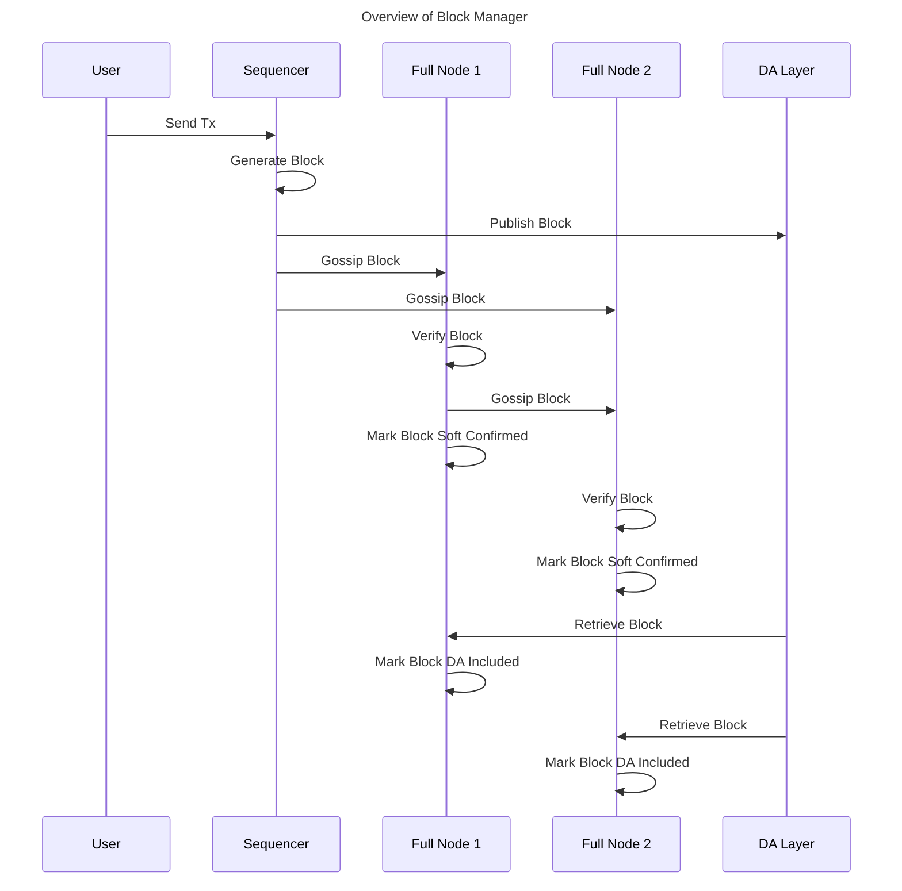

# Block Manager

## Abstract

The block manager is a key component of full nodes and is responsible for block production or block syncing depending on the node type: sequencer or non-sequencer. Block syncing in this context includes retrieving the published blocks from the network (P2P network or DA network), validating them to raise fraud proofs upon validation failure, updating the state, and storing the validated blocks. A full node invokes multiple block manager functionalities in parallel, such as:

* Block Production (only for sequencer full nodes)
* Block Publication to DA network
* Block Retrieval from DA network
* Block Sync Service
* Block Publication to P2P network
* Block Retrieval from P2P network
* State Update after Block Retrieval

## Protocol/Component Description

The block manager is initialized using several parameters as defined below:

**Name**|**Type**|**Description**
|-----|-----|-----|
signing key|crypto.PrivKey|used for signing a block after it is created
config|config.BlockManagerConfig|block manager configurations (see config options below)
genesis|*cmtypes.GenesisDoc|initialize the block manager with genesis state (genesis configuration defined in `config/genesis.json` file under the app directory)
store|store.Store|local datastore for storing rollup blocks and states (default local store path is `$db_dir/rollkit` and `db_dir` specified in the `config.yaml` file under the app directory)
mempool, proxyapp, eventbus|mempool.Mempool, proxy.AppConnConsensus, *cmtypes.EventBus|for initializing the executor (state transition function). mempool is also used in the manager to check for availability of transactions for lazy block production
dalc|da.DAClient|the data availability light client used to submit and retrieve blocks to DA network
blockstore|*goheaderstore.Store[*types.Block]|to retrieve blocks gossiped over the P2P network

Block manager configuration options:

|Name|Type|Description|
|-----|-----|-----|
|BlockTime|time.Duration|time interval used for block production and block retrieval from block store ([`defaultBlockTime`][defaultBlockTime])|
|DABlockTime|time.Duration|time interval used for both block publication to DA network and block retrieval from DA network ([`defaultDABlockTime`][defaultDABlockTime])|
|DAStartHeight|uint64|block retrieval from DA network starts from this height|
|LazyBlockTime|time.Duration|time interval used for block production in lazy aggregator mode even when there are no transactions ([`defaultLazyBlockTime`][defaultLazyBlockTime])|

### Block Production

When the full node is operating as a sequencer (aka aggregator), the block manager runs the block production logic. There are two modes of block production, which can be specified in the block manager configurations: `normal` and `lazy`.

In `normal` mode, the block manager runs a timer, which is set to the `BlockTime` configuration parameter, and continuously produces blocks at `BlockTime` intervals.

In `lazy` mode, the block manager starts building a block when any transaction becomes available in the mempool. After the first notification of the transaction availability, the manager will wait for a 1 second timer to finish, in order to collect as many transactions from the mempool as possible. The 1 second delay is chosen in accordance with the default block time of 1s. The block manager also notifies the full node after every lazy block building.

#### Building the Block

The block manager of the sequencer nodes performs the following steps to produce a block:

* Call `CreateBlock` using executor
* Sign the block using `signing key` to generate commitment
* Call `ApplyBlock` using executor to generate an updated state
* Save the block, validators, and updated state to local store
* Add the newly generated block to `pendingBlocks` queue
* Publish the newly generated block to channels to notify other components of the sequencer node (such as block and header gossip)

### Block Publication to DA Network

The block manager of the sequencer full nodes regularly publishes the produced blocks (that are pending in the `pendingBlocks` queue) to the DA network using the `DABlockTime` configuration parameter defined in the block manager config. In the event of failure to publish the block to the DA network, the manager will perform [`maxSubmitAttempts`][maxSubmitAttempts] attempts and an exponential backoff interval between the attempts. The exponential backoff interval starts off at [`initialBackoff`][initialBackoff] and it doubles in the next attempt and capped at `DABlockTime`. A successful publish event leads to the emptying of `pendingBlocks` queue and a failure event leads to proper error reporting without emptying of `pendingBlocks` queue.

### Block Retrieval from DA Network

The block manager of the full nodes regularly pulls blocks from the DA network at `DABlockTime` intervals and starts off with a DA height read from the last state stored in the local store or `DAStartHeight` configuration parameter, whichever is the latest. The block manager also actively maintains and increments the `daHeight` counter after every DA pull. The pull happens by making the `RetrieveBlocks(daHeight)` request using the Data Availability Light Client (DALC) retriever, which can return either `Success`, `NotFound`, or `Error`. In the event of an error, a retry logic kicks in after a delay of 100 milliseconds delay between every retry and after 10 retries, an error is logged and the `daHeight` counter is not incremented, which basically results in the intentional stalling of the block retrieval logic. In the block `NotFound` scenario, there is no error as it is acceptable to have no rollup block at every DA height. The retrieval successfully increments the `daHeight` counter in this case. Finally, for the `Success` scenario, first, blocks that are successfully retrieved are marked as DA included and are sent to be applied (or state update). A successful state update triggers fresh DA and block store pulls without respecting the `DABlockTime` and `BlockTime` intervals. For more details on DA integration, see the [Data Availability specification](./da.md).

#### Out-of-Order Rollup Blocks on DA

Rollkit should support blocks arriving out-of-order on DA, like so:

#### Termination Condition

If the sequencer double-signs two blocks at the same height, evidence of the fault should be posted to DA. Rollkit full nodes should process the longest valid chain up to the height of the fault evidence, and terminate. See diagram:

### Block Sync Service

The block sync service is created during full node initialization. After that, during the block manager's initialization, a pointer to the block store inside the block sync service is passed to it. Blocks created in the block manager are then passed to the `BlockCh` channel and then sent to the [go-header][go-header] service to be gossiped blocks over the P2P network.

### Block Publication to P2P network

Blocks created by the sequencer that are ready to be published to the P2P network are sent to the `BlockCh` channel in Block Manager inside `publishLoop`.
The `blockPublishLoop` in the full node continuously listens for new blocks from the `BlockCh` channel and when a new block is received, it is written to the block store and broadcasted to the network using the block sync service.

Among non-sequencer full nodes, all the block gossiping is handled by the block sync service, and they do not need to publish blocks to the P2P network using any of the block manager components.

### Block Retrieval from P2P network

For non-sequencer full nodes, Blocks gossiped through the P2P network are retrieved from the `Block Store` in `BlockStoreRetrieveLoop` in Block Manager.
Starting off with a block store height of zero, for every `blockTime` unit of time, a signal is sent to the `blockStoreCh` channel in the block manager and when this signal is received, the `BlockStoreRetrieveLoop` retrieves blocks from the block store.
It keeps track of the last retrieved block's height and every time the current block store's height is greater than the last retrieved block's height, it retrieves all blocks from the block store that are between these two heights.
For each retrieved block, it sends a new block event to the `blockInCh` channel which is the same channel in which blocks retrieved from the DA layer are sent.
This block is marked as soft confirmed by the validating full node until the same block is seen on the DA layer and then marked DA-included.

Although a sequencer does not need to retrieve blocks from the P2P network, it still runs the `BlockStoreRetrieveLoop`.

#### About Soft Confirmations and DA Inclusions

The block manager retrieves blocks from both the P2P network and the underlying DA network because the blocks are available in the P2P network faster and DA retrieval is slower (e.g., 1 second vs 15 seconds). The blocks retrieved from the P2P network are only marked as soft confirmed until the DA retrieval succeeds on those blocks and they are marked DA included. DA included blocks can be considered to have a higher level of finality.

### State Update after Block Retrieval

The block manager stores and applies the block to update its state every time a new block is retrieved either via the P2P or DA network. State update involves:

* `ApplyBlock` using executor: validates the block, executes the block (applies the transactions), captures the validator updates, and creates an updated state.
* `Commit` using executor: commit the execution and changes, update mempool, and publish events
* Store the block, the validators, and the updated state.

## Message Structure/Communication Format

The communication between the block manager and executor:

* `InitChain`: using the genesis, a set of parameters, and validator set to invoke `InitChainSync` on the proxyApp to obtain initial `appHash` and initialize the state.
* `Commit`: commit the execution and changes, update mempool, and publish events.
* `CreateBlock`: prepare a block by polling transactions from mempool.
* `ApplyBlock`: validate the block, execute the block (apply transactions), validator updates, create and return updated state

The communication between the full node and block manager:

* Notify when the block is published
* Notify when the block is done lazy building

## Assumptions and Considerations

* The block manager loads the initial state from the local store and uses genesis if not found in the local store, when the node (re)starts.
* The default mode for sequencer nodes is normal (not lazy).
* The sequencer can produce empty blocks.
* The block manager uses persistent storage (disk) when the `root_dir` and `db_path` configuration parameters are specified in `config.yaml` file under the app directory. If these configuration parameters are not specified, the in-memory storage is used, which will not be persistent if the node stops.
* The block manager does not re-apply the block again (in other words, create a new updated state and persist it) when a block was initially applied using P2P block sync, but later was DA included during DA retrieval. The block is only marked DA included in this case.
* The data sync store is created by prefixing `dataSync` on the main data store.
* The genesis `ChainID` is used to create the `PubSubTopID` in go-header with the string `-block` appended to it. This append is because the full node also has a P2P header sync running with a different P2P network. Refer to [go-header][go-header] specs for more details.
* Block sync over the P2P network works only when a full node is connected to the P2P network by specifying the initial seeds to connect to via `P2PConfig.Seeds` configuration parameter when starting the full node.
* Node's context is passed down to all the components of the P2P block sync to control shutting down the service either abruptly (in case of failure) or gracefully (during successful scenarios).
* The block manager supports the separation of header and data structures in Rollkit. This allows for expanding the sequencing scheme beyond centralized sequencing and enables the use of a decentralized sequencer mode. For detailed information on this architecture, see the [Header and Data Separation ADR](../../lazy-adr/adr-014-header-and-data-separation.md).
* The block manager processes blocks with a minimal header format, which is designed to eliminate dependency on CometBFT's header format and can be used to produce an execution layer tailored header if needed. For details on this header structure, see the [Rollkit Minimal Header](../../lazy-adr/adr-015-rollkit-minimal-header.md) specification.

## Implementation

See [block-manager]

See [tutorial] for running a multi-node network with both sequencer and non-sequencer full nodes.

## References

[1] [Go Header][go-header]

[2] [Block Sync][block-sync]

[3] [Full Node][full-node]

[4] [Block Manager][block-manager]

[5] [Tutorial][tutorial]

[6] [Header and Data Separation ADR](../../lazy-adr/adr-014-header-and-data-separation.md)

[7] [Rollkit Minimal Header](../../lazy-adr/adr-015-rollkit-minimal-header.md)

[8] [Data Availability](./da.md)

[maxSubmitAttempts]: https://github.com/rollkit/rollkit/blob/main/block/manager.go#L50
[defaultBlockTime]: https://github.com/rollkit/rollkit/blob/main/block/manager.go#L36
[defaultDABlockTime]: https://github.com/rollkit/rollkit/blob/main/block/manager.go#L33
[defaultLazyBlockTime]: https://github.com/rollkit/rollkit/blob/main/block/manager.go#L39
[initialBackoff]: https://github.com/rollkit/rollkit/blob/main/block/manager.go#L59
[go-header]: https://github.com/celestiaorg/go-header
[block-sync]: https://github.com/rollkit/rollkit/blob/main/pkg/sync/sync_service.go
[full-node]: https://github.com/rollkit/rollkit/blob/main/node/full.go
[block-manager]: https://github.com/rollkit/rollkit/blob/main/block/manager.go
[tutorial]: https://rollkit.dev/guides/full-node
